<!-- Identifier: I-01-03-AR-02-08 -->




```mermaid
flowchart TD
    A[📋 原始业务需求<br>程序请求管理自动化] --> B[🤖 AI辅助需求分析]
    
    B --> C[📝 需求规格说明书]
    B --> D[🏗️ 领域模型]
    B --> E[🎨 界面原型]
    B --> F[🌐 系统架构]
    B --> G[🔗 FreshService集成]
    
    C --> H[👨‍💼 业务分析员审核]
    D --> I[👨‍💻 系统分析员审核]
    E --> J[👨‍🎨 UI设计师审核]
    F --> K[🏗️ 系统架构师审核]
    G --> L[🔧 技术负责人审核]
    
    H & I & J & K & L --> M[📊 PRM综合系统分析文档]
    
    subgraph Q [角色协同工作流]
        R[销售/调度代表<br>业务流程验证]
        S[工程经理<br>工作流合理性]
        T[系统架构师<br>集成可行性]
        U[项目经理<br>实施风险评估]
    end
    
    M --> Q
    Q --> N[💰 项目评估]
    N --> O[📅 项目计划]
    O --> P[⚡ 项目执行]
```

```mermaid
flowchart TD
    A[🎯 业务目标分析<br>自动化程序请求管理] --> B[👥 识别系统参与者]
    B --> C[📋 定义业务用例]
    C --> D[🏗️ 设计系统结构]
    
    D --> E[🎨 界面层设计]
    D --> F[⚙️ 控制层设计]
    D --> G[💾 实体层设计]
    
    E & F & G --> H[🔌 接口层设计]
    H --> I[🌐 FreshService集成]
    
    I --> J[✅ 完整性验证]
    J --> K[📊 综合文档生成]
    
    subgraph L [AI辅助生成]
        M[程序请求用例场景生成]
        N[审批矩阵类图结构生成]
        O[工单管理界面流程生成]
        P[FreshService API接口契约生成]
    end
    
    L --> D
    L --> E
    L --> H
    
    subgraph Q [人工审核修正]
        R[石油业务逻辑修正]
        S[审批工作流优化]
        T[多角色视图调整]
        U[集成风险评估补充]
    end
    
    Q --> J
```

```mermaid
classDiagram
    direction TB
    
    class 销售调度人员 {
        <<businessActor>>
        +提交程序请求()
        +跟踪请求状态()
        +下载批准程序()
    }
    
    class 工程师 {
        <<actor>>
        +接收分配请求()
        +起草设计程序()
        +提交审查()
        +处理审批意见()
    }
    
    class 工程经理 {
        <<actor>>
        +手动分配请求()
        +审查批准程序()
        +监督工作负载()
    }
    
    class 总监副总裁 {
        <<actor>>
        +最终审批黑色矩阵()
        +监督合规性()
        +查看系统报告()
    }
    
    class 审批人员 {
        <<actor>>
        +审查分配程序()
        +批准拒绝请求()
        +添加审查意见()
    }
    
    class 运营现场团队 {
        <<actor>>
        +获取批准程序()
        +下载最终文档()
        +提供执行反馈()
    }
    
    class 提交程序请求用例 {
        <<useCase>>
    }
    
    class 自动分配请求用例 {
        <<useCase>>
    }
    
    class 起草设计程序用例 {
        <<useCase>>
    }
    
    class 审批流程管理用例 {
        <<useCase>>
    }
    
    class 程序状态跟踪用例 {
        <<useCase>>
    }
    
    class 报告分析生成用例 {
        <<useCase>>
    }
    
    class 程序请求提交界面 {
        <<boundary>>
        +显示提交表单()
        +上传支持文档()
        +选择请求类型()
    }
    
    class 工单管理界面 {
        <<boundary>>
        +显示结构化布局()
        +展示审批进度()
        +管理相关文档()
    }
    
    class 审批工作台界面 {
        <<boundary>>
        +显示待审批列表()
        +展示程序详情()
        +输入审批意见()
    }
    
    class 报告分析界面 {
        <<boundary>>
        +展示关键指标()
        +生成定制报告()
        +可视化工作负载()
    }
    
    class 请求接收控制 {
        <<control>>
        +验证请求数据()
        +生成程序ID()
        +分配矩阵颜色()
    }
    
    class 自动分配控制 {
        <<control>>
        +查询工程师映射()
        +执行分配逻辑()
        +处理无映射情况()
    }
    
    class 审批路由控制 {
        <<control>>
        +解析矩阵颜色()
        +确定审批路径()
        +通知相关人员()
    }
    
    class 状态跟踪控制 {
        <<control>>
        +更新请求状态()
        +记录时间戳()
        +计算SLA指标()
    }
    
    class 程序请求 {
        <<entity>>
        -programRequestId
        -customerName
        -requestType
        -matrixColor
        -serviceLine
        -dueDate
        -priority
        +calculatePriority()
        +assignMatrixColor()
    }
    
    class 审批记录 {
        <<entity>>
        -approvalId
        -approverRole
        -decision
        -comments
        -timestamp
        +recordApproval()
        +validateAuthority()
    }
    
    class 用户角色 {
        <<entity>>
        -userId
        -roleType
        -permissions
        -assignedCompanies
        +checkPermission()
        +getAssignedRequests()
    }
    
    class 文档附件 {
        <<entity>>
        -documentId
        -fileName
        -version
        -uploadDate
        +manageVersions()
        +controlAccess()
    }
    
    class 服务线配置 {
        <<entity>>
        -serviceLineId
        -lineName
        -approvalRules
        +getApprovalWorkflow()
    }
    
    class FreshServiceAPI {
        <<api>>
        +createTicket()
        +updateStatus()
        +getUserInfo()
        +searchTickets()
    }
    
    class 通知服务API {
        <<api>>
        +sendEmailNotification()
        +sendInAppAlert()
        +formatMessage()
    }
    
    class 报告引擎API {
        <<api>>
        +generateTurnaroundReport()
        +calculateWinLossRate()
        +analyzeWorkload()
    }
    
    class FreshService系统 {
        <<systemActor>>
        +工单管理()
        +用户管理()
        +基础报告()
    }
    
    class 邮件推送系统 {
        <<systemActor>>
        +发送邮件()
        +管理模板()
        +跟踪送达()
    }
    
    销售调度人员 ..> 提交程序请求用例
    工程师 ..> 起草设计程序用例
    工程经理 ..> 审批流程管理用例
    总监副总裁 ..> 审批流程管理用例
    审批人员 ..> 审批流程管理用例
    运营现场团队 ..> 程序状态跟踪用例
    
    提交程序请求用例 ..> 程序请求提交界面
    自动分配请求用例 ..> 工单管理界面
    审批流程管理用例 ..> 审批工作台界面
    报告分析生成用例 ..> 报告分析界面
    
    程序请求提交界面 ..> 请求接收控制
    工单管理界面 ..> 自动分配控制
    审批工作台界面 ..> 审批路由控制
    报告分析界面 ..> 状态跟踪控制
    
    请求接收控制 ..> 程序请求
    自动分配控制 ..> 用户角色
    自动分配控制 ..> 程序请求
    审批路由控制 ..> 审批记录
    审批路由控制 ..> 服务线配置
    状态跟踪控制 ..> 程序请求
    状态跟踪控制 ..> 审批记录
    
    程序请求 ..> FreshServiceAPI
    审批记录 ..> 通知服务API
    用户角色 ..> FreshServiceAPI
    
    FreshServiceAPI ..> FreshService系统
    通知服务API ..> 邮件推送系统
    报告引擎API ..> FreshService系统
```
