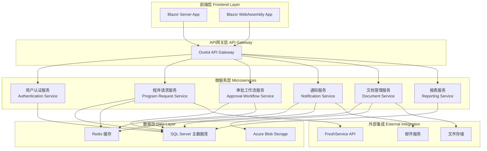

# Program Request Management 技术架构设计

## 📋 技术栈概览

### 1.1 核心技术栈

**前端技术：**
- **Blazor Server**：微软现代Web框架，支持C#和Razor语法
- **Blazor WebAssembly**：客户端渲染，提供更好的用户体验
- **Razor Components**：可复用的UI组件
- **ASP.NET Core Identity**：用户认证和授权

**后端技术：**
- **ASP.NET Core 8.0**：跨平台Web框架
- **Entity Framework Core 8.0**：ORM框架
- **SQL Server 2022**：主数据库
- **SignalR**：实时通信

**开发工具：**
- **Visual Studio 2022 Enterprise**：主要IDE
- **Azure DevOps**：CI/CD和项目管理
- **Git**：版本控制

---

## 🏗️ 系统架构设计

### 2.1 整体架构模式

采用**分层架构**结合**微服务**的设计模式：



### 2.2 微服务详细设计

#### 2.2.1 用户认证服务 (Authentication Service)
**技术栈：** ASP.NET Core Identity + JWT
**职责：**
- 用户注册、登录、注销
- 角色和权限管理
- JWT令牌生成和验证
- 密码策略和安全管理

**关键组件：**
```csharp
// 主要服务接口
public interface IAuthenticationService
{
    Task<AuthenticationResult> LoginAsync(LoginRequest request);
    Task<RegistrationResult> RegisterAsync(RegisterRequest request);
    Task<bool> ValidateTokenAsync(string token);
    Task<UserProfile> GetUserProfileAsync(string userId);
}

// 角色定义
public enum UserRole
{
    SalesDispatch,
    Engineer,
    EngineeringManager,
    DirectorVP,
    Approver,
    OperationsField
}
```

#### 2.2.2 程序请求服务 (Program Request Service)
**技术栈：** ASP.NET Core Web API + Entity Framework Core
**职责：**
- 程序请求的CRUD操作
- 请求状态管理
- 自动分配逻辑
- 复杂度矩阵计算

**核心实体：**
```csharp
public class ProgramRequest
{
    public Guid Id { get; set; }
    public string CustomerName { get; set; }
    public RequestType RequestType { get; set; }
    public ComplexityMatrix Complexity { get; set; }
    public ProgramRequestStatus Status { get; set; }
    public DateTime CreatedAt { get; set; }
    public DateTime? AssignedAt { get; set; }
    public string AssignedEngineerId { get; set; }
    public List<RequestDocument> Documents { get; set; }
}

public enum ProgramRequestStatus
{
    Open,
    Received,
    Unacknowledged,
    Acknowledged,
    Pending,
    InProgress,
    SentForReview,
    AwaitingReview,
    Reviewed,
    SentForApproval,
    AwaitingApproval,
    Approved,
    SentToSales,
    Completed
}
```

#### 2.2.3 审批工作流服务 (Approval Workflow Service)
**技术栈：** ASP.NET Core + 状态模式 + 工作流引擎
**职责：**
- 审批流程管理
- 复杂度矩阵路由
- 多级审批支持
- 审批历史记录

**工作流引擎设计：**
```csharp
public interface IWorkflowEngine
{
    Task<WorkflowResult> StartWorkflowAsync(Guid requestId);
    Task<WorkflowResult> ProcessStepAsync(WorkflowStep step);
    Task<List<WorkflowStep>> GetPendingStepsAsync(string userId);
}

public class ComplexityMatrix
{
    public MatrixColor Color { get; set; } // Red, Yellow, Green, Black
    public int ComplexityScore { get; set; }
    public List<ApprovalLevel> ApprovalLevels { get; set; }
}

public enum MatrixColor
{
    Red,    // 简单审批
    Yellow, // 中等审批
    Green,  // 复杂审批
    Black   // 总监/副总裁审批
}
```

#### 2.2.4 通知服务 (Notification Service)
**技术栈：** ASP.NET Core + SignalR + SendGrid
**职责：**
- 实时通知推送
- 邮件通知
- 通知模板管理
- 通知历史记录

**通知架构：**
```csharp
public interface INotificationService
{
    Task SendNotificationAsync(NotificationRequest request);
    Task SendEmailAsync(EmailRequest request);
    Task<List<Notification>> GetUserNotificationsAsync(string userId);
}

public class NotificationRequest
{
    public string UserId { get; set; }
    public NotificationType Type { get; set; }
    public string Title { get; set; }
    public string Message { get; set; }
    public Dictionary<string, object> Data { get; set; }
}
```

---

## 💾 数据架构设计

### 3.1 数据库设计

#### 3.1.1 主要数据表

**用户相关表：**
```sql
-- 用户表
CREATE TABLE Users (
    Id UNIQUEIDENTIFIER PRIMARY KEY DEFAULT NEWID(),
    UserName NVARCHAR(256) NOT NULL UNIQUE,
    Email NVARCHAR(256) NOT NULL UNIQUE,
    FirstName NVARCHAR(100) NOT NULL,
    LastName NVARCHAR(100) NOT NULL,
    Role NVARCHAR(50) NOT NULL,
    IsActive BIT DEFAULT 1,
    CreatedAt DATETIME2 DEFAULT GETUTCDATE(),
    UpdatedAt DATETIME2 DEFAULT GETUTCDATE()
);

-- 角色表
CREATE TABLE Roles (
    Id INT PRIMARY KEY IDENTITY,
    Name NVARCHAR(50) NOT NULL UNIQUE,
    Description NVARCHAR(500),
    Permissions NVARCHAR(MAX) -- JSON格式存储权限
);

-- 用户角色映射表
CREATE TABLE UserRoles (
    UserId UNIQUEIDENTIFIER NOT NULL,
    RoleId INT NOT NULL,
    AssignedAt DATETIME2 DEFAULT GETUTCDATE(),
    PRIMARY KEY (UserId, RoleId),
    FOREIGN KEY (UserId) REFERENCES Users(Id),
    FOREIGN KEY (RoleId) REFERENCES Roles(Id)
);
```

**程序请求相关表：**
```sql
-- 程序请求表
CREATE TABLE ProgramRequests (
    Id UNIQUEIDENTIFIER PRIMARY KEY DEFAULT NEWID(),
    CustomerName NVARCHAR(200) NOT NULL,
    RequestType NVARCHAR(100) NOT NULL,
    ServiceLine NVARCHAR(100) NOT NULL,
    Description NVARCHAR(MAX),
    ComplexityColor NVARCHAR(20) NOT NULL,
    ComplexityScore INT NOT NULL,
    Status NVARCHAR(50) NOT NULL,
    Priority NVARCHAR(20) DEFAULT 'Medium',
    CreatedBy UNIQUEIDENTIFIER NOT NULL,
    AssignedEngineerId UNIQUEIDENTIFIER NULL,
    CreatedAt DATETIME2 DEFAULT GETUTCDATE(),
    UpdatedAt DATETIME2 DEFAULT GETUTCDATE(),
    CompletedAt DATETIME2 NULL,
    FOREIGN KEY (CreatedBy) REFERENCES Users(Id),
    FOREIGN KEY (AssignedEngineerId) REFERENCES Users(Id)
);

-- 请求状态历史表
CREATE TABLE RequestStatusHistory (
    Id UNIQUEIDENTIFIER PRIMARY KEY DEFAULT NEWID(),
    RequestId UNIQUEIDENTIFIER NOT NULL,
    FromStatus NVARCHAR(50),
    ToStatus NVARCHAR(50) NOT NULL,
    ChangedBy UNIQUEIDENTIFIER NOT NULL,
    Comments NVARCHAR(500),
    ChangedAt DATETIME2 DEFAULT GETUTCDATE(),
    FOREIGN KEY (RequestId) REFERENCES ProgramRequests(Id),
    FOREIGN KEY (ChangedBy) REFERENCES Users(Id)
);

-- 审批记录表
CREATE TABLE ApprovalRecords (
    Id UNIQUEIDENTIFIER PRIMARY KEY DEFAULT NEWID(),
    RequestId UNIQUEIDENTIFIER NOT NULL,
    ApproverId UNIQUEIDENTIFIER NOT NULL,
    ApprovalLevel INT NOT NULL,
    Decision NVARCHAR(20) NOT NULL, -- Approved, Rejected, Pending
    Comments NVARCHAR(MAX),
    ApprovedAt DATETIME2 NULL,
    FOREIGN KEY (RequestId) REFERENCES ProgramRequests(Id),
    FOREIGN KEY (ApproverId) REFERENCES Users(Id)
);
```

#### 3.1.2 Entity Framework Core 配置

**DbContext 设计：**
```csharp
public class PRMDbContext : DbContext
{
    public PRMDbContext(DbContextOptions<PRMDbContext> options)
        : base(options)
    {
    }

    // 用户相关
    public DbSet<User> Users { get; set; }
    public DbSet<Role> Roles { get; set; }
    public DbSet<UserRole> UserRoles { get; set; }

    // 程序请求相关
    public DbSet<ProgramRequest> ProgramRequests { get; set; }
    public DbSet<RequestStatusHistory> RequestStatusHistory { get; set; }
    public DbSet<ApprovalRecord> ApprovalRecords { get; set; }

    // 文档相关
    public DbSet<Document> Documents { get; set; }
    public DbSet<DocumentVersion> DocumentVersions { get; set; }

    // 通知相关
    public DbSet<Notification> Notifications { get; set; }
    public DbSet<NotificationTemplate> NotificationTemplates { get; set; }

    protected override void OnModelCreating(ModelBuilder modelBuilder)
    {
        // 配置实体关系
        modelBuilder.Entity<ProgramRequest>()
            .HasOne(pr => pr.CreatedByUser)
            .WithMany()
            .HasForeignKey(pr => pr.CreatedBy)
            .OnDelete(DeleteBehavior.Restrict);

        modelBuilder.Entity<ProgramRequest>()
            .HasOne(pr => pr.AssignedEngineer)
            .WithMany()
            .HasForeignKey(pr => pr.AssignedEngineerId)
            .OnDelete(DeleteBehavior.SetNull);

        // 配置枚举转换
        modelBuilder.Entity<ProgramRequest>()
            .Property(pr => pr.Status)
            .HasConversion<string>();

        modelBuilder.Entity<ProgramRequest>()
            .Property(pr => pr.ComplexityColor)
            .HasConversion<string>();

        // 配置索引
        modelBuilder.Entity<ProgramRequest>()
            .HasIndex(pr => pr.Status);
            
        modelBuilder.Entity<ProgramRequest>()
            .HasIndex(pr => pr.CreatedAt);
    }
}
```

### 3.2 缓存策略

**Redis 缓存设计：**
```csharp
public interface ICacheService
{
    Task<T> GetAsync<T>(string key);
    Task SetAsync<T>(string key, T value, TimeSpan? expiry = null);
    Task RemoveAsync(string key);
    Task RemoveByPatternAsync(string pattern);
}

// 缓存键定义
public static class CacheKeys
{
    public const string UserById = "User:ById:{0}";
    public const string UserRoles = "User:Roles:{0}";
    public const string ProgramRequestById = "ProgramRequest:ById:{0}";
    public const string PendingRequests = "ProgramRequest:Pending:{0}";
    public const string NotificationCount = "Notification:Count:{0}";
}
```

---

## 🔌 API 设计规范

### 4.1 RESTful API 设计原则

**URL 命名规范：**
- 使用复数名词：`/api/programrequests`
- 使用小写字母和连字符：`/api/users/{userId}/notifications`
- 资源嵌套：`/api/programrequests/{id}/documents`

**HTTP 方法使用：**
- `GET`：获取资源
- `POST`：创建资源
- `PUT`：完整更新资源
- `PATCH`：部分更新资源
- `DELETE`：删除资源

### 4.2 API 控制器设计

**程序请求 API：**
```csharp
[ApiController]
[Route("api/[controller]")]
[Authorize]
public class ProgramRequestsController : ControllerBase
{
    private readonly IProgramRequestService _service;

    [HttpGet]
    public async Task<ActionResult<PagedResult<ProgramRequestDto>>> GetProgramRequests(
        [FromQuery] ProgramRequestParameters parameters)
    {
        var result = await _service.GetProgramRequestsAsync(parameters);
        return Ok(result);
    }

    [HttpGet("{id}")]
    public async Task<ActionResult<ProgramRequestDetailDto>> GetProgramRequest(Guid id)
    {
        var result = await _service.GetProgramRequestAsync(id);
        return Ok(result);
    }

    [HttpPost]
    public async Task<ActionResult<ProgramRequestDto>> CreateProgramRequest(
        [FromBody] CreateProgramRequestRequest request)
    {
        var result = await _service.CreateProgramRequestAsync(request);
        return CreatedAtAction(nameof(GetProgramRequest), new { id = result.Id }, result);
    }

    [HttpPut("{id}")]
    public async Task<ActionResult<ProgramRequestDto>> UpdateProgramRequest(
        Guid id, [FromBody] UpdateProgramRequestRequest request)
    {
        var result = await _service.UpdateProgramRequestAsync(id, request);
        return Ok(result);
    }

    [HttpPost("{id}/submit")]
    public async Task<ActionResult> SubmitProgramRequest(Guid id)
    {
        await _service.SubmitProgramRequestAsync(id);
        return NoContent();
    }

    [HttpPost("{id}/assign")]
    public async Task<ActionResult> AssignProgramRequest(
        Guid id, [FromBody] AssignRequest request)
    {
        await _service.AssignProgramRequestAsync(id, request.EngineerId);
        return NoContent();
    }
}
```

### 4.3 DTO 设计

**数据传输对象定义：**
```csharp
public class ProgramRequestDto
{
    public Guid Id { get; set; }
    public string CustomerName { get; set; }
    public string RequestType { get; set; }
    public string Status { get; set; }
    public string ComplexityColor { get; set; }
    public DateTime CreatedAt { get; set; }
    public string AssignedEngineerName { get; set; }
}

public class CreateProgramRequestRequest
{
    [Required]
    [StringLength(200)]
    public string CustomerName { get; set; }

    [Required]
    public string RequestType { get; set; }

    [Required]
    public string ServiceLine { get; set; }

    [StringLength(2000)]
    public string Description { get; set; }

    public List<IFormFile> Attachments { get; set; }
}

public class ProgramRequestParameters
{
    public int PageNumber { get; set; } = 1;
    public int PageSize { get; set; } = 20;
    public string Status { get; set; }
    public string CustomerName { get; set; }
    public DateTime? FromDate { get; set; }
    public DateTime? ToDate { get; set; }
}
```

---

## 🛡️ 安全架构设计

### 5.1 认证与授权

**JWT Token 配置：**
```csharp
public class JwtConfiguration
{
    public string SecretKey { get; set; }
    public string Issuer { get; set; }
    public string Audience { get; set; }
    public int ExpirationMinutes { get; set; } = 60;
}

// JWT 服务
public class JwtTokenService : IJwtTokenService
{
    private readonly JwtConfiguration _config;

    public string GenerateToken(User user, IList<string> roles)
    {
        var claims = new List<Claim>
        {
            new Claim(ClaimTypes.NameIdentifier, user.Id.ToString()),
            new Claim(ClaimTypes.Name, user.UserName),
            new Claim(ClaimTypes.Email, user.Email)
        };

        foreach (var role in roles)
        {
            claims.Add(new Claim(ClaimTypes.Role, role));
        }

        var key = new SymmetricSecurityKey(Encoding.UTF8.GetBytes(_config.SecretKey));
        var credentials = new SigningCredentials(key, SecurityAlgorithms.HmacSha256);

        var token = new JwtSecurityToken(
            issuer: _config.Issuer,
            audience: _config.Audience,
            claims: claims,
            expires: DateTime.Now.AddMinutes(_config.ExpirationMinutes),
            signingCredentials: credentials
        );

        return new JwtSecurityTokenHandler().WriteToken(token);
    }
}
```

### 5.2 权限控制

**基于角色的访问控制 (RBAC)：**
```csharp
public class PermissionRequirement : IAuthorizationRequirement
{
    public string Permission { get; }

    public PermissionRequirement(string permission)
    {
        Permission = permission;
    }
}

public class PermissionAuthorizationHandler : AuthorizationHandler<PermissionRequirement>
{
    protected override Task HandleRequirementAsync(
        AuthorizationHandlerContext context,
        PermissionRequirement requirement)
    {
        var permissions = context.User.Claims
            .Where(c => c.Type == "Permission")
            .Select(c => c.Value)
            .ToList();

        if (permissions.Contains(requirement.Permission))
        {
            context.Succeed(requirement);
        }

        return Task.CompletedTask;
    }
}

// 权限定义
public static class Permissions
{
    public const string ViewRequests = "requests:view";
    public const string CreateRequest = "requests:create";
    public const string AssignRequest = "requests:assign";
    public const string ApproveRequest = "requests:approve";
    public const string ViewReports = "reports:view";
}
```

---

## 🔄 集成架构设计

### 6.1 FreshService 集成

**集成服务设计：**
```csharp
public interface IFreshServiceIntegration
{
    Task<Ticket> CreateTicketAsync(ProgramRequest request);
    Task<Ticket> UpdateTicketAsync(Guid ticketId, UpdateTicketRequest request);
    Task<Ticket> GetTicketAsync(Guid ticketId);
    Task<List<Ticket>> GetTicketsByRequesterAsync(string email);
}

public class FreshServiceService : IFreshServiceIntegration
{
    private readonly HttpClient _httpClient;
    private readonly FreshServiceConfiguration _config;

    public async Task<Ticket> CreateTicketAsync(ProgramRequest request)
    {
        var ticketRequest = new CreateTicketRequest
        {
            Subject = $"Program Request - {request.CustomerName}",
            Description = request.Description,
            Requester = new RequesterInfo { Email = request.RequesterEmail },
            Priority = MapPriority(request.Priority),
            Category = "Program Request",
            CustomFields = new
            {
                program_request_id = request.Id.ToString(),
                complexity_color = request.ComplexityColor,
                service_line = request.ServiceLine
            }
        };

        var response = await _httpClient.PostAsJsonAsync("/api/v2/tickets", ticketRequest);
        response.EnsureSuccessStatusCode();

        return await response.Content.ReadFromJsonAsync<Ticket>();
    }
}
```

### 6.2 邮件服务集成

**SendGrid 集成：**
```csharp
public interface IEmailService
{
    Task SendEmailAsync(EmailMessage message);
    Task SendTemplateEmailAsync(TemplateEmailMessage message);
}

public class SendGridEmailService : IEmailService
{
    private readonly ISendGridClient _client;

    public async Task SendTemplateEmailAsync(TemplateEmailMessage message)
    {
        var msg = new SendGridMessage
        {
            From = new EmailAddress(message.FromEmail, message.FromName),
            Subject = message.Subject,
            TemplateId = message.TemplateId
        };

        msg.AddTo(message.ToEmail, message.ToName);
        
        foreach (var templateData in message.TemplateData)
        {
            msg.SetTemplateData(templateData);
        }

        var response = await _client.SendEmailAsync(msg);
        response.EnsureSuccess();
    }
}
```

---

## 📊 监控与日志架构

### 7.1 应用监控

**Application Insights 集成：**
```csharp
public class TelemetryService : ITelemetryService
{
    private readonly TelemetryClient _telemetryClient;

    public void TrackEvent(string eventName, IDictionary<string, string> properties = null)
    {
        _telemetryClient.TrackEvent(eventName, properties);
    }

    public void TrackException(Exception exception, IDictionary<string, string> properties = null)
    {
        _telemetryClient.TrackException(exception, properties);
    }

    public void TrackMetric(string metricName, double value, IDictionary<string, string> properties = null)
    {
        var metric = new MetricTelemetry
        {
            Name = metricName,
            Sum = value
        };

        if (properties != null)
        {
            foreach (var property in properties)
            {
                metric.Properties.Add(property);
            }
        }

        _telemetryClient.TrackMetric(metric);
    }
}
```

### 7.2 日志架构

**Serilog 配置：**
```csharp
public class Program
{
    public static void Main(string[] args)
    {
        Log.Logger = new LoggerConfiguration()
            .MinimumLevel.Information()
            .MinimumLevel.Override("Microsoft", LogEventLevel.Warning)
            .Enrich.FromLogContext()
            .Enrich.WithProperty("Application", "PRM.API")
            .WriteTo.Console()
            .WriteTo.File(
                path: "logs/prm-.log",
                rollingInterval: RollingInterval.Day,
                retainedFileCountLimit: 30,
                outputTemplate: "[{Timestamp:yyyy-MM-dd HH:mm:ss} {Level:u3}] {Application} {RequestId} {Message:lj}{NewLine}{Exception}")
            .WriteTo.Seq("http://localhost:5341")
            .CreateLogger();

        CreateHostBuilder(args).Build().Run();
    }
}
```

---

## 🚀 部署架构设计

### 8.1 Azure 部署架构

**Azure 资源规划：**
```yaml
# Azure 资源组
resource_group: prm-prod-rg

# 应用服务
app_service_plan:
  name: prm-prod-asp
  tier: Standard
  size: S2

# 应用服务
app_services:
  - name: prm-api
    runtime: DOTNETCORE|8.0
  - name: prm-auth
    runtime: DOTNETCORE|8.0
  - name: prm-workflow
    runtime: DOTNETCORE|8.0

# 数据库
sql_database:
  server: prm-prod-sql.database.windows.net
  database: PRM_Prod
  tier: Standard
  size: S2

# 缓存
redis_cache:
  name: prm-prod-redis
  tier: Standard
  size: C1

# 存储
storage_account:
  name: prmprodstorage
  tier: Standard
  replication: LRS
```

### 8.2 Docker 容器化

**Dockerfile 示例：**
```dockerfile
FROM mcr.microsoft.com/dotnet/aspnet:8.0 AS base
WORKDIR /app
EXPOSE 80
EXPOSE 443

FROM mcr.microsoft.com/dotnet/sdk:8.0 AS build
WORKDIR /src
COPY ["PRM.API/PRM.API.csproj", "PRM.API/"]
COPY ["PRM.Core/PRM.Core.csproj", "PRM.Core/"]
COPY ["PRM.Infrastructure/PRM.Infrastructure.csproj", "PRM.Infrastructure/"]
RUN dotnet restore "PRM.API/PRM.API.csproj"
COPY . .
WORKDIR "/src/PRM.API"
RUN dotnet build "PRM.API.csproj" -c Release -o /app/build

FROM build AS publish
RUN dotnet publish "PRM.API.csproj" -c Release -o /app/publish

FROM base AS final
WORKDIR /app
COPY --from=publish /app/publish .
ENTRYPOINT ["dotnet", "PRM.API.dll"]
```

---

## 📈 性能优化策略

### 9.1 数据库优化

**索引策略：**
```sql
-- 程序请求表索引
CREATE INDEX IX_ProgramRequests_Status_CreatedAt 
ON ProgramRequests(Status, CreatedAt DESC);

CREATE INDEX IX_ProgramRequests_AssignedEngineerId_Status 
ON ProgramRequests(AssignedEngineerId, Status);

CREATE INDEX IX_ProgramRequests_CustomerName_Status 
ON ProgramRequests(CustomerName, Status);

-- 审批记录表索引
CREATE INDEX IX_ApprovalRecords_RequestId_ApprovalLevel 
ON ApprovalRecords(RequestId, ApprovalLevel);

CREATE INDEX IX_ApprovalRecords_ApproverId_Decision 
ON ApprovalRecords(ApproverId, Decision);
```

### 9.2 缓存策略

**多级缓存设计：**
```csharp
public class CachedProgramRequestService : IProgramRequestService
{
    private readonly IProgramRequestService _service;
    private readonly ICacheService _cache;
    private readonly IMemoryCache _memoryCache;

    public async Task<ProgramRequestDto> GetProgramRequestAsync(Guid id)
    {
        var cacheKey = string.Format(CacheKeys.ProgramRequestById, id);
        
        // 先从内存缓存获取
        if (_memoryCache.TryGetValue(cacheKey, out ProgramRequestDto cachedResult))
        {
            return cachedResult;
        }

        // 再从Redis缓存获取
        var redisResult = await _cache.GetAsync<ProgramRequestDto>(cacheKey);
        if (redisResult != null)
        {
            _memoryCache.Set(cacheKey, redisResult, TimeSpan.FromMinutes(5));
            return redisResult;
        }

        // 最后从数据库获取
        var result = await _service.GetProgramRequestAsync(id);
        
        // 设置缓存
        await _cache.SetAsync(cacheKey, result, TimeSpan.FromHours(1));
        _memoryCache.Set(cacheKey, result, TimeSpan.FromMinutes(5));

        return result;
    }
}
```

---

## 🔧 开发环境配置

### 10.1 开发工具配置

**Visual Studio 配置：**
```json
{
  "profiles": {
    "PRM.API": {
      "commandName": "Project",
      "dotnetRunMessages": true,
      "launchBrowser": true,
      "applicationUrl": "https://localhost:5001;http://localhost:5000",
      "environmentVariables": {
        "ASPNETCORE_ENVIRONMENT": "Development",
        "ASPNETCORE_URLS": "https://localhost:5001;http://localhost:5000"
      }
    },
    "Docker": {
      "commandName": "Docker",
      "launchBrowser": true,
      "DockerfileRunArguments": "--rm -e ASPNETCORE_ENVIRONMENT=Development"
    }
  }
}
```

### 10.2 开发数据库配置

**LocalDB 配置：**
```json
{
  "ConnectionStrings": {
    "DefaultConnection": "Server=(localdb)\\mssqllocaldb;Database=PRM_Dev;Trusted_Connection=true;MultipleActiveResultSets=true",
    "Redis": "localhost:6379",
    "FreshService": "https://yourcompany.freshservice.com/api/v2"
  },
  "Logging": {
    "LogLevel": {
      "Default": "Information",
      "Microsoft.AspNetCore": "Warning"
    }
  }
}
```

---

## 📋 技术决策记录 (ADR)

### ADR-001: 选择 .NET 技术栈
**状态：** 已接受  
**日期：** 2024-12-01  
**决策：** 采用微软 .NET 8.0 技术栈  
**理由：** 
- 企业级应用稳定性和性能
- 与现有微软生态系统兼容
- 丰富的开发工具和社区支持
- 强类型语言提供更好的代码质量

### ADR-002: 选择 Blazor 作为前端框架
**状态：** 已接受  
**日期：** 2024-12-01  
**决策：** 采用 Blazor Server + Blazor WebAssembly 混合架构  
**理由：**
- 统一的 C# 技术栈，降低学习成本
- 服务器端渲染提供更好的SEO
- WebAssembly 提供更好的用户体验
- 与 .NET 后端无缝集成

### ADR-003: 选择 SQL Server 作为主数据库
**状态：** 已接受  
**日期：** 2024-12-01  
**决策：** 采用 SQL Server 2022 作为主数据库  
**理由：**
- 与 .NET 生态系统的最佳集成
- 企业级数据安全性和性能
- 丰富的工具支持（SSMS, Azure Data Studio）
- 成熟的高可用性和备份方案

---

**文档版本：** v1.0  
**创建日期：** 2024-12-01  
**最后更新：** 2024-12-01  
**架构师：** [架构师姓名]  
**审核人：** [技术负责人姓名]