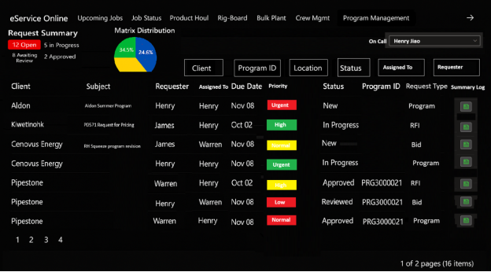
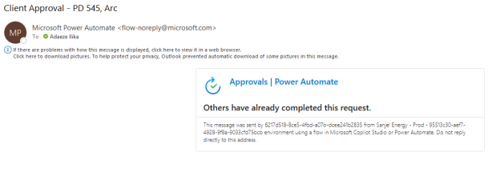
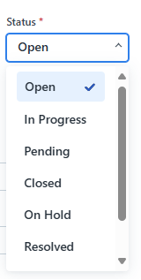
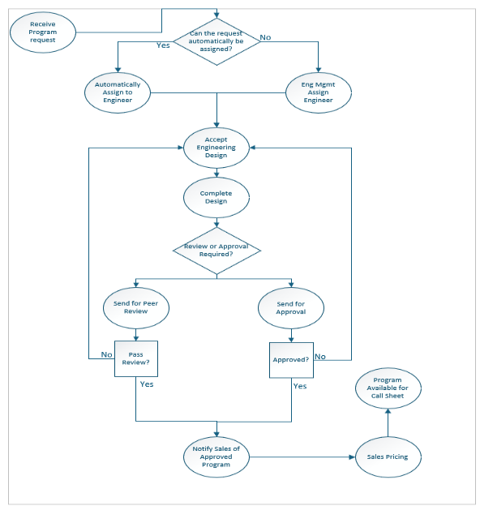

**[文件名]: 程序需求管理工具 第一阶段.docx**
**[文件内容开始]**

# **第一阶段功能需求**

1.  **需求受理/元数据字段**

**描述：** 当销售、调度或工程师通过邮件转发或门户网站表单提交一个新的程序需求时，系统应记录该请求并生成唯一的程序ID。

系统应支持通过以下方式提交请求：
- 邮件转发
- 网站门户表单

**标准字段**
- 唯一程序ID
- 客户
- 主题
- ~~需求提出者~~
- 请求者
- 指派给
- 优先级（目前工程师将手动确定优先级，因此无需自动确定，但随截止日期临近进行颜色编码会很棒）
- 截止日期
- 请求类型
- 状态
- 摘要日志/活动日志

2.  **自动分配 —— 工程师**

**描述：**
系统使用一个"公司-工程师"映射表来自动化请求分配。\
该表指定哪位工程师负责哪家公司（例如，*Enmax → Warren*）。当记录一个程序请求或由销售/工程部转发邮件时，系统检查公司名称并根据此映射自动将请求分配给正确的工程师。

**分配规则：**
1.  如果公司存在于映射表中 → 分配给映射的工程师。
2.  如果不存在映射 → 分配给工程部经理。
3.  如果请求被标记为紧急或在下班时间之后收到 → 路由给值班工程师。
4.  工程师需每天在App上手动更新"值班人员"

**通知：**
- 被指派的工程师将收到一封**电子邮件通知**，其中包含指向应用程序的可点击链接。

**邮件正文选项**
选项一：
你好 [姓名]，
在程序管理工具中有一项任务设计工作已分配给您。
请登录查看并采取必要行动。
（在此处插入链接）
谢谢

选项二：
你好 [姓名]，
来自（公司）的新程序已分配给您。
请登录查看并采取必要行动。
（在此处插入链接）
谢谢

- 系统还将生成**应用内通知**以提醒工程师有新的分配任务。

3.  **优先级设定**

**描述：** 当记录一个程序请求时，系统根据截止日期分配一个优先级分数。

**前提条件：** 存在带截止日期的程序请求。

**优先级规则：**
1.  紧急 → 截止时间少于4小时的请求。
2.  高 → 当天截止的请求。
3.  中 → 2天内截止的请求。
4.  低 → 超过2天截止的请求。
5.  普通 → 未给出截止日期

**系统行为：**
- 系统必须一致地应用上述规则，无需人工干预。
- 自动优先级分配是强制性的；没有它，该功能将无效。

4.  **审核与批准**

当工程师提交一个程序进行审核或批准时，系统根据其矩阵颜色路由程序进行审核或批准。

系统应支持基于程序/工作复杂度的结构化、颜色编码的审核和批准工作流，以及处理多工作和多程序提交。

**审核和批准不应相互串联，它是一个流程或另一个流程（两个流程在系统中可能看起来相同，只是审核者/批准者所做的事情会不同）。**

**审核和批准规则（按颜色）：**
1.  **绿色** → 需要同行审核。
2.  **黄色** → 需要经理/主管审核。
3.  **红色** → 需要经理批准。
4.  **黑色** → 需要经理 + 总监/副总裁批准。

**4.1 审核**
当工程师手动将程序分配给一个审核人进行审核时，系统应在请求需要审核时通知指定的审核人。通知应通过**工作流（应用内）** 和**电子邮件**两种渠道发送。

**前提条件：**
- 程序草稿已完成并标记为待审核。
- 工程师手动选择指派给谁进行审核。
- 系统将状态更新为 **"已发送审核。"**

指派选项：
- 指派给特定人员。
- 指派给**同行审核组**（必须有一名成员接受）。

系统行为：
将会有3种通知

A.  通知1
- 向审核人发送通知，告知他们一项审核任务已分配给他们。
- 通知内容包括：
  - 指向SharePoint中程序文档的可点击链接。
  - 指向App中用于接受/拒绝并添加评论的可点击链接。
  - 一个交互式界面，允许指定的审核人或批准者在应用程序中对待处理的请求采取行动。
 
- 请求详情（ID、客户、服务线）。
- 审核截止期限。
- 如果指派给同行审核组，当一名审核人接受后，对其他人的通知将消失（类似于Blend批准行为）。

B.  通知2和3
- 在以下情况下通知请求者：
  - 审核人接受审核程序
  - 审核人批准或拒绝程序。

系统应记录所有审核活动，包括：
- 批准/拒绝日期和时间。
- 决策结果。
- 审核人评论。

如果工作类型被拒绝，应自动返回给工程师进行修订。

**4.2 批准**
**前提条件：**
- 审核已完成，程序标记为待批准。
- 系统将状态更新为"已发送批准**。"**

**系统行为：**
- 系统将支持多工作批准，其中每种工作类型（例如，表层、中间层、衬管）遵循其自己的工作流路径。
- 系统将支持单一提交内的多程序请求。
- 系统将向指定的批准人发送电子邮件通知，内容包括：
  - 指向SharePoint中程序文档的可点击链接。
  - 指向App中用于接受/拒绝并添加评论的可点击链接。
  - 一个交互式界面，允许指定的审核人或批准者在应用程序中对持处理中的请求采取行动。
  - 
  - 请求详情（ID、客户、服务线）。
  - 批准截止期限。
- 系统应记录所有批准活动，包括：
  - 批准日期/时间。
  - 决策结果（批准/拒绝）。
  - 批准人评论。
- 如果工作类型被拒绝，应自动返回给工程师进行修订。

5.  **多层级和多工作批准**

当程序请求包含多种工作类型时，每种工作类型根据其矩阵颜色遵循其自己的批准工作流。系统应支持包含多种工作类型的请求，每种工作类型都有自己的复杂度矩阵颜色和相关的批准工作流。

**前提条件：** 程序请求包含多种工作类型（例如，表层、中间层、衬管）。

**系统行为：**
1.  一个请求中的每种工作类型可能具有不同的矩阵颜色。
示例：一个程序可能包含：
- 绿色（表层） → 同行审核。
- 黄色（中间层） → 经理审核。
- 黑色（生产） → 经理 + 总监/副总裁审核。
2.  MVP（最小可行产品）：最高权限的批准人可以通过单一操作批准整个请求。
3.  未来增强：系统应支持精细的逐项工作批准，其中每种工作类型被独立地审核/批准。
4.  系统将向指定的批准人发送电子邮件通知，内容包括：
- 指向App的链接。
- 指向相关待审核文档的链接。
5.  系统应记录所有批准活动，包括：
- 批准/拒绝日期和时间。
- 决策结果。
- 审核人评论。
6.  如果工作类型被拒绝，应自动返回给工程师进行修订。

6.  **状态（时间跟踪）**

**描述：** 当程序请求在其生命周期中移动时，系统必须捕获并记录每个阶段转换的时间戳。这使工程师、经理和销售能够实时跟踪进度，并为报告、SLA监控和问责提供完整的审计跟踪。状态选项卡将用于跟踪。

工程师希望在任何给定时间快速了解工作的状态。对于每个阶段，他们希望状态能随每个阶段自动更改。

**所需的工程团队阶段：**
- 已开启 -
- 已接收 -
- 待处理 -
- 进行中 -
- 已完成 -
- 接受工程设计 -
- 等待审核
- 已审核
- 等待批准
- 已批准
- 已发送给销售 / 等待定价
- 未确认
- 已确认
- 已发送审核
- 已发送批准

**系统行为：**
1.  系统应在程序每次从一个阶段转换到另一个阶段时捕获时间戳。
2.  系统应维护所有阶段变更的完整时间线，以支持报告、审计和SLA跟踪。
3.  每个阶段转换应对授权用户可见，确保程序状态的透明度。
4.  系统允许导出或报告时间戳数据以供分析（例如，在每个阶段花费的时间）。

7.  **自动分配 —— 销售**

**描述：** 系统根据公司名称 → 工程师映射自动将其分配给正确的工程师。系统应维护一个**公司-销售映射表（与工程映射表类似）**，以自动化将请求分配给销售。该表应定义哪位销售代表负责哪家公司（例如，*Enmax → Manjeet*）。

**分配规则：**
5.  如果公司存在于映射表中 → 分配给映射的销售代表。
6.  如果不存在映射 → 分配给经理？

**通知：**
- 被指派的销售代表将收到一封**电子邮件通知**，其中包含重定向到App的可点击链接。
- 邮件正文
> 你好 [姓名]
>
> 您的程序已获批准，可供定价。
>
> 谢谢

8.  **文档管理**

**描述：** 当工程师或销售/调度用户提交或更新程序请求时，系统必须支持用于审核和批准的文档管理。这确保所有相关的程序文件、批准和修订都存储在一个集中的、可审计的存储库中。

**前提条件：**
- 系统中存在程序请求。
- 请求者或工程师拥有支持性文档（例如，布局图、许可证、工作程序）。

**后置条件：**
- 用户可以直接将文档附加到应用程序中。？
- 用户可以可选地从外部存储系统（eService, SharePoint）链接文档。
- 所有上传或链接的文件都随程序请求存储。
- 系统维护更新文档的修订历史。
- 批准人可以在审核/批准过程中直接访问文档。
- 最终批准的文件被保留以供操作使用和审计合规。

9.  **摘要日志/活动日志**

类似于我们在工作状态板中的内容。记录所有程序请求活动的跟踪。

10. **高层级工作流和图示**

    1.  **高层级工作流**

1.  接收程序请求
    - 当提交程序请求时，流程开始。
2.  自动分配给工程师
    - 决策点：是否可以根据公司-工程师映射自动分配请求？
      - 是：自动分配给工程师。
      - 否：分配给工程部经理。
      - 下班时间：分配给值班人员。
3.  工程师接受并完成设计
    - 被指派的工程师接受任务并完成程序设计。
4.  确定下一步：审核或批准
    - 决策点：是否需要审核或批准？
      - 如果需要审核 → 发送进行同行审核。
      - 如果需要批准 → 发送进行批准。
5.  同行审核路径
    - 审核人评估程序。
    - 决策点：通过审核？
      - 否：返回给工程师进行修订。
      - 是：通知销售程序已批准。
6.  批准路径
    - 批准人评估程序。
    - 决策点：批准？
      - 否：返回给工程师进行修订。
      - 是：程序变为可用于工单和销售定价。
7.  最终步骤
    - 通知销售程序已批准，以便定价和进一步处理。

10. **10.2 工作流图示**

