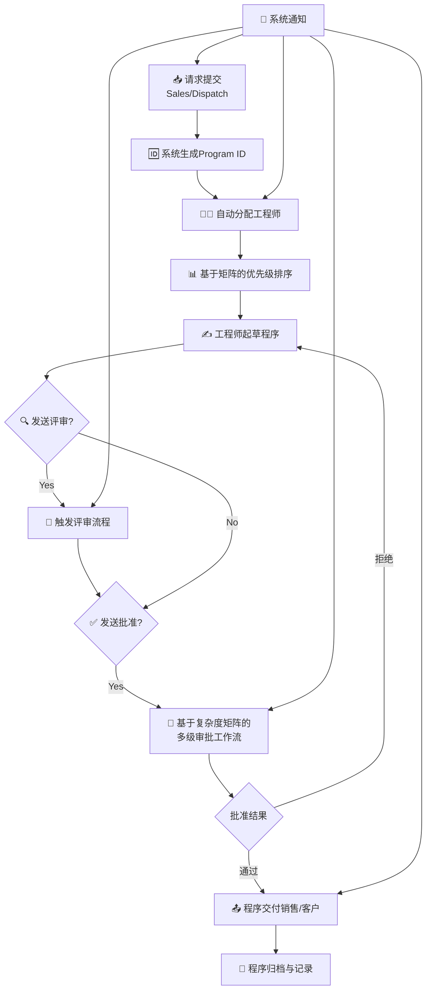
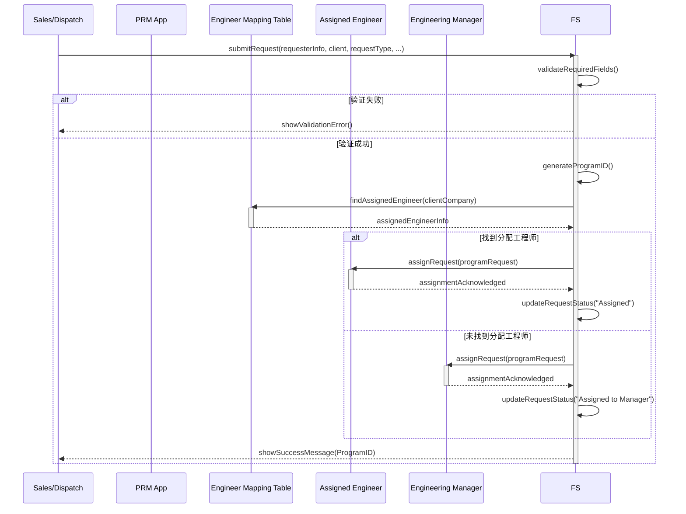
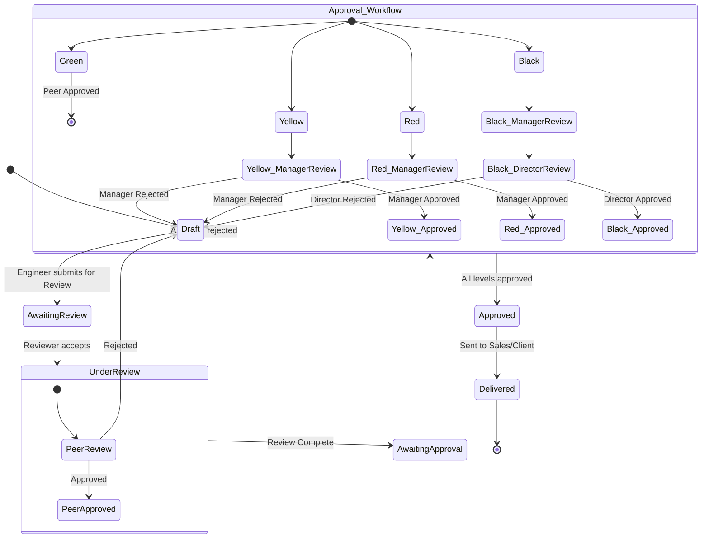
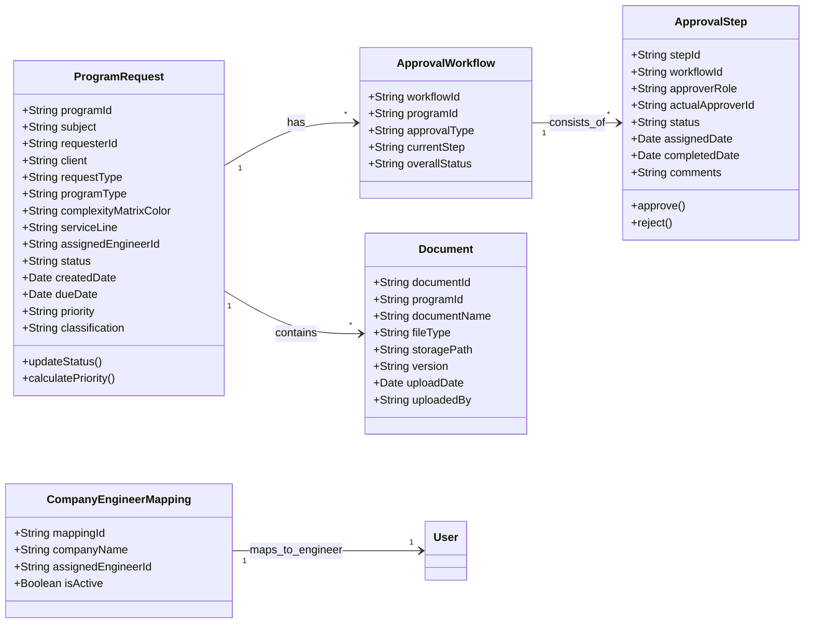

# **Program Request Management Module - 需求规格说明书**

## 1. 引言

### 1.1 目的
本文档定义了Program Request Management Module（程序请求管理模块）的完整需求规格，旨在将高层业务需求转化为结构化、可执行、可测试的系统需求，为后续的系统设计、开发和测试提供精确依据。

### 1.2 范围
本系统将自动化并标准化从接收、分配、评审、批准到跟踪的完整程序请求管理生命周期。系统边界仅包含内部自研的程序请求管理应用（PRM App）逻辑组件，涵盖销售、调度、工程师、审批人及现场团队等多个用户角色。

---

## 2. 整体功能概述

本模块核心是管理一个结构化的审批工作流，其高层业务流程如下：

## 3. 需求详细规格

### 3.1 程序请求提交与分配模块

#### 文字描述

**需求标识**: REQ-REQ-001
**需求名称**: 程序请求创建与自动分配
**业务描述**: 系统必须允许销售或调度人员通过电子邮件或门户网站提交新的程序请求。系统在收到请求后应自动生成唯一Program ID，并根据预设的“公司-工程师”映射表自动将任务分配给相应的工程师。

**前置条件**:
- 用户已成功登录系统。
- 存在有效的“公司-工程师”映射表。

**后置条件**:
- 创建新的程序请求记录，状态为“已开放”。
- 生成唯一的Program ID。
- 任务被自动分配给指定的工程师或工程经理。

**正常流程**:
1. 用户通过电子邮件或Web表单提交请求。
2. 系统验证必填字段并生成Program ID。
3. 系统根据客户公司名称查找映射表。
4. 找到映射：任务分配给指定的工程师。
5. 未找到映射：任务分配给工程经理进行手动分配。
6. 系统向被分配者发送通知。

**异常流程**:
- 必填字段缺失：系统拒绝请求并提示错误信息。
- 映射表无对应条目：任务分配给工程经理。

#### 交互图模型

### 3.2 复杂度矩阵审批工作流模块

#### 文字描述

**需求标识**: REQ-APP-001
**需求名称**: 基于复杂度矩阵的多级审批
**业务描述**: 当工程师完成程序起草后，系统必须根据请求的“复杂度矩阵颜色”自动触发相应的多级审批流程。审批路径必须严格遵循业务规则：绿色（同级评审）、黄色（经理/组长评审）、红色（经理批准）、黑色（经理+总监/副总裁批准）。

**业务规则**:
1. 审批路径由复杂度矩阵颜色唯一决定。
2. 每个审批阶段都必须记录审批人、时间、决定和评论。
3. 前一级审批未通过，不能进入下一级。
4. 审批人只能看到自己权限范围内的审批请求。

#### 状态图模型

### 3.3 系统核心数据模型

#### 类图模型

### 3.4 生命周期状态全集与映射

**FRD原始状态列表**：Open, Received, Pending, In Progress, Completed, Awaiting Review, Reviewed, Awaiting Approval, Approved, Sent to Sales / Awaiting Pricing, Unacknowledged, Acknowledged, Sent for Review, Sent for Approval。

**扩展模型过渡状态**（为实现更高审计粒度）：Unacknowledged, Acknowledged, Sent for Review, Sent for Approval, Sent to Sales。通过这些状态可更细致跟踪通知与动作之间的时间差。

| FRD状态 | 扩展状态对应 | 描述 |
|---------|--------------|------|
| Open | Open | 创建后的初始状态 |
| Received | Received | 系统记录并入队 |
| Unacknowledged | Unacknowledged | 指派已发送未确认 |
| Acknowledged | Acknowledged | 工程师确认接收 |
| Pending | Pending | 等待开始/资源/补充信息 |
| In Progress | InProgress | 起草进行中 |
| Sent for Review | SentForReview | 已触发评审通知 |
| Awaiting Review | AwaitingReview | 等待评审操作 |
| Reviewed | Reviewed | 评审结束有结果 |
| Sent for Approval | SentForApproval | 已触发审批通知 |
| Awaiting Approval | AwaitingApproval | 等待审批最终决定 |
| Approved | Approved | 审批通过内部完成 |
| Sent to Sales / Awaiting Pricing | SentToSales | 已交付销售，等待定价或后续动作 |
| Completed | Completed | 归档并关闭 |

> 审计日志需记录：状态进入时间戳、触发原因、操作人/系统、关联评论。

### 3.5 优先级计算规则 (与FRD一致)

| 优先级 | 条件 (相对到期时间) | SLA参考响应时间 | 是否允许On-Call分配 |
|--------|---------------------|------------------|----------------------|
| Urgent | <4 小时 | 首次响应 <15 分钟 | 是 |
| High | 当天 (≤ 当日23:59) | 首次响应 <30 分钟 | 视资源情况 |
| Medium | ≤2 天 | 正常队列 | 否 |
| Low | >2 天 | 延后队列 | 否 |

规则实现：`calculatePriority()` 根据 `dueDate - currentTime` 动态评估；变更优先级需记录旧值与原因。

### 3.6 复杂度矩阵审批规则表 (与FRD一致)

| 矩阵颜色 | 审批路径 | 角色级别 | 性质 | 终止条件 |
|----------|----------|----------|------|----------|
| Green | Peer Review | 同级工程师 | 评审 | 通过/拒绝 |
| Yellow | Manager/Lead Review | 经理/组长 | 评审 | 通过/拒绝 |
| Red | Manager Approval | 经理 | 最终批准 | 通过/拒绝 |
| Black | Manager Review → Director/VP Final Approval | 经理 + 总监/VP | 串行最终批准 | 全部通过/任一拒绝 |

拒绝逻辑：任一阶段拒绝 → 状态回退到 InProgress (或 Pending 若需重新准备) 并附评论。

### 3.7 多作业类型审批 (MVP 与演进)

MVP策略：含多作业类型的程序（不同矩阵颜色）可由最高权限审批者一次性批准，降低等待成本。

未来增强：每个作业类型独立记录审批步骤、评论与结果；聚合结果支持部分通过/部分拒绝；重新提交仅针对被拒绝项。

### 3.8 分类 (Classification) 规范

取值枚举：`Bid | Price Quote | Awarded Work`

用途：
- 报告转换率 (Bid → Awarded Work)
- 工作量与响应时间分层统计
- 定价与赢单分析

字段要求：在请求创建阶段必填；变更需记录审计条目。

### 3.9 搜索与报告需求补充

搜索过滤字段：Client, Program ID, Request Type, Program Type, Complexity Color, Service Line, Classification, DueDate Range, Status, Priority。

性能目标：单次搜索返回 <3 秒（数据量 ≤ 中等规模：10万记录）。

报告指标新增：
- Turnaround Time (平均/按矩阵颜色/按分类)
- Approval Cycle Duration (Peer / Manager / Director 分层)
- Rejection & Resubmission Rate
- Complexity Color Distribution
- Classification Conversion Rate
- Engineer Workload (按优先级 & 矩阵颜色)

### 3.10 文档与版本管理补充

Document实体需支持：`version` 自增、`uploadedBy` 追踪上传者、版本对比（外部实现）、软删除标记。

访问控制：未批准版本仅限工程师与相关评审/审批角色；批准后版本对 Sales、Operations 开放只读。

### 3.11 审计字段要求

必须捕获：`stateChange`, `assignmentChange`, `approvalDecision`, `priorityChange`, `classificationChange`, `documentUpload`。

日志字段：`eventId`, `timestamp`, `actorType(system|user)`, `actorId`, `eventType`, `oldValue`, `newValue`, `comments`。

---
### 3.12 字段显示自定义与个性视图

为满足不同角色的视图偏好，系统支持“字段显示自定义”与“个人视图配置”功能：

- 作用范围：每个用户可独立选择列表视图显示的列（不影响他人）；管理员可定义角色级默认视图模板。
- 配置项示例：`subject`, `client`, `requestType`, `programType`, `complexityMatrixColor`, `serviceLine`, `priority`, `dueDate`, `assignedEngineer`, `approvalStatus`, `classification`。
- 持久化：用户选择通过`UserViewPreference`存储（含用户ID、视图ID、字段集合、排序与过滤参数）。
- 交互要求：复选式字段选择器 + 拖拽排序；即时生效并可一键重置为角色默认。

### 3.13 集成与通知端点（内部应用）

- 邮件接收地址（程序请求 Intake，待确认）：`program-requests@sanjel.internal`
- 应用内通知：支持 Web 与 Mobile 推送（含深链接至请求详情）。
- 内部模块交互 API：
    - Request Intake API：创建/更新请求、附件处理、状态同步
    - Identity & Roles API：角色与分配关系同步
    - Events Webhook：状态变更、审批决定、优先级与分类变更回调
- 失败重试：通知/同步失败采用指数退避（最多3次），记录失败原因与 payload 用于审计。

### 3.14 关键枚举与取值（与FRD一致）

- `RequestType`：`ProgramGeneration | RFP | Revision | Simulation | RFI | RFQ`
- `ProgramType`：`Surface | Intermediate | Production`
- `ServiceLine`：`Primary | Remedial | Stimulation | Infrastructure`
- `ComplexityMatrixColor`：`Green | Yellow | Red | Black`
- `Priority`：`Urgent | High | Medium | Low`
- `Classification`：`Bid | Price Quote | Awarded Work`

以上枚举用于前端选择控件与后端校验；若需扩展，必须经配置变更并记录审计。

---

## 4. 非功能性需求

1.  **性能**:
    - 请求创建响应时间: < 2秒
    - 搜索操作响应时间: < 3秒
    - 系统应支持至少100个并发用户

2.  **可用性**:
    - 用户界面应直观，减少培训成本
    - 支持字段自定义显示，满足不同角色视图需求

3.  **集成性**:
    - 必须在内部 PRM App 服务模块之间通过统一 API 契约无缝协作
    - 支持与外部文档系统（如 SharePoint, eService）链接（可选）

4.  **安全性与审计**:
    - 严格的基于角色的访问控制
    - 记录所有关键操作（创建、分配、审批、状态变更）的完整审计日志

---

## 5. 总结

本需求规格说明书通过**四维描述法**，全面、无歧义地定义了Program Request Management Module的功能需求。
- **文字描述**提供了业务背景和详细规则。
- **类图模型**明确了系统的静态数据结构与核心实体关系。
- **交互图模型**展示了关键流程的动态协作行为。
- **状态图模型**刻画了核心对象（如请求、审批工作流）的生命周期。
