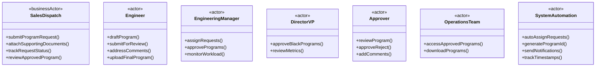
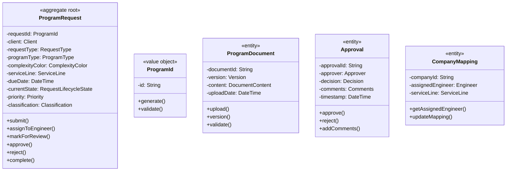
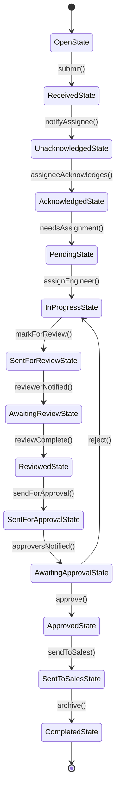
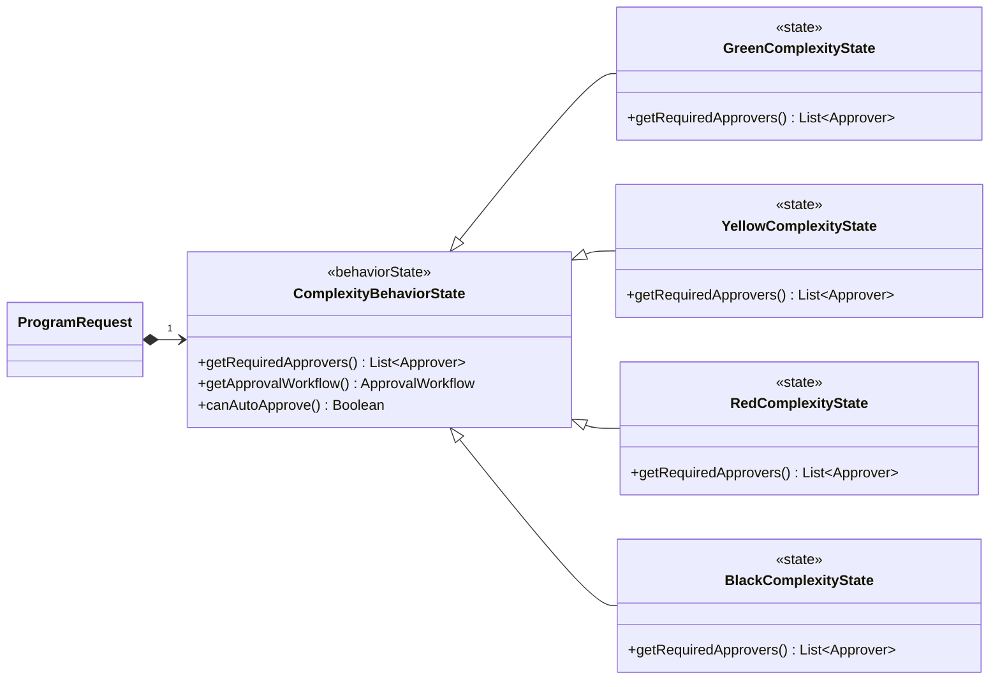
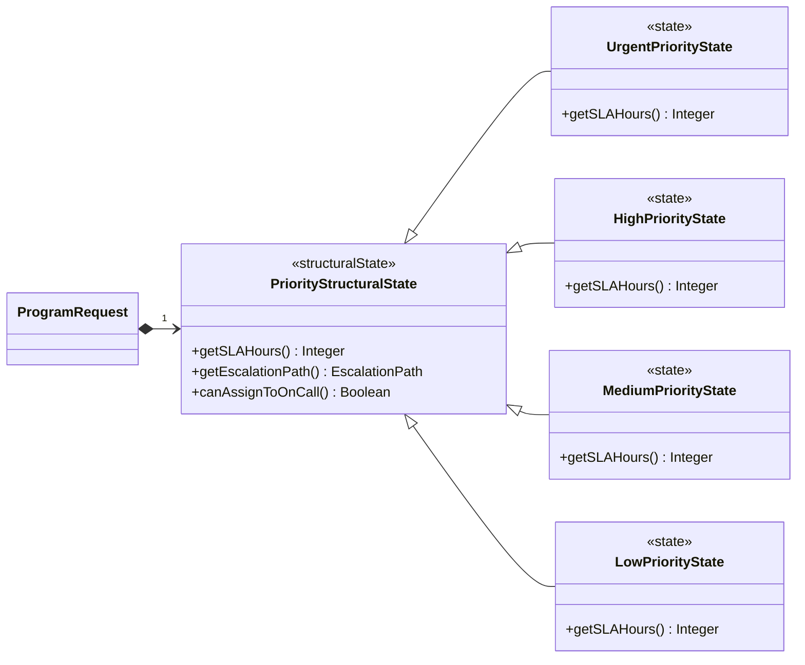
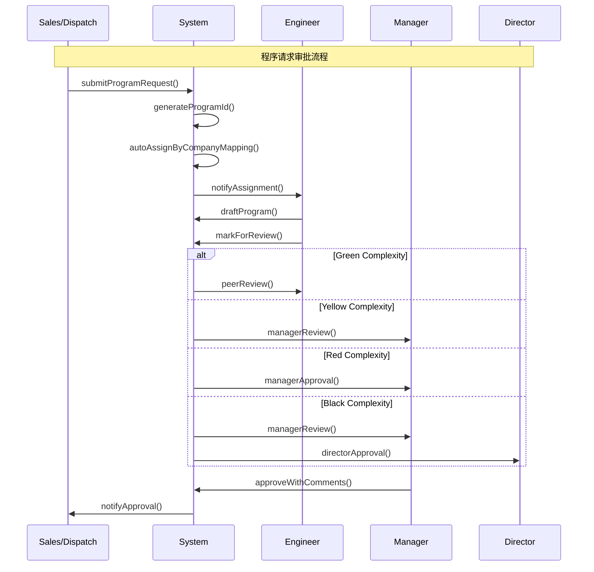
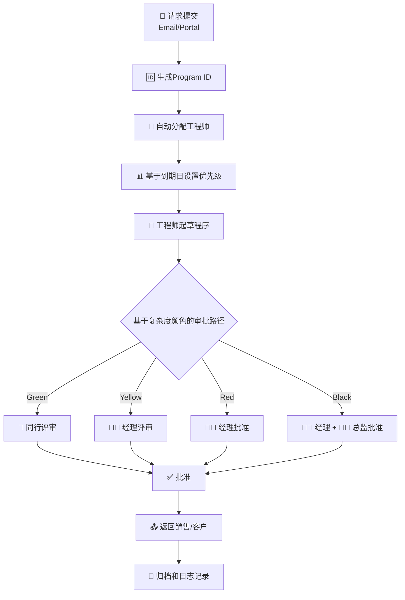
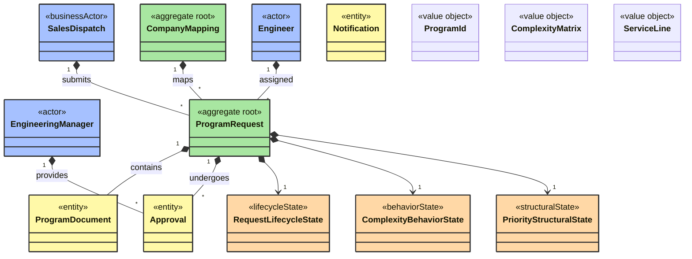

## 🎯 系统领域模型

### 1. 核心参与者识别



### 2. 核心领域实体与聚合根



### 3. 五维度状态模式应用

#### 3.1 请求生命周期状态模式

```mermaid
classDiagram
    direction TB
    
    class ProgramRequest {
        -currentState: RequestLifecycleState
        +changeState(newState: RequestLifecycleState)
    }
    
    class RequestLifecycleState {
        <<lifecycleState>>
        +canAssign() Boolean
        +canReview() Boolean
        +canApprove() Boolean
        +canComplete() Boolean
    }
    
    class OpenState {
        <<state>>
        +assignEngineer(request: ProgramRequest)
    }
    
    class ReceivedState {
        <<state>>
        +acknowledge(request: ProgramRequest)
    }
    
    class UnacknowledgedState {
        <<state>>
        +notifyAssignee(request: ProgramRequest)
    }
    
    class AcknowledgedState {
        <<state>>
        +beginWork(request: ProgramRequest)
    }
    
    class PendingState {
        <<state>>
        +awaitAssignment(request: ProgramRequest)
    }
    
    class InProgressState {
        <<state>>
        +markForReview(request: ProgramRequest)
    }
    
    class SentForReviewState {
        <<state>>
        +enterAwaitingReview(request: ProgramRequest)
    }
    
    class AwaitingReviewState {
        <<state>>
        +review(request: ProgramRequest)
    }
    
    class ReviewedState {
        <<state>>
        +prepareApproval(request: ProgramRequest)
    }
    
    class SentForApprovalState {
        <<state>>
        +enterAwaitingApproval(request: ProgramRequest)
    }
    
    class AwaitingApprovalState {
        <<state>>
        +approve(request: ProgramRequest)
        +reject(request: ProgramRequest)
    }
    
    class ApprovedState {
        <<state>>
        +sendToSales(request: ProgramRequest)
    }
    
    class SentToSalesState {
        <<state>>
        +deliver(request: ProgramRequest)
    }
    
    class CompletedState {
        <<state>>
        +archive(request: ProgramRequest)
    }
    
    ProgramRequest *--> "1" RequestLifecycleState
    RequestLifecycleState <|-- OpenState
    RequestLifecycleState <|-- ReceivedState
    RequestLifecycleState <|-- UnacknowledgedState
    RequestLifecycleState <|-- AcknowledgedState
    RequestLifecycleState <|-- PendingState
    RequestLifecycleState <|-- InProgressState
    RequestLifecycleState <|-- SentForReviewState
    RequestLifecycleState <|-- AwaitingReviewState
    RequestLifecycleState <|-- ReviewedState
    RequestLifecycleState <|-- SentForApprovalState
    RequestLifecycleState <|-- AwaitingApprovalState
    RequestLifecycleState <|-- ApprovedState
    RequestLifecycleState <|-- SentToSalesState
    RequestLifecycleState <|-- CompletedState
```



**状态转换图**：


**状态与FRD字段映射**：
| FRD状态 | 领域模型状态 | 说明 |
|---------|--------------|------|
| Open | OpenState | 初始创建 |
| Received | ReceivedState | 系统接收并记录 |
| Unacknowledged | UnacknowledgedState | 已指派未确认 |
| Acknowledged | AcknowledgedState | 工程师已确认 |
| Pending | PendingState | 待正式开始/等待资源或分配细化 |
| In Progress | InProgressState | 工程师处理中 |
| Sent for Review | SentForReviewState | 已触发评审通知 |
| Awaiting Review | AwaitingReviewState | 评审者等待处理 |
| Reviewed | ReviewedState | 评审完成结果已记录 |
| Sent for Approval | SentForApprovalState | 已触发审批通知 |
| Awaiting Approval | AwaitingApprovalState | 等待审批输入 |
| Approved | ApprovedState | 审批通过内部完成 |
| Sent to Sales / Awaiting Pricing | SentToSalesState | 已交付销售定价 |
| Completed | CompletedState | 归档结束 |

> 注：FRD中“状态”与界面展示标签保持一致，本模型扩展了过渡辅助状态以提升可追溯性。

#### 3.2 复杂度行为状态模式



#### 3.3 优先级结构状态模式



### 4. 业务流模式系统化应用

#### 4.1 状态机驱动流 - 核心审批流程



#### 4.2 业务流程驱动流 - 端到端处理



### 5. 完整领域模型概览



### 6. 关键业务规则

#### 6.1 自动分配规则
```yaml
AutoAssignment:
  rules:
    - if: company_mapping_exists
      then: assign_to_mapped_engineer
    - if: no_mapping_found
      then: assign_to_engineering_manager
    - if: urgent_or_after_hours
      then: assign_to_on_call_engineer
```

#### 6.2 审批矩阵规则
```yaml
ApprovalMatrix:
  Green: 
    required_approvers: ["Peer Engineer"]
  Yellow:
    required_approvers: ["Manager/Lead"]
  Red:
    required_approvers: ["Manager"]
  Black:
    required_approvers: ["Manager", "Director/VP"]
```

#### 6.3 优先级计算规则
```yaml
PriorityCalculation:
  Urgent: "<4 hours to due date"
  High: "Same day due date"
  Medium: "Within 2 days"
  Low: ">2 days"
```

### 7. 模式组合验证

**有效模式组合**：
```yaml
ProgramRequestManagement:
  state_patterns:
    - lifecycle: 请求生命周期状态
    - behavioral: 复杂度行为状态
    - structural: 优先级结构状态
  flow_patterns:
    - state_machine: 状态机驱动审批流
    - business_process: 端到端业务流程
```
