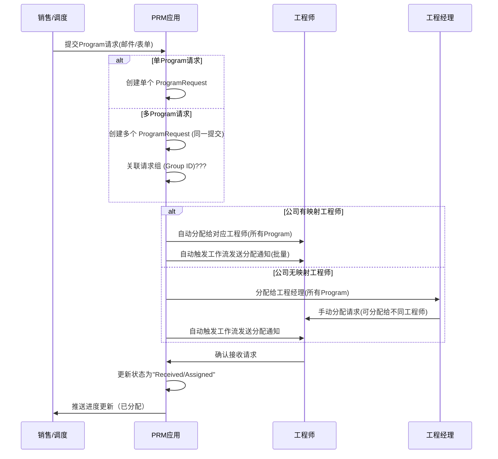
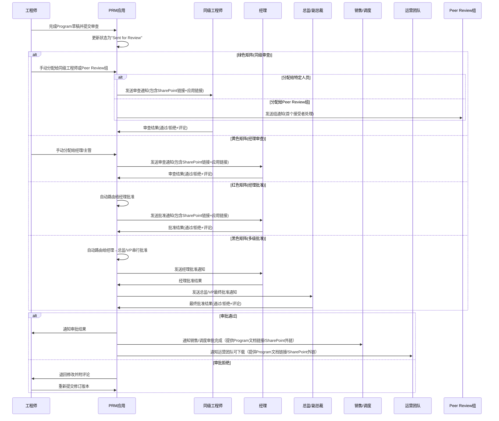
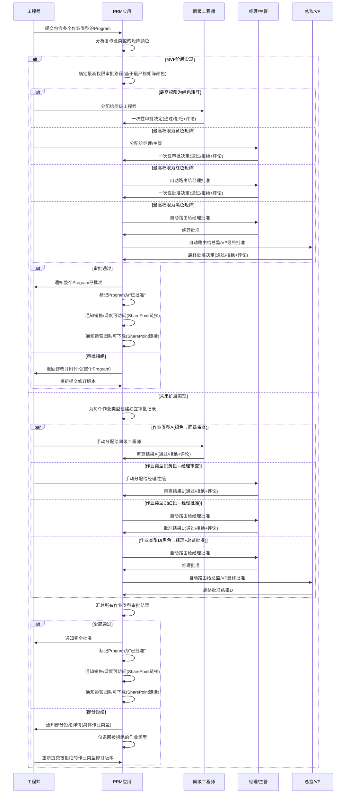
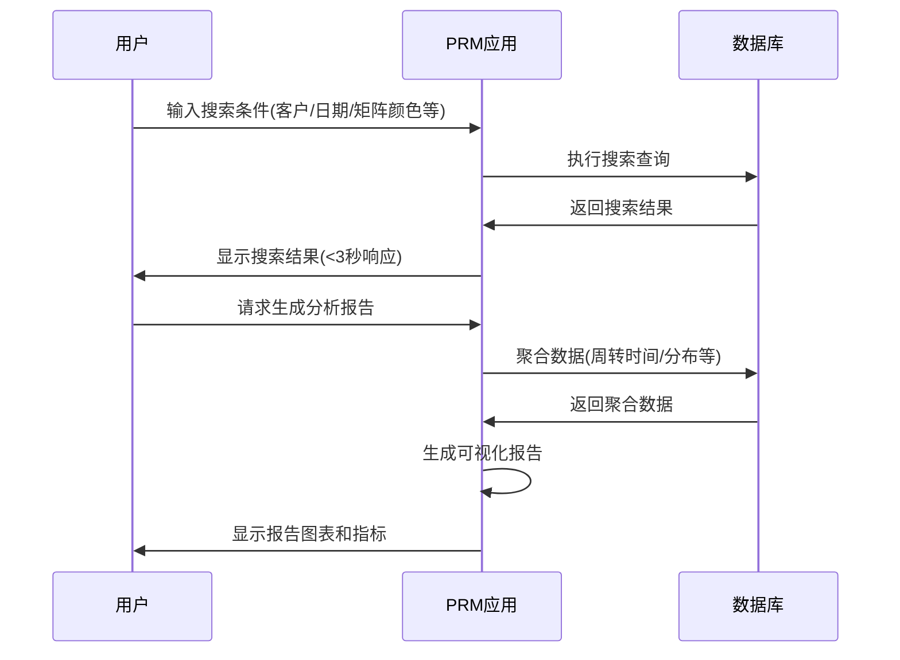

## 1. Program请求提交与分配流程

## 2. Program审查与批准流程

## 3. 多作业类型审批流程

## 4. 搜索与报告生成流程

这些序列图涵盖了文档中描述的主要业务流程，包括：
- 请求提交和自动分配（支持单Program/多Program请求）
- 基于复杂度矩阵的多级审批
- 多作业类型的并行审批
- 全生命周期状态跟踪
- 搜索和报告功能

## 6. 生命周期状态一致性补充

为与FRD定义的状态集保持一致，系统用例涉及的显式或隐式状态如下：

| FRD状态 | 用例中体现的动作/备注 | 说明 |
|---------|------------------------|------|
| Open | 提交Program请求 | 请求首次进入系统 |
| Received | 请求已接收 (提示) | 系统记录并进入接收阶段 |
| Unacknowledged | 发送分配通知 | 已指派但工程师未确认（隐含） |
| Acknowledged | 工程师确认接收 | 工程师主动确认分配 |
| Pending | 等待开始/分配细化 | 无明确操作时的过渡（隐含） |
| In Progress | 草稿进行中 | 工程师起草Program |
| Sent for Review | 提交审查 | 触发评审通知 |
| Awaiting Review | 审查通知已发送 | 等待评审者处理 |
| Reviewed | 审查通过/拒绝 | 评审结束并产生结果 |
| Sent for Approval | (黄色/红色/黑色路径触发审批) | 已进入审批通知阶段 |
| Awaiting Approval | 经理/总监审批等待 | 等待最终决策输入 |
| Approved | 审批通过 | Program被批准 |
| Sent to Sales / Awaiting Pricing | 通知销售可访问最终Program | 销售/定价处理前置状态 |
| Completed | 上传最终文档并归档 | 生命周期闭合 |

> 注：用例文本中未显式出现的辅助过渡状态（Unacknowledged, Pending, Sent for Approval 等）在序列图外通过系统自动动作存在。

## 7. 多作业类型审批 (MVP说明)

当前实现 (MVP)：当一个Program包含多个作业类型且各自矩阵颜色不同时，由最高权限审批者基于最严格的矩阵颜色一次性批准整个Program，避免多次串行等待。审批包含：
- 邮件通知（包含SharePoint文档链接和应用链接）
- 工作流内通知（支持接受/拒绝操作界面）
- 审批记录（时间、结果、评论）
- 拒绝时自动退回工程师修订

未来扩展：每个作业类型独立记录审批步骤、结果与评论；部分拒绝时仅需重新提交被拒绝作业类型，其他保持通过状态。

## 8. 优先级与SLA补充

| 优先级 | FRD定义条件 | 用例触发点 | SLA示例 (参考) |
|--------|-------------|------------|----------------|
| Urgent | 距到期 < 4 小时 | 自动分类和优先级排序 | 响应 < 15 分钟，处理加速 |
| High | 当天到期 | 自动分类 | 首次响应 < 30 分钟 |
| Medium | 2 天内到期 | 自动分类 | 正常队列 |
| Low | >2 天 | 自动分类 | 延后处理 |

## 9. 审批路径精确描述

| 矩阵颜色 | 用例动作 | 角色 | 性质 | 通知方式 |
|----------|----------|------|------|----------|
| Green | 工程师手动分配给同级工程师审查 | 同级工程师 | 评审 (Peer Review) | 邮件+工作流内通知 |
| Yellow | 工程师手动分配给经理/主管审查 | 经理/主管 | 评审 (Manager Review) | 邮件+工作流内通知 |
| Red | 系统路由给经理批准 | 经理 | 最终批准 | 邮件+工作流内通知 |
| Black | 系统路由给经理→总监/VP最终批准 | 经理 + 总监/VP | 串行多级最终批准 | 邮件+工作流内通知 |

**通知内容要求：**
- SharePoint文档链接（可点击）
- 应用内操作链接（接受/拒绝+评论）
- 请求详情（ID、客户、服务线）
- 审查截止日期

## 10. 分类与报告补充

分类(Classification)：Bid / Price Quote / Awarded Work；在“Program请求提交与分配流程”阶段记录，用于后续转换率与周转报告。

报告扩展指标：
- 各矩阵颜色分布
- 审批平均耗时(分层：Peer/Manager/Director)
- 重提交率 (Reject 后重新提交次数)
- 分类转换率 (Bid→Awarded Work)
- 多Program请求完成率(同一提交内所有Program完成比例)
- 批量分配效率(单次分配处理的Program数量)
