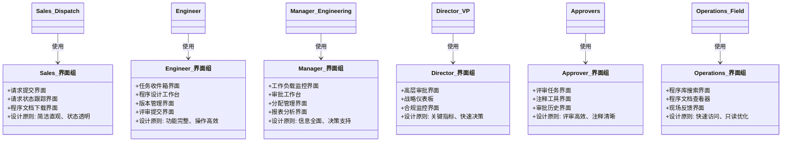

# Program Request Management 系统原型设计文档

## 1. 文档概述

### 1.1 设计背景
本原型设计基于**模式驱动的界面原型方法论**，在AI辅助开发全周期中，为Program Request Management系统创建可维护、可扩展的界面原型。

### 1.2 AI辅助开发说明
- **开发阶段**：需求分析、界面设计、开发实现、测试验证
- **AI工具**：DeepSeek/Copilot辅助代码生成、模式分析、一致性检查
- **信息留痕**：所有设计决策、模式分析、变更记录均文档化保存

---

## 2. 参与者分析与界面规划

### 2.1 参与者角色映射

### 2.2 参与者专属界面组设计

---

## 3. 状态模式驱动的界面设计

### 3.1 程序请求生命周期状态映射

### 3.2 状态驱动的界面组件设计

**审批颜色与路径补充说明**：
| 矩阵颜色 | 路径阶段 | 对应状态 | 说明 |
|----------|----------|----------|------|
| Green | 同级评审 | SentForReviewState → AwaitingReviewState → ReviewedState | 仅同行评审，无管理审批 |
| Yellow | 经理/组长评审 | ReviewedState → SentForApprovalState → AwaitingApprovalState | 经理审核性质为评审而非最终双层审批 |
| Red | 经理批准 | ReviewedState → SentForApprovalState → AwaitingApprovalState → ApprovedState | 经理直接最终批准 |
| Black | 经理+总监/VP批准 | ReviewedState → SentForApprovalState → AwaitingApprovalState (经理) → SentForApprovalState(二次) → AwaitingApprovalState(总监/VP) → ApprovedState | 多级串行审批 |

> 注：为减少界面复杂度，Yellow不再拆分“评审/批准”双层；Black在组件中以分段步骤显示。

---

## 4. 业务流模式驱动的界面导航

### 4.1 主要业务流程界面导航

### 4.2 复杂度矩阵驱动的审批流程

---

## 5. 参与者专属界面设计要点

### 5.1 Sales/Dispatch界面设计

### 5.2 Engineer工作台设计

---

## 6. AI辅助开发实施指南

### 6.1 开发阶段AI应用规划

### 6.2 信息留痕与审计要求

**AI辅助开发记录表**
| 阶段 | AI工具 | 输入内容 | 输出结果 | 人工验证 | 决策依据 | 时间戳 |
|------|--------|----------|----------|----------|----------|--------|
| 需求分析 | DeepSeek | FRD文档 | 参与者分析 | ✅ 已验证 | 模式一致性 | 2026-01-20 10:00 |
| 界面设计 | Copilot | 状态模式 | 组件设计 | ✅ 已验证 | 用户体验原则 | 2026-01-20 11:30 |
| 代码生成 | Copilot | 组件规范 | C#代码 | ⏳ 待验证 | 技术架构标准 | 2026-01-20 14:15 |

---

## 7. 原型验证与质量保证

### 7.1 模式一致性检查清单

- [ ] **状态一致性**：界面状态与程序请求状态机是否完全匹配
- [ ] **审批流程完整性**：所有复杂度矩阵路径都有对应界面流程
- [ ] **角色权限适配**：各参与者界面功能与权限要求一致
- [ ] **业务流覆盖**：界面导航覆盖所有业务场景路径
- [ ] **通知机制**：关键状态变化都有界面反馈和通知

### 7.2 AI辅助开发质量指标

## 8. 总结

本系统原型设计文档基于模式驱动的方法论，为Program Request Management系统提供了：

### 8.1 核心价值
- **业务技术一致性**：界面设计与业务需求精确对应
- **开发指导明确**：为AI辅助开发提供清晰规范
- **用户体验优化**：基于参与者角色的专属设计
- **变更可追溯**：完整的模式映射支持需求变更

### 8.2 AI辅助开发优势
1. **模式识别加速**：快速分析业务模式并生成对应界面
2. **一致性保证**：自动化检查设计模式的一致性
3. **开发效率提升**：基于模式的代码自动生成
4. **质量可度量**：建立客观的质量评估指标

### 8.3 实施建议
1. **渐进式实施**：按参与者角色分阶段开发验证
2. **持续验证**：每个迭代周期进行模式一致性检查
3. **反馈循环**：建立用户反馈到模式优化的闭环
4. **知识沉淀**：将AI辅助开发经验转化为可复用模式

此原型设计为AI辅助开发提供了系统化的框架，确保在提高开发效率的同时，保持系统的可维护性和用户体验质量。
