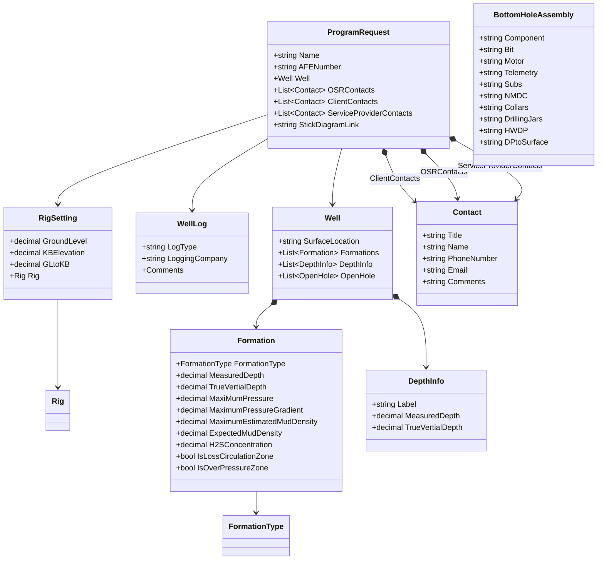

Questions:

1. Section 6, what does SS Depth stand for?
1. Section 7, need explanation line by line for BHA? What is important to us. The mapping template has current data structure. I set up a new structure called BottomHoleAssembly. Please review the mapping document. If any field needs to be split further, please provide the definition and parsing rules