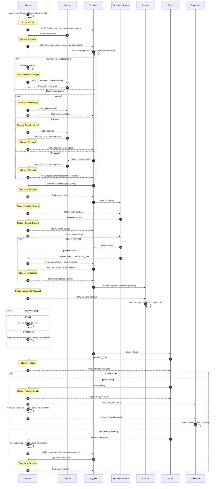

```mermaid

sequenceDiagram
    autonumber
    participant SYS as System
    participant JER as Jeremy
    participant ENG as Engineer
    participant REV as Reviewer (Group)
    participant APR as Approver
    participant SAL as Sales
    participant OPS as Operations

    %% ========== 1) Program Request Creation ==========
    SYS->>SYS: Auto-create Program Request (from email)
    Note over SYS: Status = Open
    SYS-->>ENG: Notify: Engineering group (new request open)

    %% ========== 2) Assignment ==========
    JER->>SYS: Assign to engineer
    Note over SYS: Status = Assigned
    SYS-->>ENG: Notify: Engineering group (assignment broadcast)

    %% Await acceptance by the assigned engineer
    ENG->>ENG: Review assignment (Accept / Decline / Reassign)

    alt SLA timeout (no response)
        SYS->>SYS: SLA timer elapsed
        Note over SYS: Status = Unacknowledged
        SYS-->>JER: Notify: SLA breach / unacknowledged
        JER->>SYS: (Reassign / follow-up)
    else Engineer responds
        alt Accept
            Note over SYS: Status = Acknowledged
            SYS-->>JER: Notify: acknowledged
            SYS-->>ENG: Notify: acknowledged
        else Decline
            Note over SYS: Status = Open (declined)
            SYS-->>JER: Notify: declined
            JER->>SYS: Reassign to another engineer
            Note over SYS: Status = Assigned
            SYS-->>ENG: Notify: assignment broadcast
        else Reassign
            ENG->>JER: Request reassignment
            JER->>SYS: Reassign to another engineer
            Note over SYS: Status = Assigned
            SYS-->>ENG: Notify: reassigned (broadcast/new assignee)
        end
    end

    %% ========== 3) Engineering Work ==========
    ENG->>SYS: Open Data‑Audit tool (begin work)
    Note over SYS: Status = In Progress
    SYS-->>ENG: Notify: work started

    %% ========== 4) Review ==========
    ENG->>REV: Send for Review
    Note over SYS: Status = Awaiting Review
    SYS-->>REV: Notify: awaiting review

    REV->>SYS: Reviewer accepts
    Note over SYS: Status = Review Started
    SYS-->>ENG: Notify: review started
    SYS-->>REV: Notify: review started

    alt Review outcome
        %% Pass
        REV-->>ENG: Review passed
        %% (No status change here; move to approval)
    else Review failed
        REV-->>SYS: Review failed → back to Engineer
        SYS-->>ENG: Notify: review failed — rework needed
        ENG->>SYS: Re-open Data‑Audit tool (iterate)
        Note over SYS: Status = In Progress
        SYS-->>ENG: Notify: work started (rework)
    end

    %% ========== 5) Approval ==========
    ENG->>APR: Send for Approval (specific approver)
    Note over SYS: Status = Waiting for Approval
    SYS-->>APR: Notify: awaiting approval

    APR->>APR: Perform approval (Final / Conditional)

    alt Approval type
        else Final
            SYS->>SYS: Record approval: Final
        else Conditional
            SYS->>SYS: Record approval: Conditional (restrict downstream)
    end

    %% ========== 6) Send to Sales / Pricing ==========
    ENG->>SAL: Send to Sales
    SAL->>SYS: Open Pricing Tool
    Note over SYS: Status = Pricing
    SYS-->>SAL: Notify: pricing in progress

    alt Sales action
        else Save pricing
            SAL->>SYS: Save pricing
            Note over SYS: Status = Program Ready
            SYS-->>SAL: Notify: program ready
            SYS-->>OPS: Notify: program ready
            SYS->>SYS: Print/Generate PDF → auto‑save to SharePoint
            SYS-->>OPS: Notify: released document
            OPS->>OPS: Released Document available
        else Request adjustment
            SAL->>SYS: Request adjustment
            SYS->>SYS: Reset approvals (due to pricing adjustment)
            SYS-->>ENG: Notify: restart cycle (re‑review & approvals)
            %% Back to Engineering rework loop
            ENG->>SYS: Open Data‑Audit tool
            Note over SYS: Status = In Progress
            SYS-->>ENG: Notify: work started
    end
```