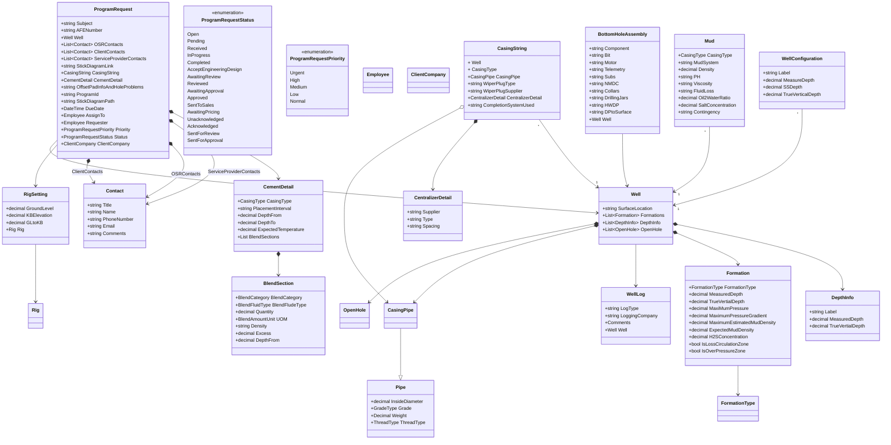

<!-- Identifier: D-01-04 -->

Questions:

1. Section 6, what does SS Depth stand for?
1. Section 7, need explanation line by line for BHA? What is important to us. The mapping template has current data structure. I set up a new structure called BottomHoleAssembly. Please review the mapping document. If any field needs to be split further, please provide the definition and parsing rules
1. There are notations for the depth in the  Well Configuration (Section 6), please clarify following definition. They are refered in BHA and Casing Information
   - Surface: Ground Level, should be 0
   - SCP: Surface Casing Point. 
   - Base of Groundwater
   - ICP: Intermediate Casing Point.
   - KOP: ?
   - ICP: Intermediate Casing Point
   - Build
   - Tangent
   - Casing XO
   - Heel
   - Turn
   - EOT
   - TD
   - Drill Out: Actual drilling depth to be updated while drilling happens.
