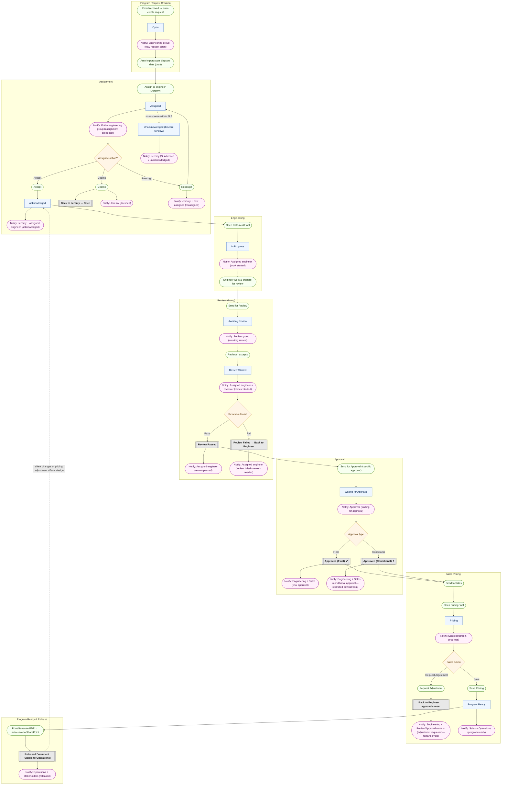

```mermaid

flowchart TD
  %% ==== STYLES ====
  classDef status fill:#eef6ff,stroke:#4a7bd0,stroke-width:1px,color:#0b2a55;
  classDef action fill:#f7fff0,stroke:#70a34a,stroke-width:1px,color:#1f3d12;
  classDef decision fill:#fff5e6,stroke:#c27d24,stroke-width:1px,color:#5a3300;
  classDef terminal fill:#e8e8e8,stroke:#666,stroke-width:1px,color:#222,font-weight:bold;
  classDef notification fill:#fff0fb,stroke:#b04bb3,stroke-width:1px,color:#4a0e4f;

  %% ==== PHASE 1: REQUEST CREATION ====
  subgraph S0["Program Request Creation"]
    direction TB
    A0(["Email received → auto-create request"]):::action
    A1["Open"]:::status
    N_A1(["Notify: Engineering group (new request open)"]):::notification
    A2(["Auto-import state diagram data (draft)"]):::action

    A0 --> A1 --> N_A1 --> A2
  end

  %% ==== PHASE 2: ASSIGNMENT ====
  subgraph S1["Assignment"]
    direction TB
    A2-->B0(["Assign to engineer (Jeremy)"]):::action
    B1["Assigned"]:::status
    N_B1(["Notify: Entire engineering group (assignment broadcast)"]):::notification
    B2{"Assignee action?"}:::decision
    B3(["Accept"]):::action
    B4(["Decline"]):::action
    B5(["Reassign"]):::action
    B6["Unacknowledged (timeout window)"]:::status
    N_B6(["Notify: Jeremy (SLA breach / unacknowledged)"]):::notification

    B0 --> B1 --> N_B1 --> B2
    B2 -->|Accept| B3 --> B7["Acknowledged"]:::status
    N_B7(["Notify: Jeremy + assigned engineer (acknowledged)"]):::notification
    B7 --> N_B7

    B2 -->|Decline| B4 --> B8[["Back to Jeremy → Open"]]:::terminal
    N_B4(["Notify: Jeremy (declined)"]):::notification
    B4 --> N_B4

    B2 -->|Reassign| B5 --> B1
    N_B5(["Notify: Jeremy + new assignee (reassigned)"]):::notification
    B5 --> N_B5

    B1 -. "no response within SLA" .-> B6 --> N_B6
  end

  %% ==== PHASE 3: ENGINEERING WORK ====
  subgraph S2["Engineering"]
    direction TB
    C0(["Open Data-Audit tool"]):::action
    C1["In Progress"]:::status
    N_C1(["Notify: Assigned engineer (work started)"]):::notification
    C2(["Engineer work & prepare for review"]):::action

    B7 --> C0 --> C1 --> N_C1 --> C2
  end

  %% ==== PHASE 4: REVIEW ====
  subgraph S3["Review (Group)"]
    direction TB
    D0(["Send for Review"]):::action
    D1["Awaiting Review"]:::status
    N_D1(["Notify: Review group (awaiting review)"]):::notification
    D2(["Reviewer accepts"]):::action
    D3["Review Started"]:::status
    N_D3(["Notify: Assigned engineer + reviewer (review started)"]):::notification
    D4{"Review outcome"}:::decision
    D5[["Review Passed"]]:::terminal
    N_D5(["Notify: Assigned engineer (review passed)"]):::notification
    D6[["Review Failed → Back to Engineer"]]:::terminal
    N_D6(["Notify: Assigned engineer (review failed—rework needed)"]):::notification

    C2 --> D0 --> D1 --> N_D1 --> D2 --> D3 --> N_D3 --> D4
    D4 -->|Pass| D5 --> N_D5
    D4 -->|Fail| D6 --> N_D6
  end

  %% ==== PHASE 5: APPROVAL ====
  subgraph S4["Approval"]
    direction TB
    E0(["Send for Approval (specific approver)"]):::action
    E1["Waiting for Approval"]:::status
    N_E1(["Notify: Approver (waiting for approval)"]):::notification
    E2{"Approval type"}:::decision
    E3[["Approved (Final) ✅"]]:::terminal
    N_E3(["Notify: Engineering + Sales (final approval)"]):::notification
    E4[["Approved (Conditional) ❓"]]:::terminal
    N_E4(["Notify: Engineering + Sales (conditional approval—restricted downstream)"]):::notification

    D5 --> E0 --> E1 --> N_E1 --> E2
    E2 -->|Final| E3 --> N_E3
    E2 -->|Conditional| E4 --> N_E4
  end

  %% ==== PHASE 6: SALES PRICING (PHASE 1 SCOPE) ====
  subgraph S5["Sales Pricing"]
    direction TB
    F0(["Send to Sales"]):::action
    F1(["Open Pricing Tool"]):::action
    F2["Pricing"]:::status
    N_F2(["Notify: Sales (pricing in progress)"]):::notification
    F3{"Sales action"}:::decision
    F4(["Save Pricing"]):::action
    F5(["Request Adjustment"]):::action
    F6[["Back to Engineer → approvals reset"]]:::terminal
    N_F6(["Notify: Engineering + Review/Approval owners (adjustment requested—restarts cycle)"]):::notification

    E3 --> F0 --> F1 --> F2 --> N_F2 --> F3
    E4 --> F0
    F3 -->|Save| F4 --> G0["Program Ready"]:::status
    N_G0(["Notify: Sales + Operations (program ready)"]):::notification
    G0 --> N_G0
    F3 -->|Request Adjustment| F5 --> F6 --> N_F6
  end

  %% ==== PHASE 7: PROGRAM READY & PRINT/RELEASE ====
  subgraph S6["Program Ready & Release"]
    direction TB
    G1(["Print/Generate PDF → auto-save to SharePoint"]):::action
    G2[["Released Document (visible to Operations)"]]:::terminal
    N_G2(["Notify: Operations + stakeholders (released)"]):::notification

    G0 --> G1 --> G2 --> N_G2
  end

  %% ==== BACK-LOOPS FOR CHANGE ====
  %% Client change or Sales adjustment forces re-review & re-approval
  G2 -. "client changes or pricing adjustment affects design" .-> B7

```