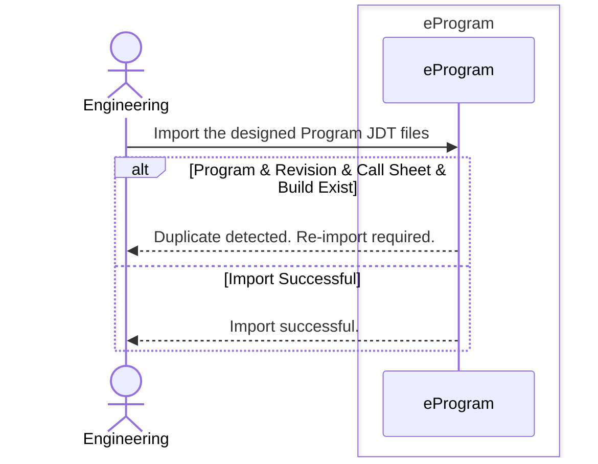

#  Prepare Job Design

```mermaid
sequenceDiagram

actor Engineering
box eProgram
  participant eProgram  
end
Engineering->>eProgram:Import the designed Program JDT files
alt Program & Revision & Call Sheet & Build Exist
        eProgram-->>Engineering: Duplicate detected. Re-import required.
    else Import Successful
        eProgram-->>Engineering: Import successful. 
    end
```
