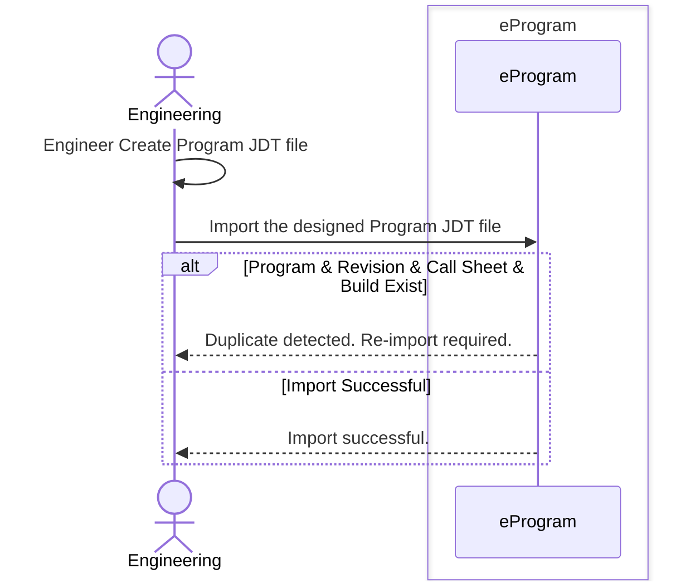

<!-- Identifier: C-01-05 -->
<!-- Name: Prepare Job Design -->

```mermaid
sequenceDiagram

actor Engineering
box eProgram
  participant eProgram  
end
Engineering->>Engineering:Engineer Create Program JDT file
Engineering->>eProgram:Import the designed Program JDT file
alt Program & Revision & Call Sheet & Build Exist
        eProgram-->>Engineering: Duplicate detected. Re-import required.
    else Import Successful
        eProgram-->>Engineering: Import successful. 
    end
```
