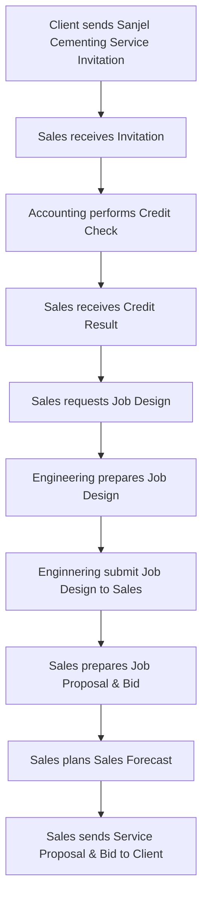

<!-- Identifier: P-01 -->
<!-- Name: Cementing Service Invitation -->

```mermaid
flowchart TD
    A[Client sends Sanjel Cementing Service Invitation] --> B[Sales receives Invitation]
    B --> C[Accounting performs Credit Check]
    C --> D[Sales receives Credit Result]
    D --> E[Sales requests Job Design]
    E-->E1[Engineering prepares Job Design]
    E1 --> G[Enginnering submit Job Design to Sales]
    G --> H[Sales prepares Job Proposal & Bid]
    H --> I[Sales plans Sales Forecast]
    I --> J[Sales sends Service Proposal & Bid to Client]
```
