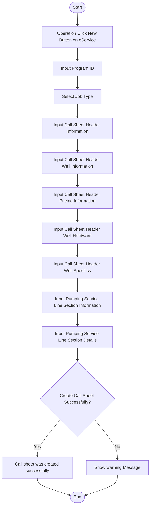
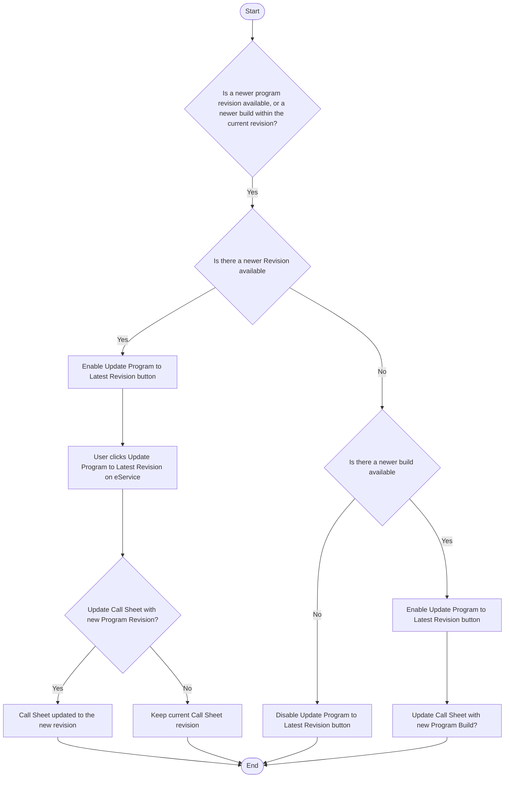

<!-- Identifier: P-04 -->
<!-- Name:  Create or Update Call Sheet -->

```mermaid
flowchart TD
    A([Start]) --> B[Operation Click New Button on eService]
    B --> C[Input Program ID]
    C --> D[Select Job Type]
    D --> E[Input Call Sheet Header Information]
    E --> F[Input Call Sheet Header Well Information]
    F --> G[Input Call Sheet Header Pricing Information]
    G --> H[Input Call Sheet Header Well Hardware]
    H --> I[Input Call Sheet Header Well Specifics]
    I --> J[Input Pumping Service Line Section Information]
    J --> K[Input Pumping Service Line Section Details]
    K --> L{Create Call Sheet Successfully?}
    L -- Yes --> M[Call sheet was created successfully]
    L -- No --> N[Show warning Message]
   
    M --> O([End])
    N--> O
```

```mermaid
flowchart TD
    A([Start]) --> B{Is a newer program revision available, or a newer build within the current revision?}
    B -->|Yes| C1{"Is there a newer Revision available"}
    C1-->|Yes|D1["Enable Update Program to Latest Revision button"]
    D1--> D3[User clicks Update Program to Latest Revision on eService]
    D3-->F{Update Call Sheet with new Program Revision?}
   %% B -->|No| 
    %%B -->|Yes| C["Enable Update Program to Latest Revision button"]
    C1 -->|No| D2{Is there a newer build available}
    D2-->|Yes|D5["Enable Update Program to Latest Revision button"]
    D5-->D6[Update Call Sheet with new Program Build?]
    D2-->|No|D4["Disable Update Program to Latest Revision button"]
    %%C --> D[User clicks Update Program to Latest Revision on eService]
    %%D3 --> E[Different update page is displayed]
    
    F -->|Yes| G[Call Sheet updated to the new revision]
    F -->|No| H[Keep current Call Sheet revision]
    G --> O([End])
    H --> O
    D4 --> O
    D6--> O
```

