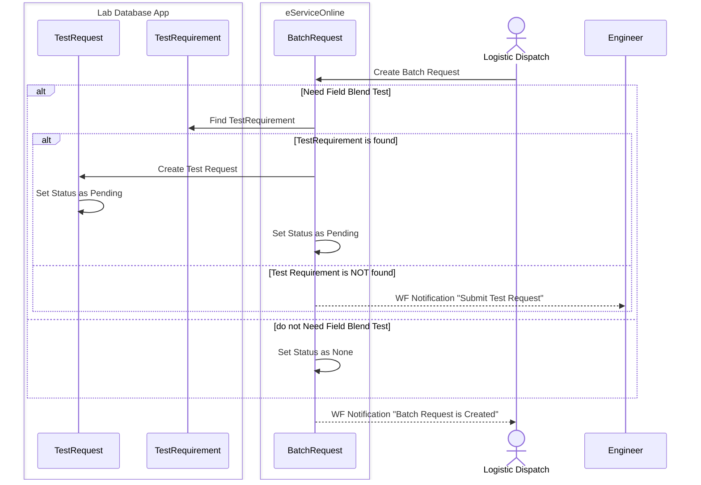

<!-- Identifier: C-04-09-01 -->
<!-- Name:  Create Batch Request -->

```mermaid
sequenceDiagram
box Lab Database App
participant TestRequest
participant TestRequirement
end
box eServiceOnline
participant BatchRequest
end
actor Logi as Logistic Dispatch

Logi->>BatchRequest: Create Batch Request
    alt Need Field Blend Test
        BatchRequest->>TestRequirement: Find TestRequirement
           alt TestRequirement is found
                BatchRequest->>TestRequest: Create Test Request
                TestRequest->>TestRequest:Set Status as Pending
                BatchRequest->>BatchRequest:Set Status as Pending
                %%alt At least one sample is scanned
    %%TestRequest->>TestRequest: Set Status as Ready
 %% else All samples not scanned
   %% TestRequest->>TestRequest: Set Status as Pending
  %%end
  			else Test Requirement is NOT found
    			BatchRequest-->>Engineer: WF Notification "Submit Test Request"
          end
     else do not Need Field Blend Test 
        BatchRequest->>BatchRequest:Set Status as None
    end
 BatchRequest-->>Logi: WF Notification "Batch Request is Created"
 
    
```