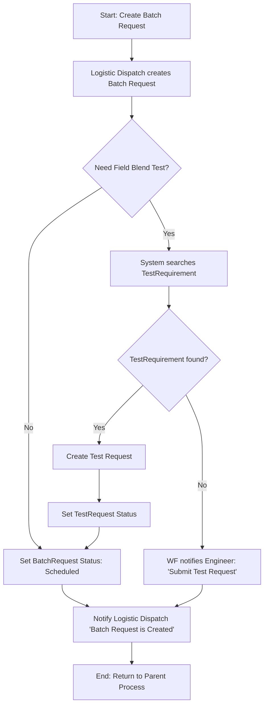

<!-- Identifier: P-04-09-01 -->
<!-- Name:  Create Batch Request -->

```mermaid
flowchart TD
	A[Start: Create Batch Request] --> B[Logistic Dispatch creates Batch Request]
	B --> C{Need Field Blend Test?}

	C -->|No| H

	C -->|Yes| D[System searches TestRequirement]
	D --> E{TestRequirement found?}

	E -->|Yes| F[Create Test Request]
	F --> G[Set TestRequest Status]
	G --> H[Set BatchRequest Status: Scheduled]
	H --> J[Notify Logistic Dispatch 'Batch Request is Created']

	E -->|No| M[WF notifies Engineer: 'Submit Test Request']
	M --> J

	J --> Z[End: Return to Parent Process]
```