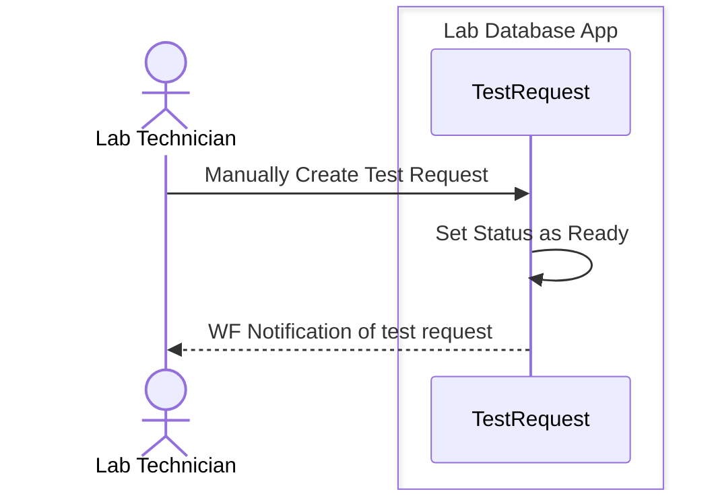
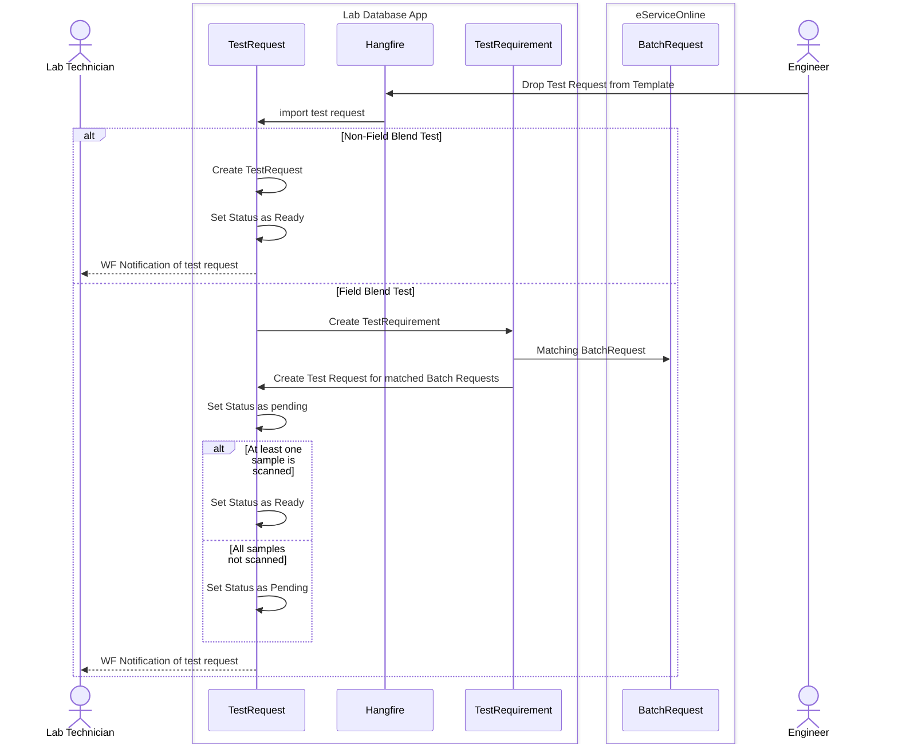
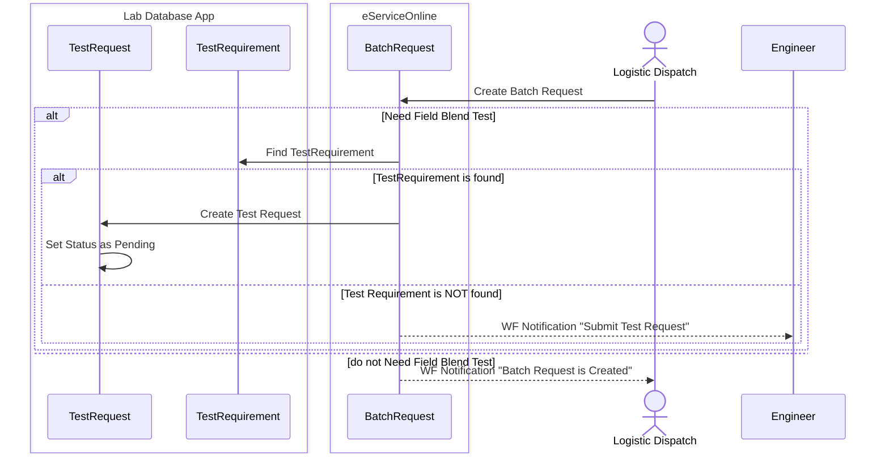
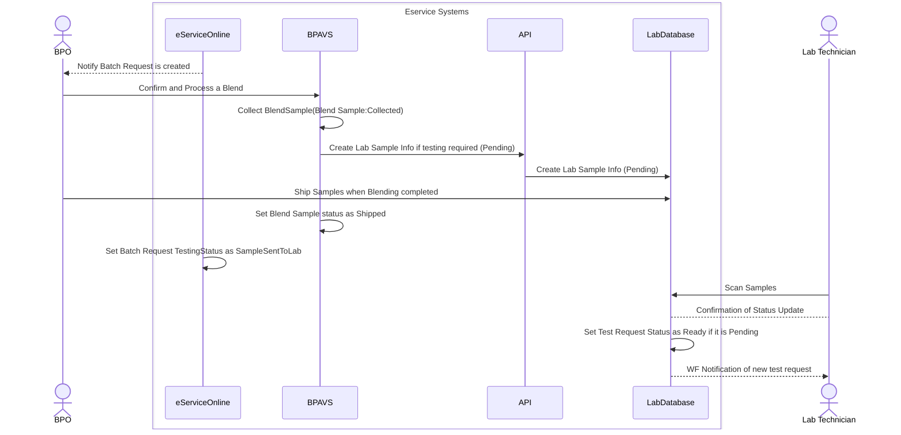

<!-- Identifier: C-04-09-04-01 -->
<!-- Name:  Lab Create Test Request -->

##### Lab Technician Create Test Request

##### Engineer Submit Test Request

### Logistics Dispatch Create Batch Request

### BPO blends a batch request

