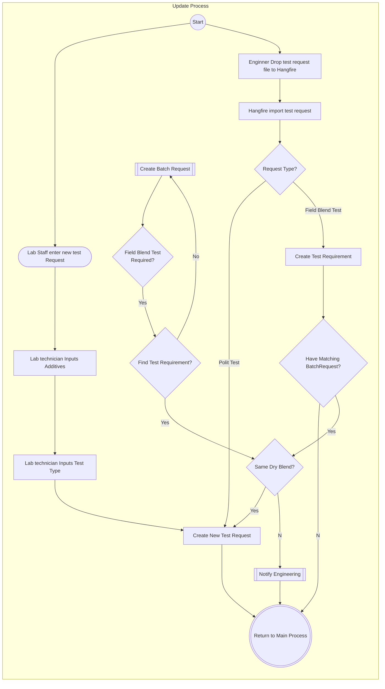

<!-- Identifier: P-04-09-04-01 -->
<!-- Name:  Lab Create Test Request -->

```mermaid
flowchart LR
 subgraph Update Process

 S@{ shape: circle, label: "Start" }
S-->A
S-->H
  A([Lab Staff enter new test Request])
  A-->F[Lab technician Inputs Additives]
  F-->G[Lab technician Inputs Test Type]
  G-->B[Create New Test Request]
  H[Enginner Drop test request file to Hangfire]-->J[ Hangfire import test request ]
  J-->C{Request Type?}
  C-- Polit Test -->B
  C-- Field Blend Test -->Z[Create Test Requirement]
Z-->Y{Have Matching BatchRequest?}
  Y--No-->E
  Y--Yes-->P{Same Dry Blend?}
  P--Yes-->B
  P--No-->Q[[Notify Engineering]]
  Q-->E
  %%K-->E
B-->E@{ shape: dbl-circ, label: "Return to Main Process" }
click E "https://github.com/Sanjel-Energy-Services/LabDatabase/wiki/LabProcess-Process"

R[["Create Batch Request"]]-->T{Field Blend Test <br> Required?}  
%%R1[["Create Composite Test"]]-->T
T-- Yes --> U{Find Test Requirement?}
U-- Yes -->P
U-- No -->R
%%T-- No -->R
%%U-- No -->R1
%%T-- No -->R1
click R "https://github.com/Sanjel-Energy-Services/eServiceOnline/wiki/Batch-Request-Creation"
click R1 "https://github.com/Sanjel-Energy-Services/eServiceOnline/wiki/Create-Composite-Test-Request"
end


```