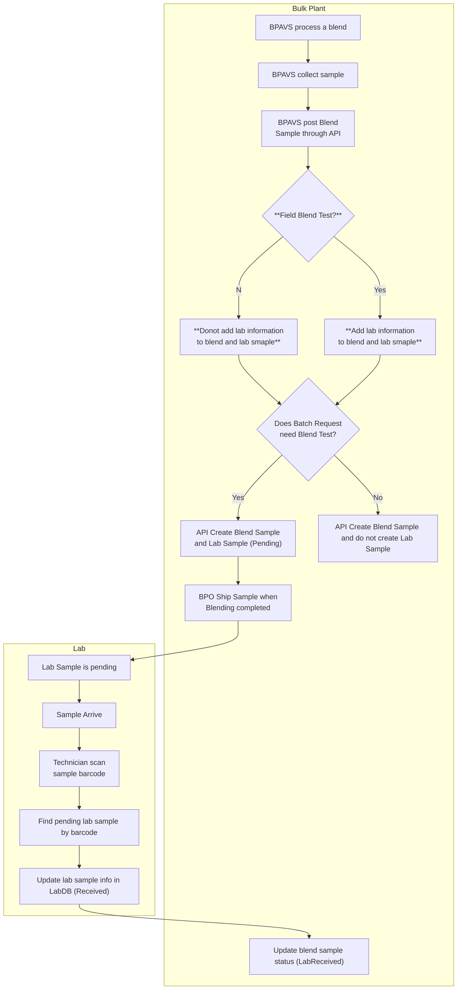

<!-- Identifier: P-04-09-04-02 -->
<!-- Name:  Lab Technician Log In Samples -->

```mermaid
flowchart TB

subgraph Bulk Plant
Z["BPAVS process a blend"]-->Y["BPAVS collect sample"]
Y-->X["BPAVS post Blend <BR>Sample through API"]
X-->X1{**Field Blend Test?**}
X1--No-->X2[**Donot add lab information<BR> to blend and lab smaple**]
X1--Yes-->X3[**Add lab information<BR> to blend and lab smaple**]
X2-->Z1{Does Batch Request <BR>need Blend Test?}
X3-->Z1
  Z1 -- Yes --> T["API Create Blend Sample<BR> and Lab Sample (Pending)"]
  Z1 -- No --> N["API Create Blend Sample <BR>and do not create Lab Sample"]
%%X-->T["API Create Lab Sample(Pending)"]
T-->Q[BPO Ship Sample when <BR>Blending completed]
F["Update blend sample status (LabReceived) "]
end
subgraph Lab
    G["Lab Sample is pending"]-->A
    A["Sample Arrive"]--> B["Technician scan<BR> sample barcode"]
    B-->D["Find pending lab sample by barcode"]
    D-->E["Update lab sample info in LabDB (Received)"]
end     
Q-->G
E-->F

```