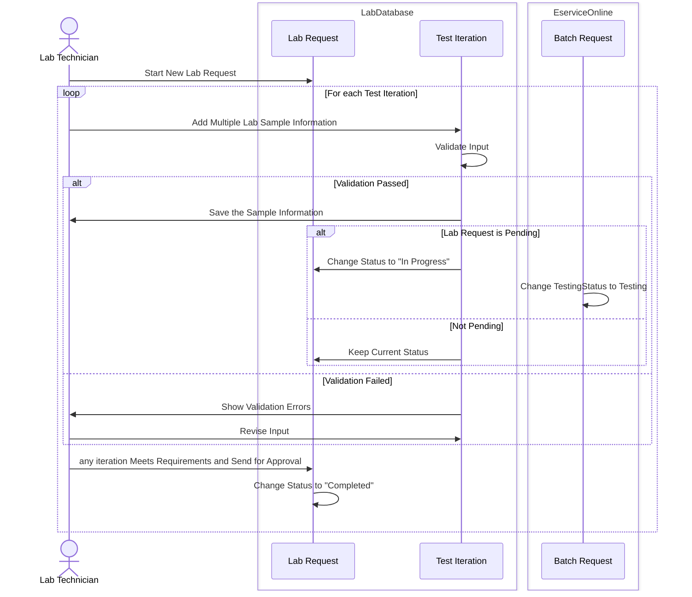

<!-- Identifier: C-04-09-04-03 -->
<!-- Name:  Prepare Test Iteration -->

```mermaid

sequenceDiagram
actor Lab Technician
box LabDatabase
    participant Lab Request
    participant Test Iteration
end
box EserviceOnline
    participant Batch Request
end

Lab Technician->>Lab Request: Start New Lab Request

loop For each Test Iteration
    Lab Technician->>Test Iteration: Add Multiple Lab Sample Information
    Test Iteration->>Test Iteration: Validate Input

    alt Validation Passed
        %%Test Iteration->>Lab Request: Link to Lab Request
        Test Iteration->>Lab Technician: Save the Sample Information

        alt Lab Request is Pending
            Test Iteration->>Lab Request: Change Status to "In Progress"
            Batch Request->>Batch Request:Change TestingStatus to Testing
        else Not Pending
            Test Iteration->>Lab Request: Keep Current Status
        end

    else Validation Failed
        Test Iteration->>Lab Technician: Show Validation Errors
        Lab Technician->>Test Iteration: Revise Input
    end
Lab Technician->>Lab Request:any iteration Meets Requirements and Send for Approval
Lab Request->>Lab Request:Change Status to "Completed"
end

```

