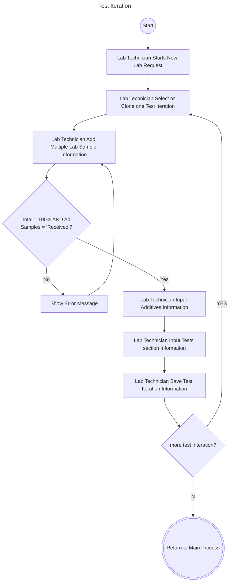

<!-- Identifier: P-04-09-04-03 -->
<!-- Name:  Prepare Test Iteration -->

```mermaid
---
title: Test Iteration
---

flowchart TB


S((Start))


S--> A[Lab Technician Starts New Lab Request]
A-->B[Lab Technician Select or Clone one Test Iteration]
%%B-->C[[Lab Technician Input  Lab Sample Information]]
B-->Z[Lab Technician Add Multiple Lab Sample Information]
Z-->Y{Total = 100% AND All Samples = 'Received'?}
Y -- No --> X[Show Error Message]
X --> Z
Y -- Yes -->D[Lab Technician Input Additives Information]
%%T[Save the Test Iteration Info]

D-->E[Lab Technician Input Tests section Information]
E-->F[Lab Technician Save Test Iteration Information]
F --> L{more test interation?}

L--YES-->B
L --No--> G@{ shape: dbl-circ, label: "Return to Main Process" }
click G "https://github.com/Sanjel-Energy-Services/TestRequest/wiki/LabProcess-Process"
%%T-->O@{ shape: dbl-circ, label: "Return to Main Test Interation Flow" }
%%click O "#main-test-iteration-flow"


```