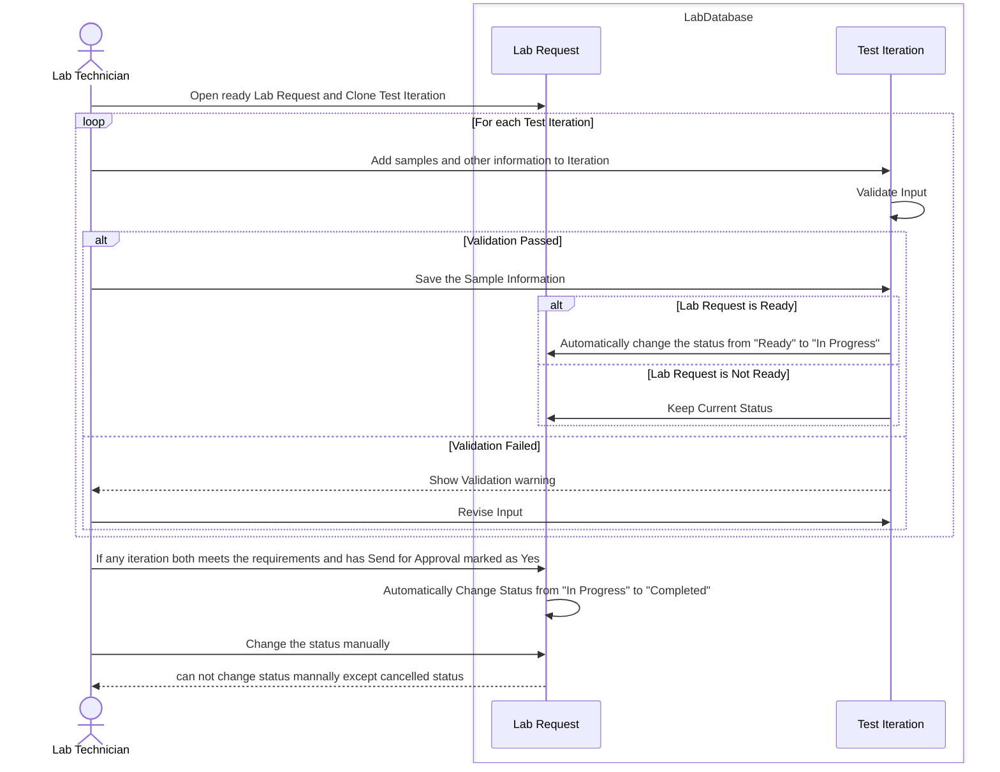
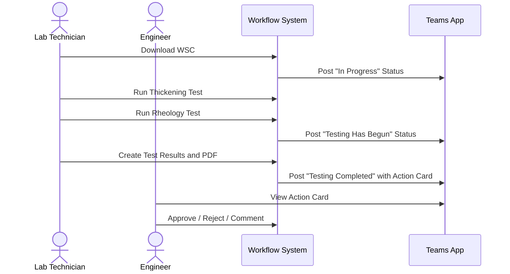

<!-- Identifier: C-04-09-04-04 -->
<!-- Name:  Execute Test -->

```mermaid

sequenceDiagram
actor Lab Technician
box LabDatabase
    participant Lab Request
    participant Test Iteration
end


Lab Technician->>Lab Request: Open ready Lab Request and Clone Test Iteration

loop For each Test Iteration
    Lab Technician->>Test Iteration: Add samples and other information to Iteration
    Test Iteration->>Test Iteration: Validate Input

    alt Validation Passed
        %%Test Iteration->>Lab Request: Link to Lab Request
        Lab Technician->>Test Iteration: Save the Sample Information

        alt Lab Request is Ready
            Test Iteration->>Lab Request: Automatically change the status from "Ready" to "In Progress"
        else Lab Request is Not Ready
            Test Iteration->>Lab Request: Keep Current Status
        end

    else Validation Failed
        Test Iteration-->>Lab Technician: Show Validation warning
        Lab Technician->>Test Iteration: Revise Input
    end
end
Lab Technician->>Lab Request:If any iteration both meets the requirements and has Send for Approval marked as Yes
Lab Request->>Lab Request:Automatically Change Status from "In Progress" to "Completed"
Lab Technician->>Lab Request:Change the status manually
 Lab Request-->>Lab Technician: can not change status mannally except cancelled status


```

```mermaid
sequenceDiagram
    actor LabTech as Lab Technician
    actor Engineer as Engineer
    participant System as Workflow System
    participant Teams as Teams App

    LabTech->>System: Download WSC
    System->>Teams: Post "In Progress" Status

    LabTech->>System: Run Thickening Test
    LabTech->>System: Run Rheology Test
    System->>Teams: Post "Testing Has Begun" Status

    LabTech->>System: Create Test Results and PDF
    System->>Teams: Post "Testing Completed" with Action Card

    Engineer->>Teams: View Action Card
    Engineer->>System: Approve / Reject / Comment

```

