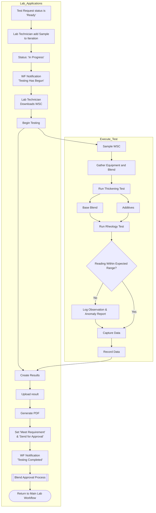

<!-- Identifier: P-04-09-04-04 -->
<!-- Name:  Execute Tests -->

```mermaid

flowchart TD
 subgraph Lab_Applications["Lab_Applications"]
        A0["Test Request status is <br>'Ready'"]
        A01["Lab Technician add Sample<br> to Iteration"]
        A1["Lab Technician <br>Downloads WSC"]
        A2["Status: 'In Progress'"]
        WF1["WF Notification <br> 'Testing Has Begun'"]
        A3["Begin Testing"]
        A5["Create Results"]
        A6["Upload result"]
        A7["Generate PDF"]
        A8["Set 'Meet Requirement'<br> & 'Send for Approval'"]
        WF2["WF Notification <br> 'Testing Completed'"]
        A9[[Blend Approval Process]]
  A11([Return to Main Lab Workflow])
 end
 subgraph Execute_Test["Execute_Test"]
        B1["Sample WSC"]
        B2["Gather Equipment and Blend"]
        B3["Run Thickening Test"]
        B4a["Base Blend"]
        B4b["Additives"]
        B5["Run Rheology Test"]
        B6{Reading Within Expected Range?}
        B7["Log Observation & Anomaly Report"]
        B8[Capture Data]
        B9[Record Data]
 end
 
    A0 --> A01
    A01-->A2
    A2 -->WF1 
    WF1-->A1
    A1 --> A3
    A3 --> B1
    A3 --> A5
    A5 --> A6
    A6 --> A7
    A7 --> A8
    A8 --> WF2-->A9
    A9 --> A11
    B1 --> B2
    B2 --> B3
    B3 --> B4a
    B3 --> B4b
    B4a --> B5
    B4b --> B5
    B5 --> B6
    B6 -- No --> B7 --> B8 --> B9
    B6 -- Yes --> B8
    B9 --> A5
click A11 "https://github.com/Sanjel-Energy-Services/LabDatabase/wiki/LabProcess-Process"


```