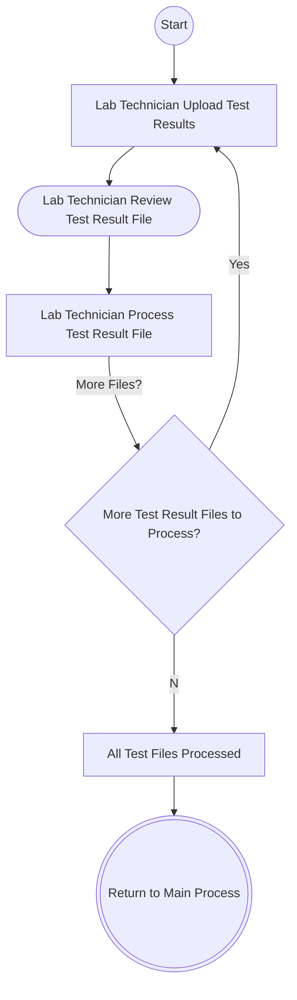

<!-- Identifier: P-04-09-04-05 -->
<!-- Name:  Finalize Test Results -->

```mermaid


flowchart TB
 %% subgraph Old Process
S@{ shape: circle, label: "Start" }
S-->A
 A[ Lab Technician Upload Test Results]
 A --> B([Lab Technician Review Test Result File])
 B --> C[Lab Technician Process Test Result File]

 C -->|More Files?| H{More Test Result Files to Process?}
 %%F -->|More Files?| H
 %%G -->|More Files?| H

 H --Yes--> A
 H --No--> I[All Test Files Processed]
I-->G@{ shape: dbl-circ, label: "Return to Main Process" }

%%click G "https://github.com/Sanjel-Energy-Services/LabDatabase/wiki/LabProcess-Process"
click G "https://github.com/Sanjel-Energy-Services/LabDatabase/wiki/LabProcess-Process"


```