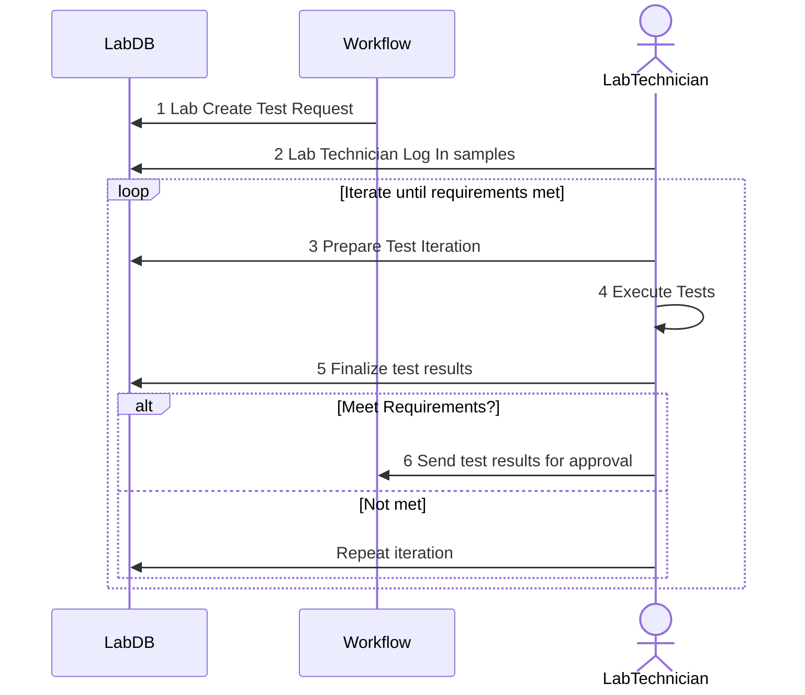

<!-- Identifier: C-04-09-04 -->
<!-- Name:  Lab Testing Process -->

```mermaid
sequenceDiagram
    participant LabDB
    participant Workflow
    actor LabTechnician

    Workflow->>LabDB: 1 Lab Create Test Request
    LabTechnician->>LabDB: 2 Lab Technician Log In samples
    loop Iterate until requirements met
        LabTechnician->>LabDB: 3 Prepare Test Iteration
        LabTechnician->>LabTechnician: 4 Execute Tests
        LabTechnician->>LabDB: 5 Finalize test results
        alt Meet Requirements?
            LabTechnician->>Workflow: 6 Send test results for approval
        else Not met
            LabTechnician->>LabDB: Repeat iteration
        end
    end
    
```
