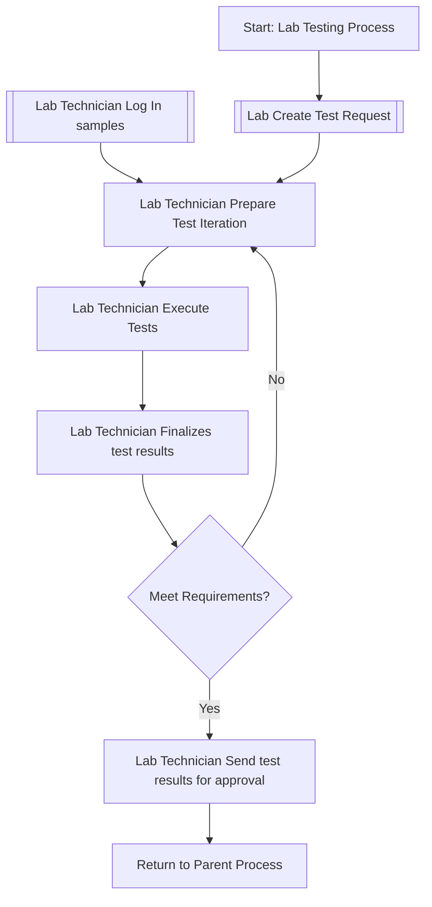

<!-- Identifier: P-04-0b-04 -->
<!-- Name:  Material Preparation Process -->

```mermaid
flowchart TD
    A[Start: Lab Testing Process]-->B[[Lab Create Test Request]]
    C[[Lab Technician Log In samples]] --> D[Lab Technician Prepare Test Iteration]
    B-->D
    D --> E[Lab Technician Execute Tests]
    E --> F[Lab Technician Finalizes test results]
    F --> G{Meet Requirements?}
    G-->|Yes|P[Lab Technician Send test results for approval]
    G-->|No| D
    P-->Z[Return to Parent Process]

```