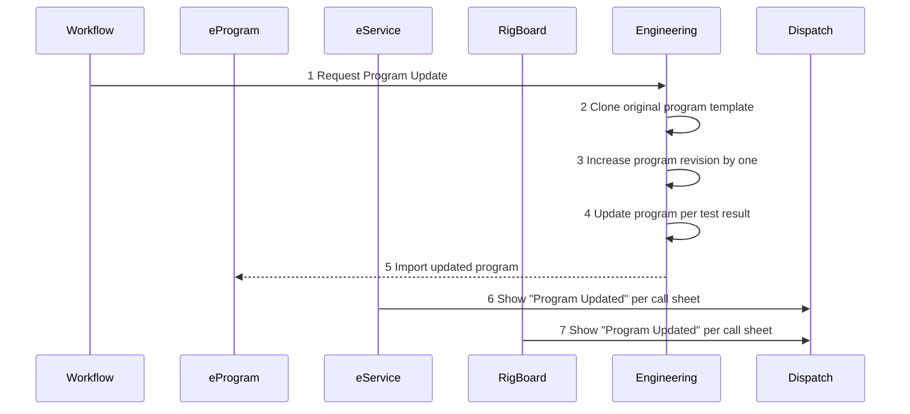

<!-- Identifier: C-04-09-05-10 -->
<!-- Name: Program Update -->

```mermaid
sequenceDiagram
    participant Workflow
    participant eProgram
    participant eService
    participant RigBoard
    participant Engineering
    participant Dispatch


    Workflow->>Engineering: 1 Request Program Update
    Engineering->>Engineering: 2 Clone original program template
    Engineering->>Engineering: 3 Increase program revision by one
    Engineering->>Engineering: 4 Update program per test result
    Engineering-->>eProgram: 5 Import updated program
    eService->>Dispatch: 6 Show "Program Updated" per call sheet
    RigBoard->>Dispatch: 7 Show "Program Updated" per call sheet

```