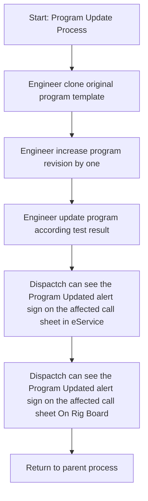

<!-- Identifier: P-04-09-05-10 -->
<!-- Name:  Program Update Process -->

```mermaid
flowchart TD
    A[Start: Program Update Process] --> B[Engineer clone original program template]
    B --> C[Engineer increase program revision by one]
    C --> D[Engineer update program according test result]
    D --> E[Dispactch can see the Program Updated alert sign on the affected call sheet in eService ]
    E --> F[Dispactch can see the Program Updated alert sign on the affected call sheet On Rig Board ]
    F --> G[Return to parent process]

```