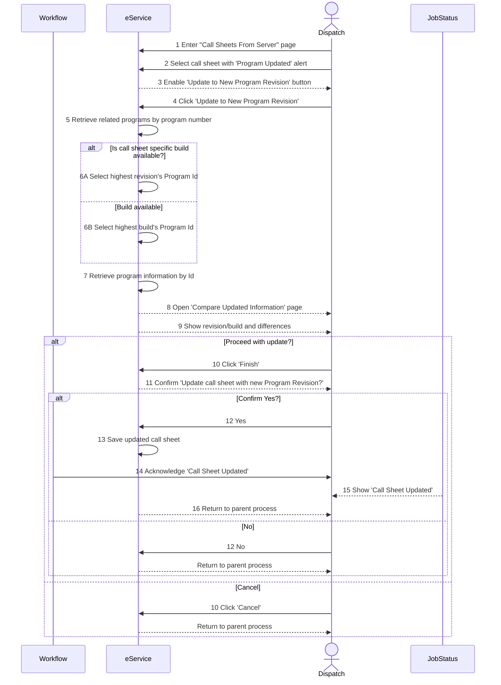

<!-- Identifier: C-04-09-05-11 -->
<!-- Name: Document Update -->

```mermaid
sequenceDiagram
    participant Workflow
    participant eService
    actor Dispatch
    participant JobStatus

    Dispatch->>eService: 1 Enter "Call Sheets From Server" page
    Dispatch->>eService: 2 Select call sheet with 'Program Updated' alert
    eService-->>Dispatch: 3 Enable 'Update to New Program Revision' button
    Dispatch->>eService: 4 Click 'Update to New Program Revision'
    eService->>eService: 5 Retrieve related programs by program number
    alt Is call sheet specific build available?
        eService->>eService: 6A Select highest revision's Program Id
    else Build available
        eService->>eService: 6B Select highest build's Program Id
    end
    eService->>eService: 7 Retrieve program information by Id
    eService-->>Dispatch: 8 Open 'Compare Updated Information' page
    eService-->>Dispatch: 9 Show revision/build and differences
    alt Proceed with update?
        Dispatch->>eService: 10 Click 'Finish'
        eService-->>Dispatch: 11 Confirm 'Update call sheet with new Program Revision?'
        alt Confirm Yes?
            Dispatch->>eService: 12 Yes
            eService->>eService: 13 Save updated call sheet
            Workflow->>Dispatch: 14 Acknowledge 'Call Sheet Updated'
            JobStatus-->>Dispatch: 15 Show 'Call Sheet Updated'
            eService-->>Dispatch: 16 Return to parent process
        else No
            Dispatch->>eService: 12 No
            eService-->>Dispatch: Return to parent process
        end
    else Cancel
        Dispatch->>eService: 10 Click 'Cancel'
        eService-->>Dispatch: Return to parent process
    end
```
