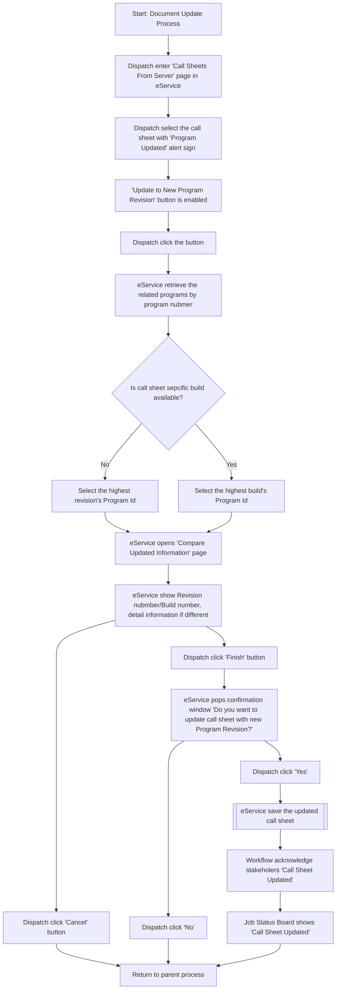

<!-- Identifier: P-04-09-05-11 -->
<!-- Name:  Document Update Process -->

```mermaid
flowchart TD
    A[Start: Document Update Process] --> B[Dispatch enter 'Call Sheets From Server' page in eService]
    B-->C[Dispatch select the call sheet with 'Program Updated' alert sign]
    C-->D['Update to New Program Revision' button is enabled]
    D-->E[Dispatch click the button]
    E-->F[eService retrieve the related programs by program nubmer]
    F-->G{Is call sheet sepcific build available?}
    G-->|No|H[Select the highest revision's Program Id]
    G-->|Yes|I[Select the highest build's Program Id]
    H-->J[Retrieve the program information by Id]
    I-->J[eService opens 'Compare Updated Information' page]
    J-->K[eService show Revision nubmber/Build number, detail information if different]
    K-->L[Dispatch click 'Finish' button]
    K-->M[Dispatch click 'Cancel' button]
    L-->N[eService pops confirmation window 'Do you want to update call sheet with new Program Revision?']
    N-->O[Dispatch click 'Yes']
    N-->P[Dispatch click 'No']
    O-->Q[[eService save the updated call sheet]]
    Q-->R[Workflow acknowledge stakeholers 'Call Sheet Updated']
    R-->S[Job Status Board shows 'Call Sheet Updated']
    M-->Z[Return to parent process]
    P-->Z
    S-->Z

```