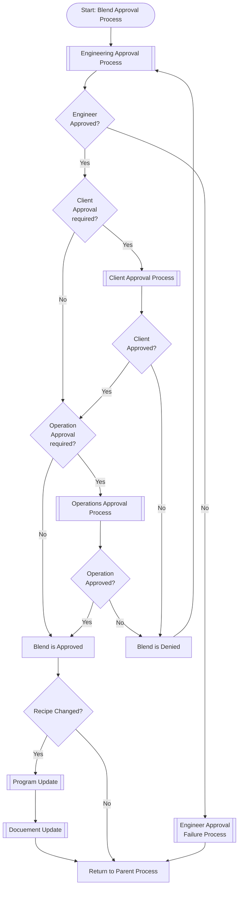

<!-- Identifier: P-04-09-05 -->
<!-- Name:  Blend Approval Process -->

```mermaid


flowchart TD

  A([Start: Blend Approval Process])-->D[[Engineering Approval Process]]
  D-->I{Engineer<br>Approved?}
  I-->|Yes|E{Client<br>Approval<br>required?}
  I-->|No|K[[Engineer Approval<br>Failure Process]]
  E-->|No|G1
  E-->|Yes| F[[Client Approval Process]]
  F-->L{Client<br>Approved?}
  L-->|Yes|G1{Operation<br>Approval<br>required?}
  G1-->|Yes|G[[Operations Approval Process]]
  G1-->|No|U
  G-->P{Operation<br>Approved?}
  P-->|No|B
  L-->|No|B[Blend is Denied]
  B-->D
  P-->|Yes|U[Blend is Approved]
  U-->Q{Recipe Changed?}
  Q-->|Yes|R[[Program Update]]
  R-->T[[Docuement Update]]
  T-->S
  Q-->|No|S
  K-->S[Return to Parent Process]


```