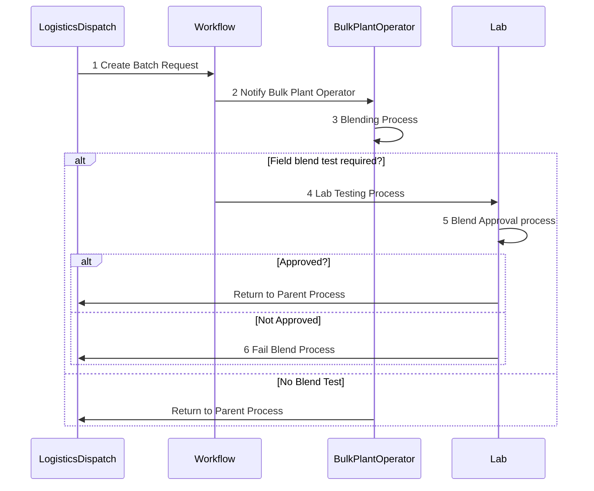

<!-- Identifier: C-04-09 -->
<!-- Name:  Material Preparation Process -->

```mermaid
sequenceDiagram
    participant LogisticsDispatch
    participant Workflow
    participant BulkPlantOperator
    participant Lab

    LogisticsDispatch->>Workflow: 1 Create Batch Request
    Workflow->>BulkPlantOperator: 2 Notify Bulk Plant Operator
    BulkPlantOperator->>BulkPlantOperator: 3 Blending Process

    alt Field blend test required?
        Workflow->>Lab: 4 Lab Testing Process
        Lab->>Lab: 5 Blend Approval process
        alt Approved?
            Lab->>LogisticsDispatch: Return to Parent Process
        else Not Approved
            Lab->>LogisticsDispatch: 6 Fail Blend Process
        end
    else No Blend Test
        BulkPlantOperator->>LogisticsDispatch: Return to Parent Process
    end
  
```