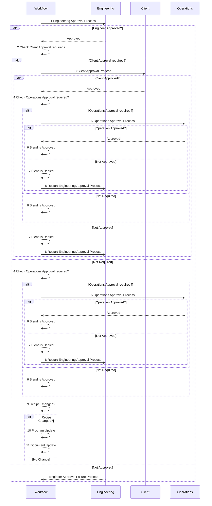

<!-- Identifier: C-04-0b-05 -->
<!-- Name:  Blend Approval Process -->

```mermaid
sequenceDiagram
    participant Workflow
    participant Engineering
    participant Client
    participant Operations

    Workflow->>Engineering: 1 Engineering Approval Process
    alt Engineer Approved?
        Engineering-->>Workflow: Approved
        Workflow->>Workflow: 2 Check Client Approval required?
        alt Client Approval required?
            Workflow->>Client: 3 Client Approval Process
            alt Client Approved?
                Client-->>Workflow: Approved
                Workflow->>Workflow: 4 Check Operations Approval required?
                alt Operations Approval required?
                    Workflow->>Operations: 5 Operations Approval Process
                    alt Operation Approved?
                        Operations-->>Workflow: Approved
                        Workflow->>Workflow: 6 Blend is Approved
                    else Not Approved
                        Workflow->>Workflow: 7 Blend is Denied
                        Workflow->>Engineering: 8 Restart Engineering Approval Process
                    end
                else Not Required
                    Workflow->>Workflow: 6 Blend is Approved
                end
            else Not Approved
                Workflow->>Workflow: 7 Blend is Denied
                Workflow->>Engineering: 8 Restart Engineering Approval Process
            end
        else Not Required
            Workflow->>Workflow: 4 Check Operations Approval required?
            alt Operations Approval required?
                Workflow->>Operations: 5 Operations Approval Process
                alt Operation Approved?
                    Operations-->>Workflow: Approved
                    Workflow->>Workflow: 6 Blend is Approved
                else Not Approved
                    Workflow->>Workflow: 7 Blend is Denied
                    Workflow->>Engineering: 8 Restart Engineering Approval Process
                end
            else Not Required
                Workflow->>Workflow: 6 Blend is Approved
            end
        end
        Workflow->>Workflow: 9 Recipe Changed?
        alt Recipe Changed?
            Workflow->>Workflow: 10 Program Update
            Workflow->>Workflow: 11 Document Update
        else No Change
        end
    else Not Approved
        Engineering-->>Workflow: Engineer Approval Failure Process
    end
```
