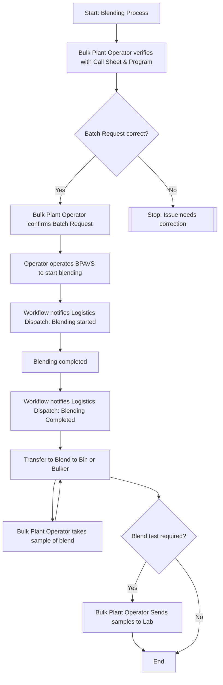

<!-- Identifier: P-04-0b-0-02 -->
<!-- Name:  Blending Process -->

```mermaid
flowchart TD
	A[Start: Blending Process]-->D[Bulk Plant Operator verifies with Call Sheet & Program]
	D --> E{Batch Request correct?}
    E -->|Yes| F[Bulk Plant Operator confirms Batch Request]
    E -->|No| G[[Stop: Issue needs correction]]
    F --> H[Operator operates BPAVS to start blending]
    H --> I[Workflow notifies Logistics Dispatch: Blending started]
    I --> J[Blending completed]
    J --> J1[Workflow notifies Logistics Dispatch: Blending Completed]
    J1 --> K[Transfer to Blend to Bin or Bulker]
    K --> L[Bulk Plant Operator takes sample of blend]
    L --> K
    K --> N{Blend test required?}
    N --> |Yes|M[Bulk Plant Operator Sends samples to Lab]
    M-->Z
    N --> |No|Z[End]

```

