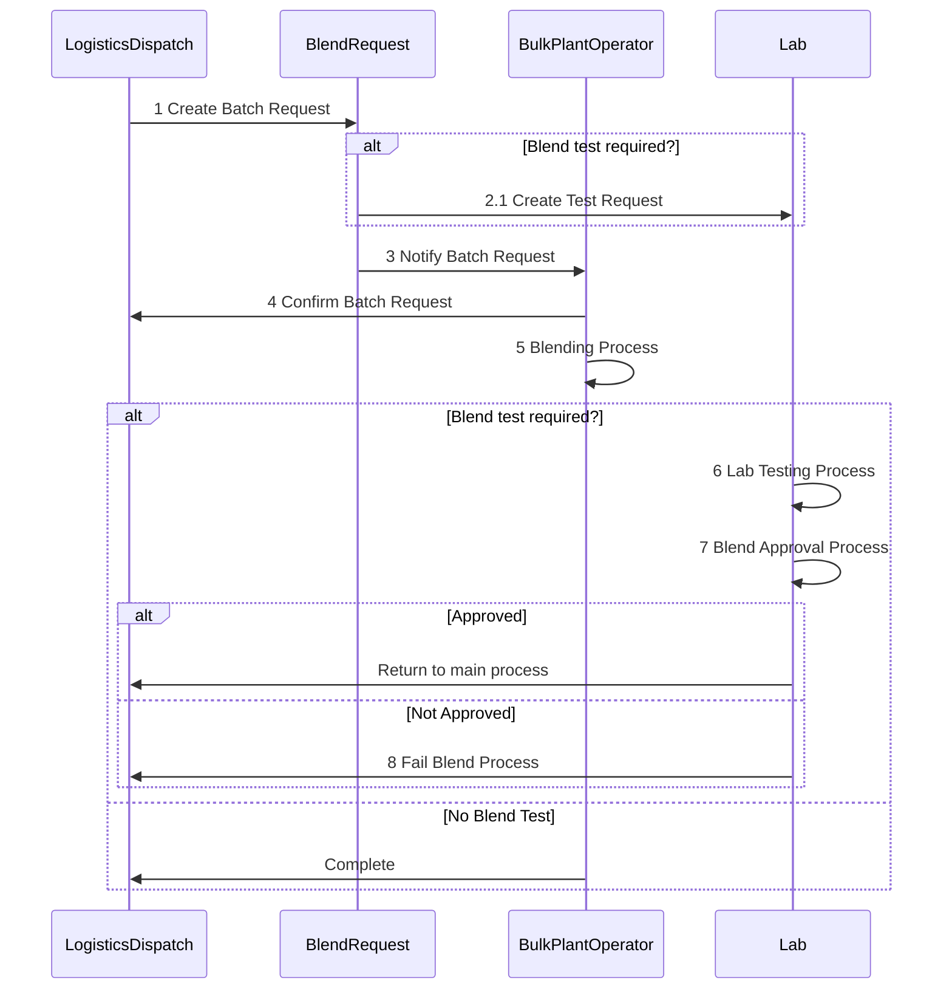

<!-- Identifier: C-04-0b-03 -->
<!-- Name:  Material Preparation Process -->

```mermaid
sequenceDiagram
    participant LogisticsDispatch
    participant BlendRequest
    participant BulkPlantOperator
    participant Lab

    LogisticsDispatch->>BlendRequest: 1 Create Batch Request
    alt Blend test required?
    BlendRequest->>Lab: 2.1 Create Test Request
    end
    BlendRequest->>BulkPlantOperator: 3 Notify Batch Request
    BulkPlantOperator->>LogisticsDispatch: 4 Confirm Batch Request
    BulkPlantOperator->>BulkPlantOperator: 5 Blending Process

    alt Blend test required?
        Lab->>Lab: 6 Lab Testing Process
        Lab->>Lab: 7 Blend Approval Process
        alt Approved
            Lab->>LogisticsDispatch: Return to main process
        else Not Approved
            Lab->>LogisticsDispatch: 8 Fail Blend Process
        end
    else No Blend Test
        BulkPlantOperator->>LogisticsDispatch:Complete
    end
  
```