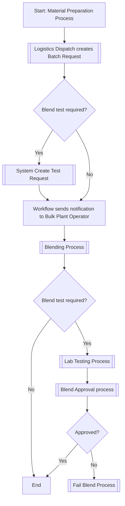

<!-- Identifier: P-01-04-0b  -->
<!-- Name:  Material Preparation Process -->

```mermaid
flowchart TD
    A[Start: Material Preparation Process] --> B[[Logistics Dispatch creates Batch Request]]
    B --> C1{Blend test required?}
    C1 --> |Yes|C2[[System Create Test Request]]
    C1 --> |No|C[Workflow sends notification to Bulk Plant Operator]
    C2 --> C
    C --> D[[Blending Process]]
    D --> F{Blend test required?}
    F --> |Yes|E[[Lab Testing Process]]
    E --> Q[[Blend Approval process]]
    Q --> R{Approved?}
    R -->|Yes| U[End]
    F --> |No| U
    R -->|No| T[[Fail Blend Process]]

```