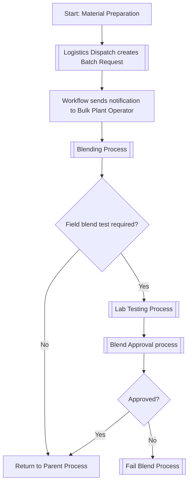

<!-- Identifier: P-04-0b -->
<!-- Name:  Material Preparation Process -->

```mermaid
flowchart TD
    A[Start: Material Preparation] --> B[[Logistics Dispatch creates Batch Request]]
    B --> C[Workflow sends notification to Bulk Plant Operator]
    C --> D[[Blending Process]]
    D --> F{Field blend test required?}
    F --> |Yes|E[[Lab Testing Process]]
    E --> Q[[Blend Approval process]]
    Q --> R{Approved?}
    R -->|Yes| U[Return to Parent Process]
    F --> |No| U
    R -->|No| T[[Fail Blend Process]]

```