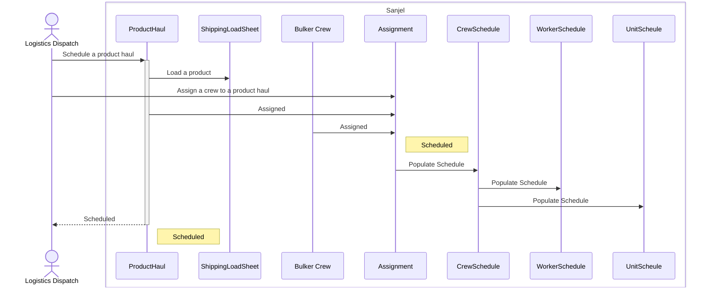
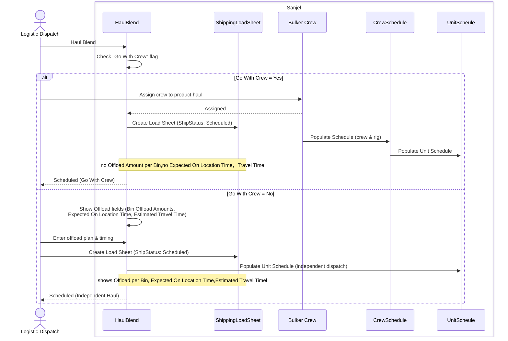

<!-- Identifier: C-04 -->
<!-- Name: Schedule Product Haul -->

```mermaid
sequenceDiagram
    actor Logistics Dispatch 

box Sanjel
    participant ProductHaul
    participant ShippingLoadSheet
    participant Bulker Crew
    participant Assignment
    participant CrewSchedule
    participant WorkerSchedule
    participant UnitScheule
end
    Logistics Dispatch->>+ProductHaul: Schedule a product haul
    ProductHaul->>ShippingLoadSheet:Load a product
    Logistics Dispatch->>Assignment: Assign a crew to a product haul
    ProductHaul->>Assignment:Assigned
    Bulker Crew->>Assignment:Assigned
    Note right of Assignment:Scheduled
    Assignment->>CrewSchedule:Populate Schedule
    CrewSchedule->>WorkerSchedule:Populate Schedule
    CrewSchedule->>UnitScheule:Populate Schedule
    ProductHaul-->>-Logistics Dispatch:Scheduled
    Note right of ProductHaul:Scheduled

```

```mermaid

sequenceDiagram
    actor Logi as Logistic Dispatch

    box Sanjel
        participant HaulBlend
        participant ShippingLoadSheet
        participant Bulker Crew
        participant CrewSchedule
        participant UnitScheule
    end

    Logi->>HaulBlend: Haul Blend 
    HaulBlend->>HaulBlend: Check "Go With Crew" flag

    alt Go With Crew = Yes
        Logi->>Bulker Crew: Assign crew to product haul
        Bulker Crew-->>HaulBlend: Assigned
        HaulBlend->>ShippingLoadSheet: Create Load Sheet (ShipStatus: Scheduled)
        Bulker Crew->>CrewSchedule: Populate Schedule (crew & rig)
        CrewSchedule->>UnitScheule: Populate Unit Schedule
        Note over HaulBlend,ShippingLoadSheet: no Offload Amount per Bin,no Expected On Location Time，Travel Time
        HaulBlend-->>Logi: Scheduled (Go With Crew)

    else Go With Crew = No
        HaulBlend->>HaulBlend: Show Offload fields (Bin Offload Amounts,<br/>Expected On Location Time, Estimated Travel Time)
        Logi->>HaulBlend: Enter offload plan & timing
        Logi->>ShippingLoadSheet: Create Load Sheet (ShipStatus: Scheduled)
        HaulBlend->>UnitScheule: Populate Unit Schedule (independent dispatch)
        Note over HaulBlend,ShippingLoadSheet: shows Offload per Bin, Expected On Location Time,Estimated Travel Timel
        HaulBlend-->>Logi: Scheduled (Independent Haul)
    end 

```

