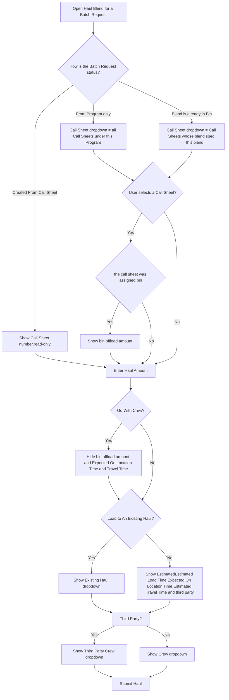

<!-- Identifier: P-01 -->
<!-- Name:  Schedule Product Haul -->

```mermaid
flowchart TD
A[Open Haul Blend for a Batch Request] --> B{How is the Batch Request status?}

B -- Created From Call Sheet --> C[Show Call Sheet number,read-only]
C --> X
E[Destination & Haul Quantity]

B -- From Program only --> H[Call Sheet dropdown = all Call Sheets under this Program]
H --> I{User selects a Call Sheet?}
I -- Yes --> E{the call sheet was assigned bin}
E -- Yes --> Z[Show bin offload amount]
Z-->X[Enter Haul Amount]
I -- No --> X
E -- No --> X 
X-->Y{Go With Crew?}
Y -- Yes --> T[Hide bin offload amount and Expected On Location Time and Travel Time]
T-->R{Load to An Existing Haul?}
R-- Yes -->Q[Show Existing Haul dropdown]
R-- No -->P[Show EstimatedEstimated Load Time,Expected On Location Time,Estimated Travel Time and third party ]
Y -- No -->R
Q-->O[Third Party?]
O-- Yes -->N[Show Third Party Crew dropdown]
O-- No -->M[Show  Crew dropdown]
P-->O
B -- Blend is already in Bin --> K[Call Sheet dropdown = Call Sheets whose blend spec == this blend]
K --> I
N --> L[Submit Haul]
M-->L


```