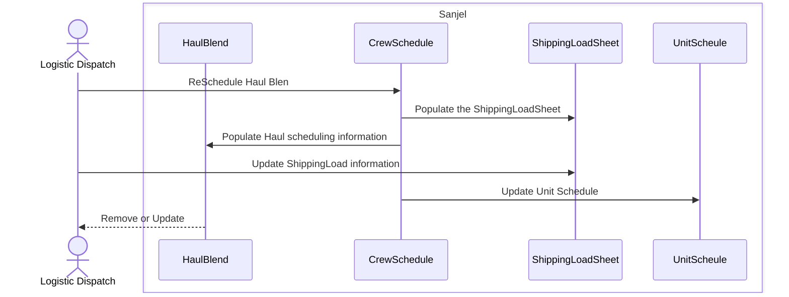

<!-- Identifier: P-03 -->
<!-- Name: ReSchedule Product Haul -->

```mermaid
sequenceDiagram
    actor Logi as Logistic Dispatch

    box Sanjel
        %%participant Bin
        participant HaulBlend
        participant CrewSchedule
         %%participant Bulker Crew
        
        participant ShippingLoadSheet
        participant UnitScheule
    end
   Logi->>CrewSchedule:ReSchedule Haul Blen
   CrewSchedule->>ShippingLoadSheet: Populate the ShippingLoadSheet 
   CrewSchedule->>HaulBlend: Populate Haul scheduling information
   Logi->>ShippingLoadSheet:Update ShippingLoad information
   CrewSchedule->>UnitScheule: Update Unit Schedule
   HaulBlend-->>Logi:Remove or Update
       

```

