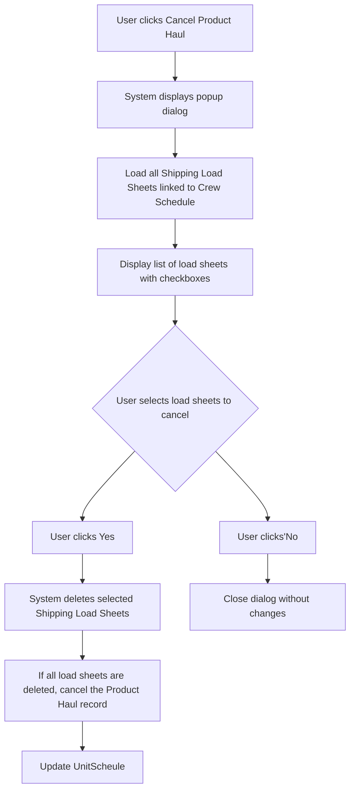

<!-- Identifier: P-04 -->
<!-- Name:  Cancel Product Haul -->

```mermaid
flowchart TD
    A[User clicks Cancel Product Haul] --> B[System displays popup dialog]
    B --> C[Load all Shipping Load Sheets linked to Crew Schedule]
    C --> D[Display list of load sheets with checkboxes]
    D --> E{User selects load sheets to cancel}
    E --> F[User clicks Yes]
    E --> G[User clicks'No]
    F --> H[System deletes selected Shipping Load Sheets]
    H --> I[If all load sheets are deleted, cancel the Product Haul record]
    I --> J[Update UnitScheule]
    G --> K[Close dialog without changes]


```