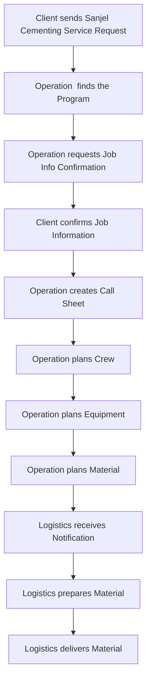

<!-- Identifier: P-04-02 -->
<!-- Name:  Cementing Service Request -->

```mermaid
flowchart TD
    A[Client sends Sanjel Cementing Service Request] --> B[Operation  finds the Program]
    B --> C[Operation requests Job Info Confirmation]
    C --> D[Client confirms Job Information]
    D --> E[Operation creates Call Sheet]
    E --> F[Operation plans Crew]
    F --> G[Operation plans Equipment]
    G --> H[Operation plans Material]
    H --> I[Logistics receives Notification]
    I --> J[Logistics prepares Material]
    J --> K[Logistics delivers Material]
```