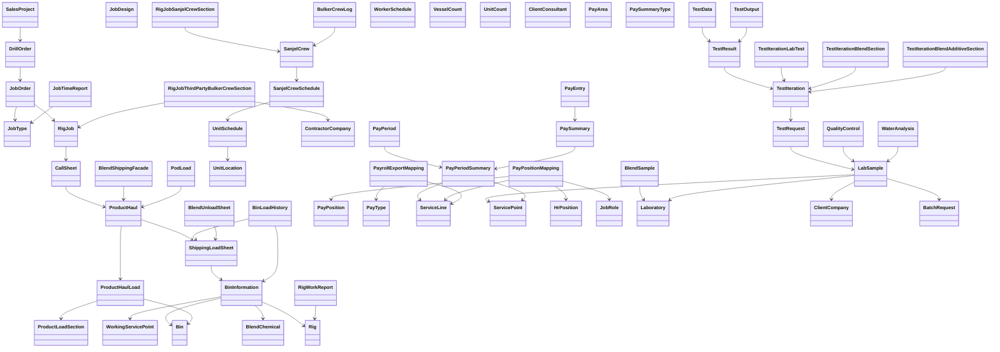

<!-- Identifier: D -->

```mermaid
classDiagram

class SalesProject
class DrillOrder
class JobOrder
class JobDesign
class JobType
class CallSheet
class ProductHaul
class ProductHaulLoad
class ShippingLoadSheet
class ProductLoadSection
class BlendUnloadSheet
class BlendShippingFacade
class PodLoad
class BinInformation
class BinLoadHistory
class Bin
class BlendChemical
class Rig
class WorkingServicePoint
class RigJob
class RigJobSanjelCrewSection
class RigJobThirdPartyBulkerCrewSection
class BulkerCrewLog
class SanjelCrew
class SanjelCrewSchedule
class UnitSchedule
class UnitLocation
class WorkerSchedule
class VesselCount
class UnitCount
class ContractorCompany
class ClientConsultant
class JobTimeReport
class RigWorkReport

class PayPeriod
class PayPeriodSummary
class PaySummary
class PayEntry
class PayArea
class PayPosition
class PayPositionMapping
class PayrollExportMapping
class PayType
class PaySummaryType
class ServiceLine
class ServicePoint
class HrPosition
class JobRole

class LabSample
class TestRequest
class TestIteration
class TestResult
class TestData
class QualityControl
class WaterAnalysis
class TestOutput
class TestIterationLabTest
class TestIterationBlendSection
class TestIterationBlendAdditiveSection
class BlendSample
class Laboratory
class ClientCompany
class BatchRequest

SalesProject --> DrillOrder
DrillOrder --> JobOrder
JobOrder --> JobType

JobOrder --> RigJob
RigJob --> CallSheet
CallSheet --> ProductHaul
ProductHaul --> ShippingLoadSheet
ShippingLoadSheet --> BinInformation
BinInformation --> Bin
BinInformation --> BlendChemical
BinInformation --> Rig
BinInformation --> WorkingServicePoint
BinLoadHistory --> BinInformation
BinLoadHistory --> ShippingLoadSheet

ProductHaul --> ProductHaulLoad
ProductHaulLoad --> Bin
ProductHaulLoad --> ProductLoadSection
BlendUnloadSheet --> ShippingLoadSheet
BlendShippingFacade --> ProductHaul
PodLoad --> ProductHaul

BlendSample --> Laboratory
LabSample --> Laboratory
LabSample --> ServicePoint
LabSample --> ClientCompany
LabSample --> BatchRequest
TestRequest --> LabSample
TestIteration --> TestRequest
TestResult --> TestIteration
TestData --> TestResult
QualityControl --> LabSample
WaterAnalysis --> LabSample
TestOutput --> TestResult
TestIterationLabTest --> TestIteration
TestIterationBlendSection --> TestIteration
TestIterationBlendAdditiveSection --> TestIteration

PayPeriod --> PayPeriodSummary
PayPeriodSummary --> ServiceLine
PayPeriodSummary --> ServicePoint
PaySummary --> PayPeriodSummary
PayEntry --> PaySummary
PayPositionMapping --> HrPosition
PayPositionMapping --> JobRole
PayPositionMapping --> PayPosition
PayPositionMapping --> ServiceLine
PayrollExportMapping --> PayType
PayrollExportMapping --> ServiceLine

SanjelCrew --> SanjelCrewSchedule
SanjelCrewSchedule --> UnitSchedule
UnitSchedule --> UnitLocation
RigJobSanjelCrewSection --> SanjelCrew
RigJobThirdPartyBulkerCrewSection --> RigJob
RigJobThirdPartyBulkerCrewSection --> ContractorCompany
BulkerCrewLog --> SanjelCrew

JobTimeReport --> JobType
RigWorkReport --> Rig
```
