# 2 领域模型中状态模式五个维度

## 2.1 状态模式五维度概述与对比

### 核心概念
在软件系统设计中，状态管理是处理业务逻辑复杂性的核心挑战之一。传统的状态模式主要关注对象行为随状态的变化，但随着业务系统复杂度的不断增加，单一维度的状态管理已无法满足现代软件系统的需求。我们通过实践总结出状态模式的**五个维度**，形成了从简单到复杂的完整建模体系。

### 五维度核心特征对比

| 维度                 | 核心关注点         | 状态转换特征         | 适用复杂度 | 典型业务场景                 |
| -------------------- | ------------------ | -------------------- | ---------- | ---------------------------- |
| **行为状态模式**     | 对象行为随状态变化 | 无严格顺序，行为驱动 | 简单       | UI交互、游戏角色、编辑模式   |
| **生命周期状态模式** | 业务阶段顺序推进   | 严格顺序，流程驱动   | 中等       | 订单流程、项目管理、审批流   |
| **结构状态模式**     | 内部结构组成变化   | 结构演化，约束驱动   | 中等       | 保险保单、产品配置、合同管理 |
| **事件溯源状态模式** | 历史事件重建状态   | 事件重放，追溯驱动   | 复杂       | 金融交易、审计系统、供应链   |
| **正交状态模式**     | 多维度状态并发     | 组合协同，维度驱动   | 高度复杂   | 智能系统、工业控制、物联网   |

---

## 2.2 行为状态模式 (Behavior State)

### 核心特征
通过状态对象封装不同的行为策略，状态改变主要影响对象的行为方式。**状态之间不一定有严格的顺序，而是行为不同**。

### 类图
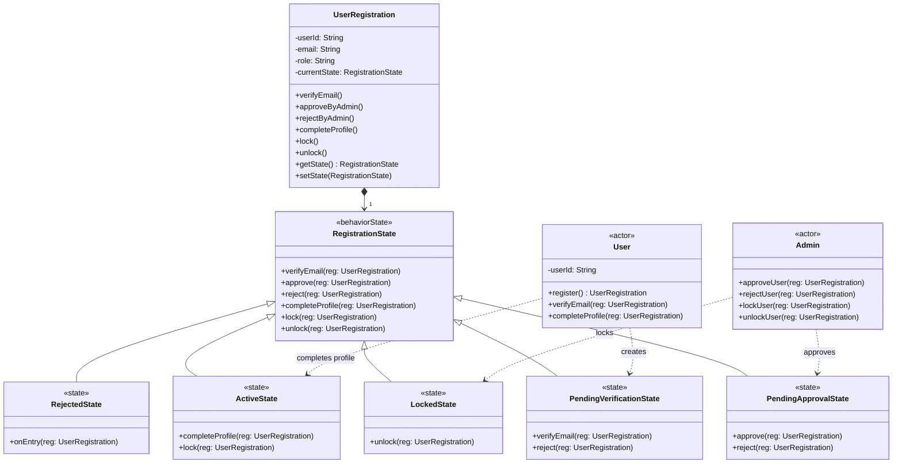
```mermaid
classDiagram
    direction TB
    
    class UserRegistration {
        -userId: String
        -email: String
        -role: String
        -currentState: RegistrationState
        +verifyEmail()
        +approveByAdmin()
        +rejectByAdmin()
        +completeProfile()
        +lock()
        +unlock()
        +getState() RegistrationState
        +setState(RegistrationState)
    }
    
    class RegistrationState {
        <<behaviorState>>
        +verifyEmail(reg: UserRegistration)
        +approve(reg: UserRegistration)
        +reject(reg: UserRegistration)
        +completeProfile(reg: UserRegistration)
        +lock(reg: UserRegistration)
        +unlock(reg: UserRegistration)
    }
    
    class PendingVerificationState {
        <<state>>
        +verifyEmail(reg: UserRegistration)
        +reject(reg: UserRegistration)
    }
    
    class PendingApprovalState {
        <<state>>
        +approve(reg: UserRegistration)
        +reject(reg: UserRegistration)
    }
    
    class ActiveState {
        <<state>>
        +completeProfile(reg: UserRegistration)
        +lock(reg: UserRegistration)
    }
    
    class LockedState {
        <<state>>
        +unlock(reg: UserRegistration)
    }
    
    class RejectedState {
        <<state>>
        +onEntry(reg: UserRegistration)
    }
    
    %% Actor类
    class User {
        <<actor>>
        -userId: String
        +register() UserRegistration
        +verifyEmail(reg: UserRegistration)
        +completeProfile(reg: UserRegistration)
    }
    
    class Admin {
        <<actor>>
        +approveUser(reg: UserRegistration)
        +rejectUser(reg: UserRegistration)
        +lockUser(reg: UserRegistration)
        +unlockUser(reg: UserRegistration)
    }
    
    %% 关系定义
    UserRegistration *--> "1" RegistrationState
    RegistrationState <|-- PendingVerificationState
    RegistrationState <|-- PendingApprovalState
    RegistrationState <|-- ActiveState
    RegistrationState <|-- LockedState
    RegistrationState <|-- RejectedState
    
    %% Actor与状态的关系
    User ..> PendingVerificationState : creates
    User ..> ActiveState : completes profile
    Admin ..> PendingApprovalState : approves
    Admin ..> LockedState : locks
```

### 状态转换图
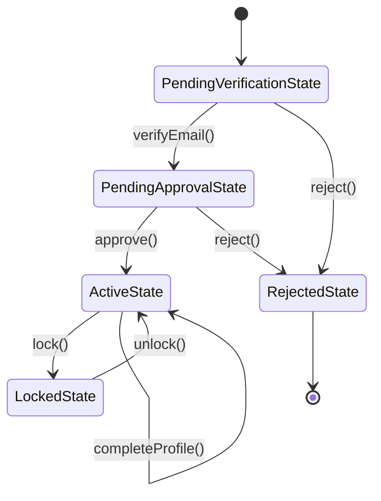
```mermaid
stateDiagram-v2
    [*] --> PendingVerificationState
    PendingVerificationState --> PendingApprovalState : verifyEmail()
    PendingVerificationState --> RejectedState : reject()
    
    PendingApprovalState --> ActiveState : approve()
    PendingApprovalState --> RejectedState : reject()
    
    ActiveState --> LockedState : lock()
    ActiveState --> ActiveState : completeProfile()
    
    LockedState --> ActiveState : unlock()
    
    RejectedState --> [*]
```

### 交互序列图
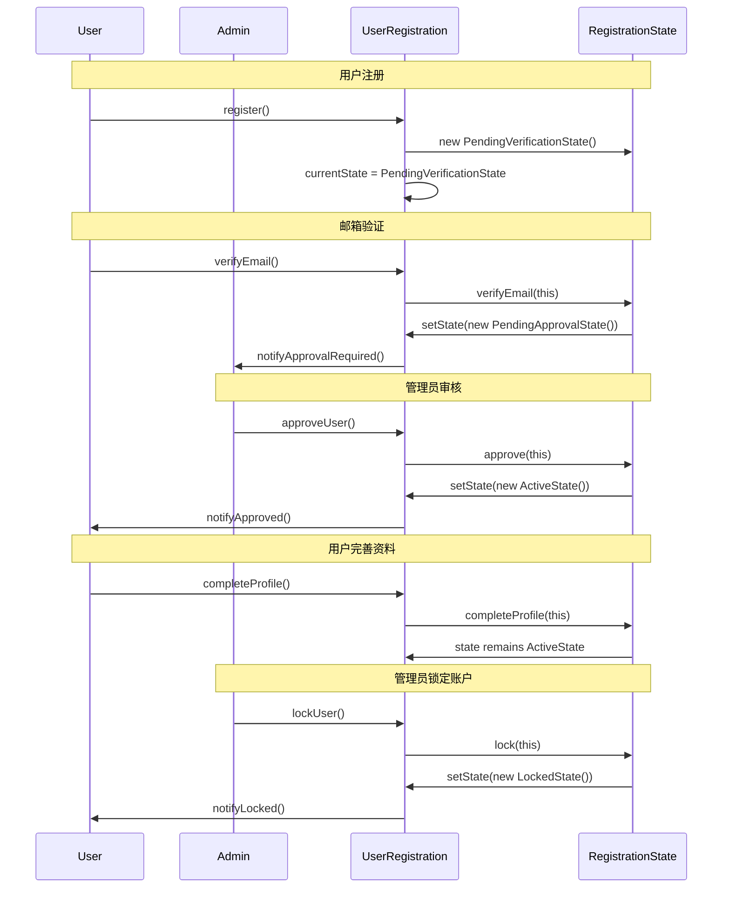
```mermaid
sequenceDiagram
    participant U as User
    participant A as Admin
    participant R as UserRegistration
    participant S as RegistrationState
    
    Note over U,S: 用户注册
    U->>R: register()
    R->>S: new PendingVerificationState()
    R->>R: currentState = PendingVerificationState
    
    Note over U,S: 邮箱验证
    U->>R: verifyEmail()
    R->>S: verifyEmail(this)
    S->>R: setState(new PendingApprovalState())
    R->>A: notifyApprovalRequired()
    
    Note over A,S: 管理员审核
    A->>R: approveUser()
    R->>S: approve(this)
    S->>R: setState(new ActiveState())
    R->>U: notifyApproved()
    
    Note over U,S: 用户完善资料
    U->>R: completeProfile()
    R->>S: completeProfile(this)
    S->>R: state remains ActiveState
    
    Note over A,S: 管理员锁定账户
    A->>R: lockUser()
    R->>S: lock(this)
    S->>R: setState(new LockedState())
    R->>U: notifyLocked()
```

### 领域规则约束
| 状态                         | 允许的操作                | 业务规则                          | 负责的Actor |
| ---------------------------- | ------------------------- | --------------------------------- | ----------- |
| **PendingVerificationState** | verifyEmail(), reject()   | 邮箱验证链接有效期为24小时        | User, Admin |
| **PendingApprovalState**     | approve(), reject()       | 管理员需在48小时内审核            | Admin       |
| **ActiveState**              | completeProfile(), lock() | 资料完整度需达80%才能使用全部功能 | User, Admin |
| **LockedState**              | unlock()                  | 锁定后需联系客服解锁              | Admin       |
| **RejectedState**            | (无)                      | 拒绝原因必须记录并通知用户        | Admin       |

### 典型应用场景

#### 文档编辑器
- **编辑模式**：阅读模式、编辑模式、审阅模式
- **行为差异**：阅读模式只能查看，编辑模式可以修改，审阅模式只能添加批注
- **业务规则**：文档锁定状态下禁止任何编辑操作

#### 用户界面控件
- **控件状态**：正常状态、禁用状态、悬停状态、焦点状态
- **行为差异**：禁用状态不响应点击，悬停状态显示提示，焦点状态接受键盘输入
- **业务规则**：表单验证失败时提交按钮处于禁用状态

#### 游戏角色状态
- **角色状态**：站立、行走、奔跑、攻击、防御、死亡
- **行为差异**：攻击状态不能移动，防御状态减伤，死亡状态无法行动
- **业务规则**：角色血量低于阈值自动进入濒死状态

#### 设备操作模式
- **设备模式**：待机模式、工作模式、维护模式、诊断模式
- **行为差异**：待机模式低功耗，工作模式全功能，维护模式限制操作
- **业务规则**：设备过热时自动切换到安全模式

#### 网络连接状态
- **连接状态**：断开连接、正在连接、已连接、重新连接
- **行为差异**：断开状态显示重连按钮，连接中显示进度，已连接正常通信
- **业务规则**：网络异常时自动尝试重新连接

### 领域优势总结
1. **行为局部化**：每个状态类只关注该状态下的行为逻辑
2. **消除条件判断**：避免了大量的if-else或switch-case语句
3. **易于扩展**：新增状态只需添加新的状态类，符合开闭原则
4. **状态转换明确**：转换逻辑集中在状态类中，易于理解和维护
5. **业务规则集中**：每个状态封装了相应的业务规则和约束

这种模式特别适合那些**行为随状态变化而显著不同**的领域场景，能够有效管理复杂的状态转换逻辑。

---

## 2.3 生命周期状态模式 (Lifecycle State)

### 核心特征
状态代表业务对象的生命周期阶段，状态转换伴随业务流程推进，关注阶段的顺序性和完整性。

### 类图
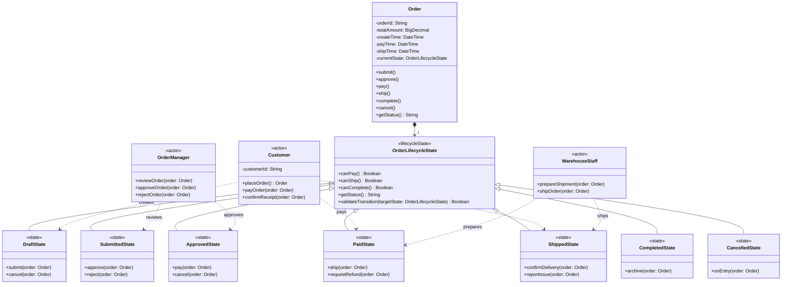
```mermaid
classDiagram
    direction TB
    
    class Order {
        -orderId: String
        -totalAmount: BigDecimal
        -createTime: DateTime
        -payTime: DateTime
        -shipTime: DateTime
        -currentState: OrderLifecycleState
        +submit()
        +approve()
        +pay()
        +ship()
        +complete()
        +cancel()
        +getStatus() String
    }
    
    class OrderLifecycleState {
        <<lifecycleState>>
        +canPay() Boolean
        +canShip() Boolean
        +canComplete() Boolean
        +getStatus() String
        +validateTransition(targetState: OrderLifecycleState) Boolean
    }
    
    class DraftState {
        <<state>>
        +submit(order: Order)
        +cancel(order: Order)
    }
    
    class SubmittedState {
        <<state>>
        +approve(order: Order)
        +reject(order: Order)
    }
    
    class ApprovedState {
        <<state>>
        +pay(order: Order)
        +cancel(order: Order)
    }
    
    class PaidState {
        <<state>>
        +ship(order: Order)
        +requestRefund(order: Order)
    }
    
    class ShippedState {
        <<state>>
        +confirmDelivery(order: Order)
        +reportIssue(order: Order)
    }
    
    class CompletedState {
        <<state>>
        +archive(order: Order)
    }
    
    class CancelledState {
        <<state>>
        +onEntry(order: Order)
    }
    
    %% Actor类
    class Customer {
        <<actor>>
        -customerId: String
        +placeOrder() Order
        +payOrder(order: Order)
        +confirmReceipt(order: Order)
    }
    
    class OrderManager {
        <<actor>>
        +reviewOrder(order: Order)
        +approveOrder(order: Order)
        +rejectOrder(order: Order)
    }
    
    class WarehouseStaff {
        <<actor>>
        +prepareShipment(order: Order)
        +shipOrder(order: Order)
    }
    
    %% 关系定义
    Order *--> "1" OrderLifecycleState
    OrderLifecycleState <|-- DraftState
    OrderLifecycleState <|-- SubmittedState
    OrderLifecycleState <|-- ApprovedState
    OrderLifecycleState <|-- PaidState
    OrderLifecycleState <|-- ShippedState
    OrderLifecycleState <|-- CompletedState
    OrderLifecycleState <|-- CancelledState
    
    %% Actor与状态的关系
    Customer ..> DraftState : creates
    Customer ..> PaidState : pays
    Customer ..> ShippedState : confirms
    OrderManager ..> SubmittedState : reviews
    OrderManager ..> ApprovedState : approves
    WarehouseStaff ..> PaidState : prepares
    WarehouseStaff ..> ShippedState : ships
```

### 状态转换图
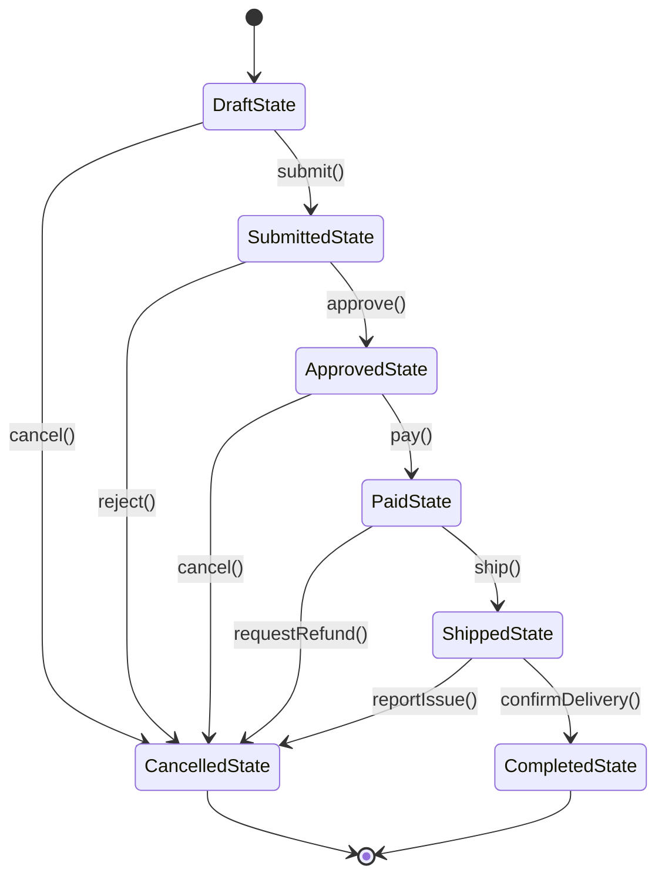
```mermaid
stateDiagram-v2
    [*] --> DraftState
    DraftState --> SubmittedState : submit()
    DraftState --> CancelledState : cancel()
    
    SubmittedState --> ApprovedState : approve()
    SubmittedState --> CancelledState : reject()
    
    ApprovedState --> PaidState : pay()
    ApprovedState --> CancelledState : cancel()
    
    PaidState --> ShippedState : ship()
    PaidState --> CancelledState : requestRefund()
    
    ShippedState --> CompletedState : confirmDelivery()
    ShippedState --> CancelledState : reportIssue()
    
    CancelledState --> [*]
    CompletedState --> [*]
```

### 交互序列图
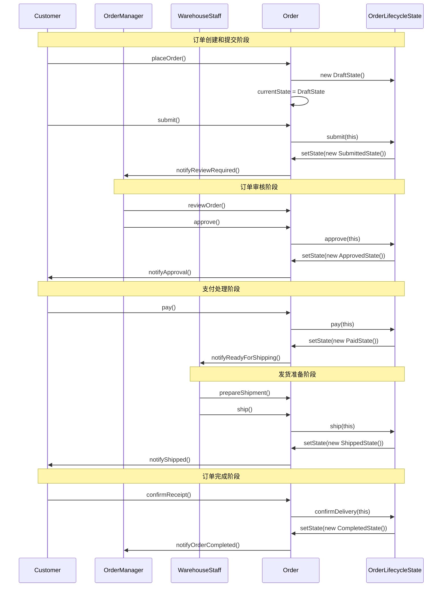
```mermaid
sequenceDiagram
    participant C as Customer
    participant OM as OrderManager
    participant WS as WarehouseStaff
    participant O as Order
    participant S as OrderLifecycleState
    
    Note over C,S: 订单创建和提交阶段
    C->>O: placeOrder()
    O->>S: new DraftState()
    O->>O: currentState = DraftState
    C->>O: submit()
    O->>S: submit(this)
    S->>O: setState(new SubmittedState())
    O->>OM: notifyReviewRequired()
    
    Note over OM,S: 订单审核阶段
    OM->>O: reviewOrder()
    OM->>O: approve()
    O->>S: approve(this)
    S->>O: setState(new ApprovedState())
    O->>C: notifyApproval()
    
    Note over C,S: 支付处理阶段
    C->>O: pay()
    O->>S: pay(this)
    S->>O: setState(new PaidState())
    O->>WS: notifyReadyForShipping()
    
    Note over WS,S: 发货准备阶段
    WS->>O: prepareShipment()
    WS->>O: ship()
    O->>S: ship(this)
    S->>O: setState(new ShippedState())
    O->>C: notifyShipped()
    
    Note over C,S: 订单完成阶段
    C->>O: confirmReceipt()
    O->>S: confirmDelivery(this)
    S->>O: setState(new CompletedState())
    O->>OM: notifyOrderCompleted()
```

### 领域规则约束
| 状态               | 允许的操作                       | 业务规则           | 负责的Actor    |
| ------------------ | -------------------------------- | ------------------ | -------------- |
| **DraftState**     | submit(), cancel()               | 订单金额必须大于0  | Customer       |
| **SubmittedState** | approve(), reject()              | 必须在24小时内审核 | OrderManager   |
| **ApprovedState**  | pay(), cancel()                  | 支付有效期7天      | Customer       |
| **PaidState**      | ship(), requestRefund()          | 必须在3天内发货    | WarehouseStaff |
| **ShippedState**   | confirmDelivery(), reportIssue() | 收货确认期15天     | Customer       |
| **CompletedState** | archive()                        | 完成后30天自动归档 | System         |
| **CancelledState** | (无)                             | 取消原因必须记录   | Various        |

### 典型应用场景

#### 订单管理系统
- **订单流程**：草稿→待审核→已审核→已支付→已发货→已完成
- **业务规则**：支付后才能发货，发货后才能确认收货
- **参与者**：客户、订单管理员、仓库人员

#### 项目管理系统
- **项目阶段**：规划→执行→测试→交付→维护
- **业务规则**：前一阶段完成才能进入下一阶段
- **参与者**：项目经理、开发人员、测试人员、客户

#### 客户关系管理
- **客户生命周期**：潜在客户→活跃客户→流失客户→赢回客户
- **业务规则**：活跃客户需要定期跟进，流失客户需要分析原因
- **参与者**：销售代表、客户经理、市场人员

#### 招聘流程管理
- **招聘流程**：简历筛选→面试安排→offer发放→入职完成
- **业务规则**：面试通过才能发offer，背景调查完成才能入职
- **参与者**：HR、面试官、部门经理、候选人

#### 贷款审批系统
- **审批流程**：申请提交→初审→终审→放款→还款完成
- **业务规则**：信用审核通过才能放款，按时还款影响信用评级
- **参与者**：申请人、信贷员、风控专员、财务人员

### 领域优势总结
1. **生命周期完整性**：确保业务对象经历完整的生命周期阶段
2. **阶段顺序性**：强制遵守业务阶段的先后顺序
3. **状态可追溯**：便于跟踪业务对象的历史状态变迁
4. **业务流程标准化**：统一相同类型业务对象的处理流程
5. **阶段约束明确**：每个阶段都有明确的进入和退出条件

这种模式特别适合那些有明确生命周期、阶段顺序固定的业务场景，能够确保业务流程的规范性和完整性。

---

## 2.4 结构状态模式 (Structural State)

### 核心特征
状态决定聚合根的内部结构组成，不同状态下拥有不同的有效成员、关联关系和约束条件。

### 类图
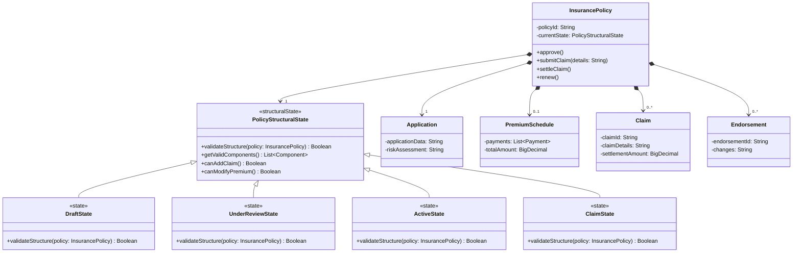
```mermaid
classDiagram
    direction TB
    
    class PolicyStructuralState {
        <<structuralState>>
        +validateStructure(policy: InsurancePolicy) Boolean
        +getValidComponents() List~Component~
        +canAddClaim() Boolean
        +canModifyPremium() Boolean
    }
    
    class DraftState {
        <<state>>
        +validateStructure(policy: InsurancePolicy) Boolean
    }
    
    class UnderReviewState {
        <<state>>
        +validateStructure(policy: InsurancePolicy) Boolean
    }
    
    class ActiveState {
        <<state>>
        +validateStructure(policy: InsurancePolicy) Boolean
    }
    
    class ClaimState {
        <<state>>
        +validateStructure(policy: InsurancePolicy) Boolean
    }
    
    class InsurancePolicy {
        -policyId: String
        -currentState: PolicyStructuralState
        +approve()
        +submitClaim(details: String)
        +settleClaim()
        +renew()
    }
    
    class Application {
        -applicationData: String
        -riskAssessment: String
    }
    
    class PremiumSchedule {
        -payments: List~Payment~
        -totalAmount: BigDecimal
    }
    
    class Claim {
        -claimId: String
        -claimDetails: String
        -settlementAmount: BigDecimal
    }
    
    class Endorsement {
        -endorsementId: String
        -changes: String
    }
    
    %% 关系定义
    PolicyStructuralState <|-- DraftState
    PolicyStructuralState <|-- UnderReviewState
    PolicyStructuralState <|-- ActiveState
    PolicyStructuralState <|-- ClaimState
    
    InsurancePolicy *--> "1" PolicyStructuralState
    InsurancePolicy *--> "1" Application
    InsurancePolicy *--> "0..1" PremiumSchedule
    InsurancePolicy *--> "0..*" Claim
    InsurancePolicy *--> "0..*" Endorsement
```

### 状态转换图
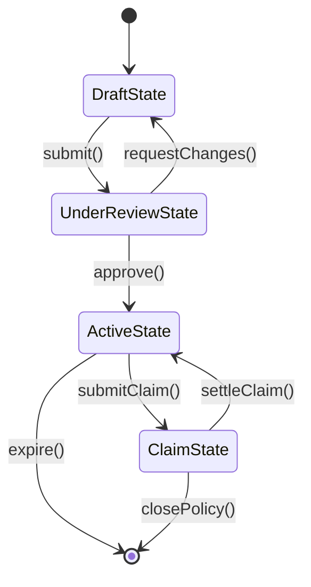
```mermaid
stateDiagram-v2
    [*] --> DraftState
    DraftState --> UnderReviewState : submit()
    UnderReviewState --> ActiveState : approve()
    UnderReviewState --> DraftState : requestChanges()
    ActiveState --> ClaimState : submitClaim()
    ClaimState --> ActiveState : settleClaim()
    ActiveState --> [*] : expire()
    ClaimState --> [*] : closePolicy()
```

### 结构组成约束表
| 状态                 | 必需组件                            | 可选组件          | 结构规则                 |
| -------------------- | ----------------------------------- | ----------------- | ------------------------ |
| **DraftState**       | Application                         | -                 | 申请信息必须完整但未验证 |
| **UnderReviewState** | Application                         | -                 | 申请信息通过初步验证     |
| **ActiveState**      | Application, PremiumSchedule        | Endorsement(0..*) | 保费计划必须生效且有效   |
| **ClaimState**       | Application, PremiumSchedule, Claim | Endorsement(0..*) | 必须有正在处理的理赔案件 |

### 交互序列图
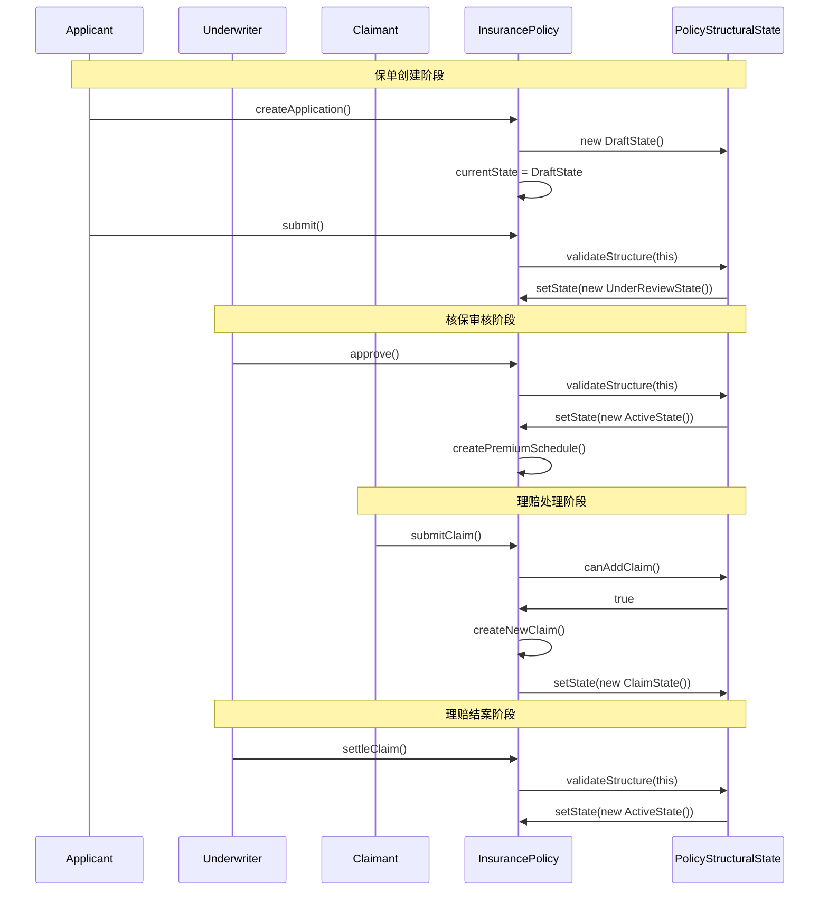
```mermaid
sequenceDiagram
    participant A as Applicant
    participant UW as Underwriter
    participant C as Claimant
    participant P as InsurancePolicy
    participant S as PolicyStructuralState
    
    Note over A,S: 保单创建阶段
    A->>P: createApplication()
    P->>S: new DraftState()
    P->>P: currentState = DraftState
    A->>P: submit()
    P->>S: validateStructure(this)
    S->>P: setState(new UnderReviewState())
    
    Note over UW,S: 核保审核阶段
    UW->>P: approve()
    P->>S: validateStructure(this)
    S->>P: setState(new ActiveState())
    P->>P: createPremiumSchedule()
    
    Note over C,S: 理赔处理阶段
    C->>P: submitClaim()
    P->>S: canAddClaim()
    S->>P: true
    P->>P: createNewClaim()
    P->>S: setState(new ClaimState())
    
    Note over UW,S: 理赔结案阶段
    UW->>P: settleClaim()
    P->>S: validateStructure(this)
    S->>P: setState(new ActiveState())
```

### 领域规则约束
| 状态                 | 结构验证规则                         | 业务约束                       |
| -------------------- | ------------------------------------ | ------------------------------ |
| **DraftState**       | Application必须存在且未提交          | 允许修改所有申请信息           |
| **UnderReviewState** | Application必须通过格式验证          | 核保员可请求补充材料           |
| **ActiveState**      | Application和PremiumSchedule必须有效 | 允许添加批单但不能修改核心信息 |
| **ClaimState**       | 必须有一个活跃的Claim实例            | 理赔期间暂停保费调整           |

### 典型应用场景

#### 保险保单系统
- **保单生命周期**：草稿期→审核期→生效期→理赔期→终止期
- **结构变化**：不同阶段需要不同的文档、条款和附件集合
- **业务规则**：生效期必须有保费计划，理赔期必须有索赔申请

#### 复杂产品配置系统
- **产品开发流程**：设计阶段→测试阶段→生产阶段
- **结构变化**：设计阶段需要原型，测试阶段需要测试计划，生产阶段需要制造规格
- **业务规则**：只有设计阶段允许修改核心设计参数

#### 工作流表单引擎
- **表单处理流程**：初始化→进行中→审核中→已完成
- **结构变化**：不同阶段显示不同的表单字段和附件要求
- **业务规则**：审核阶段需要审核意见附件，完成阶段需要签名确认

#### 合同管理系统
- **合同状态**：草案→谈判中→已签署→执行中→终止
- **结构变化**：草案期只有基础条款，谈判期有修订记录，执行期有履约记录
- **业务规则**：已签署合同不能修改核心条款，只能通过补充协议

#### 项目管理系统
- **项目阶段**：启动→规划→执行→监控→收尾
- **结构变化**：规划阶段需要项目计划，执行阶段需要任务分配，监控阶段需要进度报告
- **业务规则**：收尾阶段必须完成所有交付物和验收文档

### 领域优势总结
1. **结构一致性**：保证聚合在不同状态下内部结构的一致性
2. **动态成员管理**：根据状态动态管理内部组件的可见性和有效性  
3. **业务本质反映**：真实反映业务对象在不同阶段的本质结构变化
4. **约束集中化**：将结构约束集中在状态类中，便于维护
5. **运行时验证**：在状态转换时进行结构完整性验证

这种模式特别适合那些**内部结构随状态发生本质变化**的复杂领域对象，能够有效管理聚合根在不同业务阶段的结构组成。

---

## 2.5 事件溯源状态模式 (Event Sourced State)

### 核心特征
当前状态通过重放历史领域事件计算得出，事件是状态的唯一来源。状态本身不直接修改，而是通过应用事件来演进。

### 类图
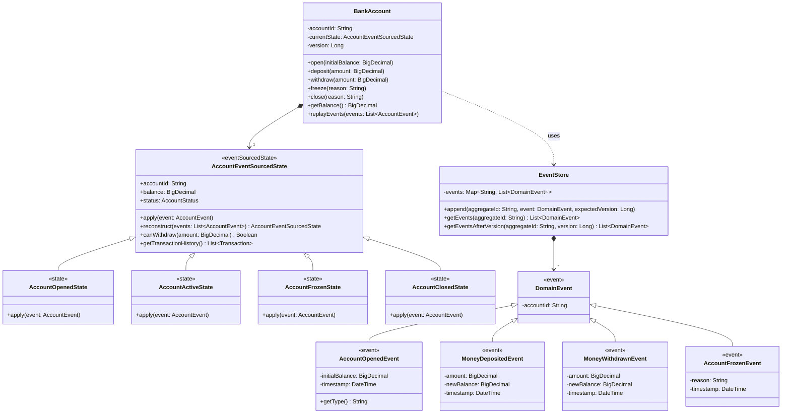
```mermaid
classDiagram
    direction TB
    
    class AccountEventSourcedState {
        <<eventSourcedState>>
        +accountId: String
        +balance: BigDecimal
        +status: AccountStatus
        +apply(event: AccountEvent)
        +reconstruct(events: List~AccountEvent~) AccountEventSourcedState
        +canWithdraw(amount: BigDecimal) Boolean
        +getTransactionHistory() List~Transaction~
    }
    
    class AccountOpenedState {
        <<state>>
        +apply(event: AccountEvent)
    }
    
    class AccountActiveState {
        <<state>>
        +apply(event: AccountEvent)
    }
    
    class AccountFrozenState {
        <<state>>
        +apply(event: AccountEvent)
    }
    
    class AccountClosedState {
        <<state>>
        +apply(event: AccountEvent)
    }
    
    class BankAccount {
        -accountId: String
        -currentState: AccountEventSourcedState
        -version: Long
        +open(initialBalance: BigDecimal)
        +deposit(amount: BigDecimal)
        +withdraw(amount: BigDecimal)
        +freeze(reason: String)
        +close(reason: String)
        +getBalance() BigDecimal
        +replayEvents(events: List~AccountEvent~)
    }
    
    class EventStore {
        -events: Map~String, List~DomainEvent~~
        +append(aggregateId: String, event: DomainEvent, expectedVersion: Long)
        +getEvents(aggregateId: String) List~DomainEvent~
        +getEventsAfterVersion(aggregateId: String, version: Long) List~DomainEvent~
    }

    class DomainEvent {
    	<<event>>
        -accountId: String
    }

    class AccountOpenedEvent {
    	<<event>>
        -initialBalance: BigDecimal
        -timestamp: DateTime
        +getType() String
    }
    
    class MoneyDepositedEvent {
    	<<event>>
        -amount: BigDecimal
        -newBalance: BigDecimal
        -timestamp: DateTime
    }
    
    class MoneyWithdrawnEvent {
    	<<event>>
        -amount: BigDecimal
        -newBalance: BigDecimal
        -timestamp: DateTime
    }
    
    class AccountFrozenEvent {
    	<<event>>
        -reason: String
        -timestamp: DateTime
    }
    
    %% 关系定义
    AccountEventSourcedState <|-- AccountOpenedState
    AccountEventSourcedState <|-- AccountActiveState
    AccountEventSourcedState <|-- AccountFrozenState
    AccountEventSourcedState <|-- AccountClosedState
    
    BankAccount *--> "1" AccountEventSourcedState
    BankAccount ..> EventStore : uses
    EventStore *--> "*" DomainEvent
    DomainEvent <|-- AccountOpenedEvent
    DomainEvent <|-- MoneyDepositedEvent
    DomainEvent <|-- MoneyWithdrawnEvent
    DomainEvent <|-- AccountFrozenEvent
```

### 状态重建流程
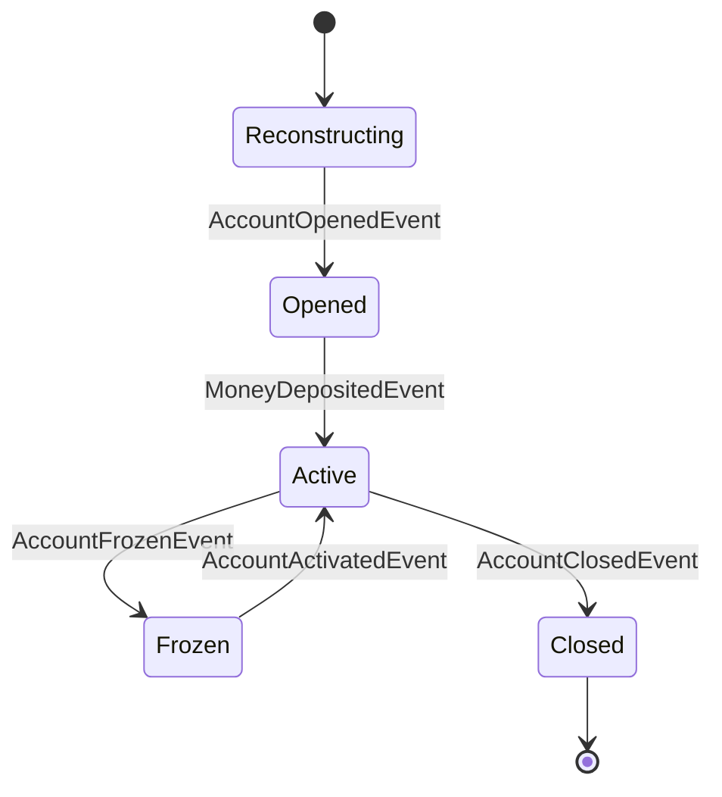
```mermaid
stateDiagram-v2
    [*] --> Reconstructing
    Reconstructing --> Opened : AccountOpenedEvent
    Opened --> Active : MoneyDepositedEvent
    Active --> Frozen : AccountFrozenEvent
    Frozen --> Active : AccountActivatedEvent
    Active --> Closed : AccountClosedEvent
    Closed --> [*]
```

### 事件序列图
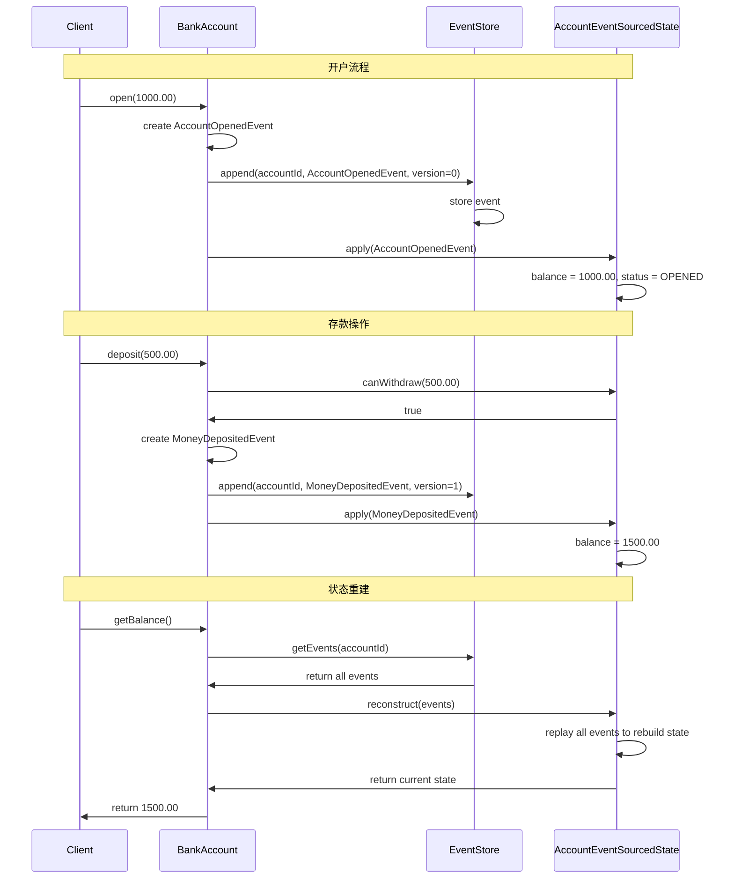
```mermaid
sequenceDiagram
    participant C as Client
    participant BA as BankAccount
    participant ES as EventStore
    participant S as AccountEventSourcedState
    
    Note over C,S: 开户流程
    C->>BA: open(1000.00)
    BA->>BA: create AccountOpenedEvent
    BA->>ES: append(accountId, AccountOpenedEvent, version=0)
    ES->>ES: store event
    BA->>S: apply(AccountOpenedEvent)
    S->>S: balance = 1000.00, status = OPENED
    
    Note over C,S: 存款操作
    C->>BA: deposit(500.00)
    BA->>S: canWithdraw(500.00)
    S->>BA: true
    BA->>BA: create MoneyDepositedEvent
    BA->>ES: append(accountId, MoneyDepositedEvent, version=1)
    BA->>S: apply(MoneyDepositedEvent)
    S->>S: balance = 1500.00
    
    Note over C,S: 状态重建
    C->>BA: getBalance()
    BA->>ES: getEvents(accountId)
    ES->>BA: return all events
    BA->>S: reconstruct(events)
    S->>S: replay all events to rebuild state
    S->>BA: return current state
    BA->>C: return 1500.00
```

### 事件类型表
| 事件类型                  | 触发条件 | 状态影响        | 业务规则           |
| ------------------------- | -------- | --------------- | ------------------ |
| **AccountOpenedEvent**    | 开户操作 | OPENED → ACTIVE | 初始余额必须 ≥ 0   |
| **MoneyDepositedEvent**   | 存款操作 | 余额增加        | 存款金额必须 > 0   |
| **MoneyWithdrawnEvent**   | 取款操作 | 余额减少        | 取款后余额不能为负 |
| **AccountFrozenEvent**    | 风险控制 | ACTIVE → FROZEN | 冻结期间禁止交易   |
| **AccountActivatedEvent** | 解冻操作 | FROZEN → ACTIVE | 需要风险审核通过   |
| **AccountClosedEvent**    | 销户操作 | ACTIVE → CLOSED | 余额必须为 0       |

### 领域规则约束
| 状态            | 允许的事件            | 业务约束         | 重建规则                 |
| --------------- | --------------------- | ---------------- | ------------------------ |
| **OpenedState** | MoneyDepositedEvent   | 必须完成首次存款 | 从AccountOpenedEvent开始 |
| **ActiveState** | 所有资金相关事件      | 余额不能为负     | 按时间顺序重放所有事件   |
| **FrozenState** | AccountActivatedEvent | 禁止资金变动     | 冻结时点后的交易事件无效 |
| **ClosedState** | (无)                  | 账户已终止       | 忽略关闭后所有事件       |

### 典型应用场景

#### 金融交易系统
- **账户管理**：开户、存款、取款、转账、销户等操作记录
- **状态重建**：通过交易事件序列重建账户余额和状态
- **业务规则**：余额不能为负，冻结账户禁止交易

#### 供应链追溯系统
- **商品流转**：采购、入库、出库、调拨、盘点等物流事件
- **状态重建**：通过物流事件重建商品库存和位置状态
- **业务规则**：库存不能为负，批次号必须唯一

#### 医疗记录系统
- **患者诊疗**：挂号、诊断、检查、治疗、出院等医疗事件
- **状态重建**：通过医疗事件重建患者病历和治疗历史
- **业务规则**：诊断必须有医生签名，用药记录必须完整

#### 法律合规系统
- **合同管理**：起草、谈判、签署、履行、变更、终止等法律事件
- **状态重建**：通过法律事件重建合同状态和条款变更历史
- **业务规则**：签署后不能修改核心条款，变更需要双方同意

#### 库存管理系统
- **库存操作**：收货、发货、调整、盘点等库存事件
- **状态重建**：通过库存事件重建商品数量和状态
- **业务规则**：发货数量不能超过库存，盘点差异需要审批

### 领域优势总结
1. **完整审计追踪**：提供完整的业务操作历史记录
2. **时间旅行能力**：支持任意时间点的状态重建
3. **事件驱动架构**：天然支持事件驱动和CQRS模式
4. **并发控制**：通过版本号实现乐观并发控制
5. **业务意图明确**：事件直接反映业务操作意图

这种模式特别适合那些**需要完整审计追踪和时间旅行能力**的业务场景，能够提供不可篡改的业务操作历史记录。

---

## 2.6 正交状态模式 (Orthogonal State)

### 核心特征
对象同时处于多个独立的状态维度，各维度状态并发存在且独立演化。状态组合决定整体行为。

### 类图
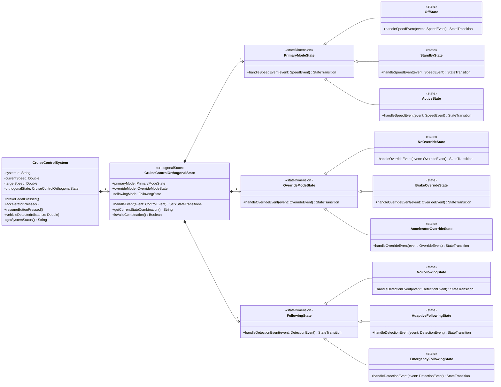
```mermaid
classDiagram
    direction LR
    
    class CruiseControlOrthogonalState {
        <<orthogonalState>>
        +primaryMode: PrimaryModeState
        +overrideMode: OverrideModeState
        +followingMode: FollowingState
        +handleEvent(event: ControlEvent) Set~StateTransition~
        +getCurrentStateCombination() String
        +isValidCombination() Boolean
    }
    
    class PrimaryModeState {
        <<stateDimension>>
        +handleSpeedEvent(event: SpeedEvent) StateTransition
    }
    
    class OverrideModeState {
        <<stateDimension>>
        +handleOverrideEvent(event: OverrideEvent) StateTransition
    }
    
    class FollowingState {
        <<stateDimension>>
        +handleDetectionEvent(event: DetectionEvent) StateTransition
    }
    
    class CruiseControlSystem {
        -systemId: String
        -currentSpeed: Double
        -targetSpeed: Double
        -orthogonalState: CruiseControlOrthogonalState
        +brakePedalPressed()
        +acceleratorPressed()
        +resumeButtonPressed()
        +vehicleDetected(distance: Double)
        +getSystemStatus() String
    }
    
    %% Primary Mode 维度
    class OffState {
        <<state>>
        +handleSpeedEvent(event: SpeedEvent) StateTransition
    }
    
    class StandbyState {
        <<state>>
        +handleSpeedEvent(event: SpeedEvent) StateTransition
    }
    
    class ActiveState {
        <<state>>
        +handleSpeedEvent(event: SpeedEvent) StateTransition
    }
    
    %% Override Mode 维度
    class NoOverrideState {
        <<state>>
        +handleOverrideEvent(event: OverrideEvent) StateTransition
    }
    
    class BrakeOverrideState {
        <<state>>
        +handleOverrideEvent(event: OverrideEvent) StateTransition
    }
    
    class AcceleratorOverrideState {
        <<state>>
        +handleOverrideEvent(event: OverrideEvent) StateTransition
    }
    
    %% Following Mode 维度
    class NoFollowingState {
        <<state>>
        +handleDetectionEvent(event: DetectionEvent) StateTransition
    }
    
    class AdaptiveFollowingState {
        <<state>>
        +handleDetectionEvent(event: DetectionEvent) StateTransition
    }
    
    class EmergencyFollowingState {
        <<state>>
        +handleDetectionEvent(event: DetectionEvent) StateTransition
    }
    
    %% 关系定义
    CruiseControlOrthogonalState *--> "1" PrimaryModeState
    CruiseControlOrthogonalState *--> "1" OverrideModeState
    CruiseControlOrthogonalState *--> "1" FollowingState
    
    PrimaryModeState <|-- OffState
    PrimaryModeState <|-- StandbyState
    PrimaryModeState <|-- ActiveState
    
    OverrideModeState <|-- NoOverrideState
    OverrideModeState <|-- BrakeOverrideState
    OverrideModeState <|-- AcceleratorOverrideState
    
    FollowingState <|-- NoFollowingState
    FollowingState <|-- AdaptiveFollowingState
    FollowingState <|-- EmergencyFollowingState
    
    CruiseControlSystem *--> "1" CruiseControlOrthogonalState
```

### 状态组合图
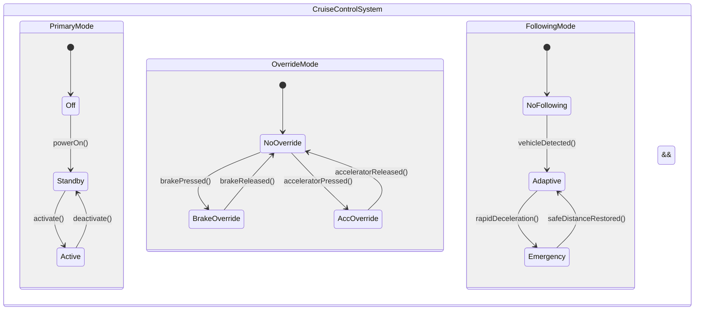
```mermaid
stateDiagram-v2
    state CruiseControlSystem {
        state PrimaryMode {
            [*] --> Off
            Off --> Standby : powerOn()
            Standby --> Active : activate()
            Active --> Standby : deactivate()
        }
        
        state OverrideMode {
            [*] --> NoOverride
            NoOverride --> BrakeOverride : brakePressed()
            BrakeOverride --> NoOverride : brakeReleased()
            NoOverride --> AccOverride : acceleratorPressed()
            AccOverride --> NoOverride : acceleratorReleased()
        }
        
        state FollowingMode {
            [*] --> NoFollowing
            NoFollowing --> Adaptive : vehicleDetected()
            Adaptive --> Emergency : rapidDeceleration()
            Emergency --> Adaptive : safeDistanceRestored()
        }
        
        PrimaryMode && OverrideMode && FollowingMode
    }
```

### 交互序列图
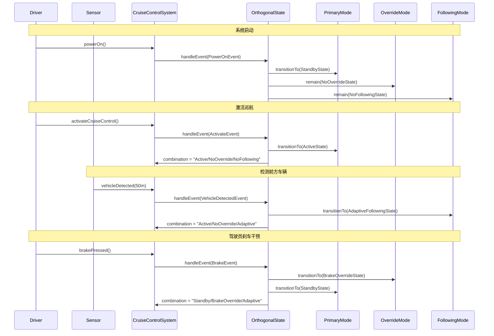
```mermaid
sequenceDiagram
    participant D as Driver
    participant S as Sensor
    participant CC as CruiseControlSystem
    participant OS as OrthogonalState
    participant PM as PrimaryMode
    participant OM as OverrideMode
    participant FM as FollowingMode
    
    Note over D,FM: 系统启动
    D->>CC: powerOn()
    CC->>OS: handleEvent(PowerOnEvent)
    OS->>PM: transitionTo(StandbyState)
    OS->>OM: remain(NoOverrideState)
    OS->>FM: remain(NoFollowingState)
    
    Note over D,FM: 激活巡航
    D->>CC: activateCruiseControl()
    CC->>OS: handleEvent(ActivateEvent)
    OS->>PM: transitionTo(ActiveState)
    OS->>CC: combination = "Active/NoOverride/NoFollowing"
    
    Note over S,FM: 检测前方车辆
    S->>CC: vehicleDetected(50m)
    CC->>OS: handleEvent(VehicleDetectedEvent)
    OS->>FM: transitionTo(AdaptiveFollowingState)
    OS->>CC: combination = "Active/NoOverride/Adaptive"
    
    Note over D,FM: 驾驶员刹车干预
    D->>CC: brakePressed()
    CC->>OS: handleEvent(BrakeEvent)
    OS->>OM: transitionTo(BrakeOverrideState)
    OS->>PM: transitionTo(StandbyState)
    OS->>CC: combination = "Standby/BrakeOverride/Adaptive"
```

### 状态组合规则表
| 主要模式 | 覆盖模式            | 跟随模式    | 有效性 | 系统行为   |
| -------- | ------------------- | ----------- | ------ | ---------- |
| Off      | 任意                | NoFollowing | 有效   | 系统关闭   |
| Standby  | NoOverride          | NoFollowing | 有效   | 准备就绪   |
| Active   | NoOverride          | NoFollowing | 有效   | 定速巡航   |
| Active   | NoOverride          | Adaptive    | 有效   | 自适应巡航 |
| Active   | BrakeOverride       | 任意        | 无效   | 冲突状态   |
| Standby  | AcceleratorOverride | 任意        | 有效   | 加速超车   |
| Active   | AcceleratorOverride | Adaptive    | 有效   | 主动超车   |

### 领域规则约束
| 状态维度          | 状态值                           | 约束条件              | 触发事件           |
| ----------------- | -------------------------------- | --------------------- | ------------------ |
| **PrimaryMode**   | Off, Standby, Active             | Active需要车速>30km/h | 电源、激活按钮     |
| **OverrideMode**  | NoOverride, Brake, Accelerator   | 覆盖模式优先于主模式  | 刹车、油门踏板     |
| **FollowingMode** | NoFollowing, Adaptive, Emergency | 需要雷达传感器正常    | 车辆检测、距离变化 |

### 典型应用场景

#### 汽车电子系统
- **状态维度**：驱动模式、安全状态、自动驾驶等级、能源模式
- **组合规则**：运动模式+主动安全+辅助驾驶+混动模式
- **业务规则**：紧急制动时自动退出自动驾驶模式

#### 工业控制系统
- **状态维度**：设备运行状态、安全监控、维护模式、生产效率
- **组合规则**：运行中+正常监控+在线维护+高效模式
- **业务规则**：维护模式下禁止生产操作

#### 智能家居系统
- **状态维度**：安全布防、能耗模式、环境控制、场景模式
- **组合规则**：离家模式+节能模式+自动控制+影院场景
- **业务规则**：安全布防时自动关闭不必要的电器

#### 云服务平台
- **状态维度**：订阅状态、合规状态、性能状态、安全状态
- **组合规则**：活跃订阅+合规通过+高性能+安全防护
- **业务规则**：合规审计期间暂停配置变更

#### 医疗设备系统
- **状态维度**：操作模式、患者状态、设备状态、安全状态
- **组合规则**：治疗模式+稳定状态+正常运行+安全监控
- **业务规则**：患者危急时自动切换到紧急处理模式

### 领域优势总结
1. **多维度建模**：准确反映现实世界中对象的并发状态维度
2. **复杂度分解**：将复杂状态机分解为多个简单的状态维度
3. **独立演化**：各状态维度可以独立设计和修改
4. **组合灵活性**：支持复杂的状态组合和约束规则
5. **系统容错**：单个维度的故障不影响其他维度运行

这种模式特别适合那些**需要处理多个独立但相关的状态维度**的复杂系统，能够有效管理并发状态并确保状态组合的有效性。

---

## 2.7 状态模式应用决策与总结

### 复杂度对比图谱
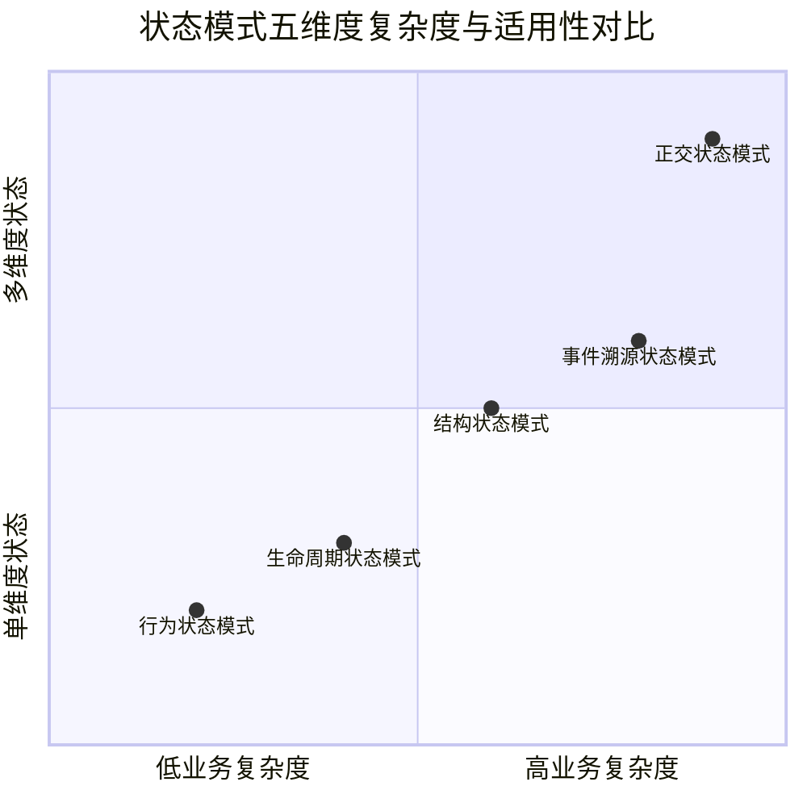
```mermaid
quadrantChart
    title 状态模式五维度复杂度与适用性对比
    x-axis "低业务复杂度" --> "高业务复杂度"
    y-axis "单维度状态" --> "多维度状态"
    
    "行为状态模式": [0.2, 0.2]
    "生命周期状态模式": [0.4, 0.3]
    "结构状态模式": [0.6, 0.5]
    "事件溯源状态模式": [0.8, 0.6]
    "正交状态模式": [0.9, 0.9]
```

## 选择指南

| 当你需要...                | 选择维度     | 示例                      |
| -------------------------- | ------------ | ------------------------- |
| **不同状态下行为不同**     | 行为状态     | 文档编辑器的阅读/编辑模式 |
| **管理有顺序的业务阶段**   | 生命周期状态 | 订单流程、审批流程        |
| **状态影响对象内部结构**   | 结构状态     | 保险保单、复杂产品配置    |
| **完整的历史追溯能力**     | 事件溯源状态 | 银行账户、审计系统        |
| **处理多个独立的状态维度** | 正交状态     | 智能家居、工业控制系统    |

这五个维度从简单到复杂，从单维度到多维度，为不同业务场景提供了精准的状态管理解决方案。

### 维度选择决策树
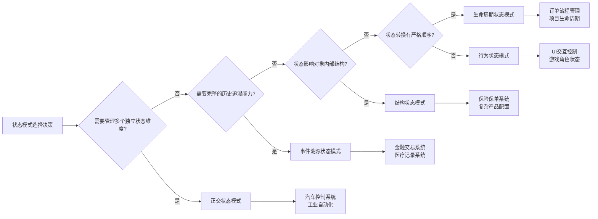
```mermaid
flowchart LR
    Start[状态模式选择决策] --> Q1{需要管理多个独立状态维度?}
    
    Q1 -->|是| Orthogonal[正交状态模式]
    Q1 -->|否| Q2{需要完整的历史追溯能力?}
    
    Q2 -->|是| EventSourced[事件溯源状态模式]
    Q2 -->|否| Q3{状态影响对象内部结构?}
    
    Q3 -->|是| Structural[结构状态模式]
    Q3 -->|否| Q4{状态转换有严格顺序?}
    
    Q4 -->|是| Lifecycle[生命周期状态模式]
    Q4 -->|否| Behavioral[行为状态模式]
    
    Orthogonal --> UseCase1[汽车控制系统<br>工业自动化]
    EventSourced --> UseCase2[金融交易系统<br>医疗记录系统]
    Structural --> UseCase3[保险保单系统<br>复杂产品配置]
    Lifecycle --> UseCase4[订单流程管理<br>项目生命周期]
    Behavioral --> UseCase5[UI交互控制<br>游戏角色状态]
```

### 实践建议

1. **渐进式采用**：从简单的行为状态开始，根据需要逐步升级到更复杂的模式
2. **模式组合使用**：复杂系统往往需要组合多个状态模式维度
3. **团队技能匹配**：选择团队熟悉且能够维护的技术方案
4. **业务价值导向**：根据业务需求选择适当复杂度的模式，避免过度设计

### 总结

状态模式的五个维度构成了一个完整的解决方案体系，从简单的单维度行为管理到复杂的多维度并发状态处理，为不同复杂度的业务场景提供了精准的技术选择。掌握这五个维度，能够帮助架构师和开发者在领域驱动设计中做出更加科学合理的决策，构建出既满足业务需求又具备良好可维护性的软件系统。

在实际项目中，关键在于准确识别业务场景的本质特征，选择最适合的状态模式维度，并在复杂度、可维护性和业务价值之间找到最佳平衡点。
