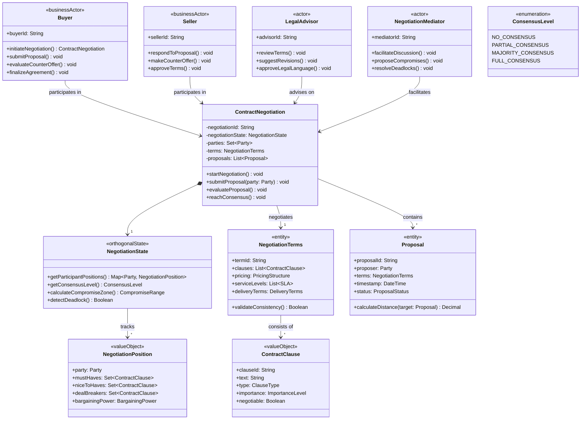

# 3 领域模型中业务流模式

## 概述

业务流模式是领域驱动设计中描述**业务过程协作**的高级模式，关注多个领域对象如何协同完成业务目标。与计算平台无关，纯粹从业务视角建模业务流程的协作方式。

---

## 3.1 状态机驱动流（State Machine Driven Flow）

### 核心特征
基于预定义状态和转换规则的顺序业务流程，状态转换驱动业务推进。业务主角（Business Actor）发起业务流程，参与者（Actor）在流程中执行具体操作。

### 业务场景
- 订单处理流程
- 审批工作流  
- 客户生命周期管理

### 领域模型

### 业务流程

### 角色职责说明

#### Business Actor（业务主角）
- **Customer（客户）**：业务流程的发起者和最终受益者
- 代表外部业务参与者，通常是系统的核心服务对象
- 发起关键业务操作，如创建订单、确认收货
- 业务流程的价值最终体现在为Business Actor提供的服务上

#### Actor（参与者）
- **OrderManager（订单管理员）**：负责订单审核和批准
- **WarehouseOperator（仓库操作员）**：负责订单发货处理
- 代表内部业务角色，在流程中执行具体操作任务
- 每个Actor在特定流程阶段承担明确的责任
- 通过状态转换触发Actor的参与和职责交接

### 状态转换与角色协作

| 状态转换             | 触发者                     | 参与者介入 | 业务价值     |
| -------------------- | -------------------------- | ---------- | ------------ |
| Draft → Submitted    | Customer（Business Actor） | -          | 客户提交需求 |
| Submitted → Approved | OrderManager（Actor）      | 订单审核   | 风险控制     |
| Approved → Shipped   | WarehouseOperator（Actor） | 物流处理   | 履约服务     |
| Shipped → Completed  | Customer（Business Actor） | -          | 服务完成确认 |

## 设计要点

1. **Business Actor驱动**：业务流程由Business Actor的需求发起，体现业务价值流向
2. **Actor分工明确**：每个Actor在特定状态阶段介入，职责边界清晰
3. **状态转换控制**：状态机确保业务流程的顺序性和完整性
4. **角色协作契约**：状态转换定义了不同角色间的协作接口和责任传递

这种模式确保了业务流程中各个角色的职责分离和有序协作，同时保持了业务意图的清晰表达。

---

## 3.2 事件风暴驱动流（Event Storming Driven Flow）

### 核心特征
业务操作产生领域事件，事件触发后续处理链，形成事件驱动的业务流程。业务主角（Business Actor）发起关键业务操作，参与者（Actor）响应事件并执行处理任务。

### 业务场景
- 保险保单处理
- 金融交易处理  
- 实时监控系统

### 领域模型

### 业务流程

### 角色职责说明

#### Business Actor（业务主角）
- **InsuranceAgent（保险代理人）**：业务流程的发起者和销售代表
- 代表外部业务参与者，负责获取客户和创建保单
- 发起核心业务操作，如创建保单、确认保单生效
- 业务流程的价值最终体现在为Business Actor完成的销售服务上

#### Actor（参与者）
- **Underwriter（核保员）**：负责风险评估和核保决策
- **BillingSpecialist（账单专员）**：负责账单设置和激活
- 代表内部专业角色，在事件触发时执行特定处理任务
- 每个Actor响应特定类型的事件，承担专业职责
- 通过事件传播实现Actor间的松耦合协作

### 事件传播与角色协作

| 领域事件                   | 产生者                           | 响应者                           | 业务价值     |
| -------------------------- | -------------------------------- | -------------------------------- | ------------ |
| PolicyCreatedEvent         | InsuranceAgent（Business Actor） | Underwriter（Actor）             | 新业务录入   |
| UnderwritingCompletedEvent | Underwriter（Actor）             | BillingSpecialist（Actor）       | 风险评估完成 |
| PolicyActivatedEvent       | BillingSpecialist（Actor）       | InsuranceAgent（Business Actor） | 保单正式生效 |

## 设计要点

1. **Business Actor发起**：业务流程由Business Agent的销售活动发起，体现业务价值创造
2. **事件驱动协作**：各个Actor通过领域事件进行异步协作，降低系统耦合度
3. **事件溯源**：通过事件序列重建业务对象状态，提供完整的审计追踪
4. **角色专业分工**：每个Actor专注于特定领域的专业处理任务

这种模式确保了业务流程中各个专业角色的明确分工和事件驱动的松耦合协作。

---

## 3.3 业务流程驱动流（Business Process Driven Flow）

### 核心特征
复杂业务流程的步骤化执行和管理，每个步骤有明确的输入输出和验收标准。业务主角（Business Actor）发起业务流程，多个参与者（Actor）在特定步骤介入执行专业任务。

### 业务场景
- 贷款审批流程
- 保险理赔处理
- 合规审查流程

### 领域模型

### 业务流程

### 角色职责说明

#### Business Actor（业务主角）
- **LoanApplicant（贷款申请人）**：业务流程的发起者和最终受益者
- 代表外部业务参与者，有明确的金融服务需求
- 发起贷款申请，提供必要材料，接收最终审批结果
- 业务流程的价值体现在为申请人提供资金解决方案

#### Actor（参与者）
- **LoanOfficer（贷款专员）**：负责初步审核和材料验证
- **CreditAnalyst（信用分析师）**：负责信用风险评估
- **UnderwritingManager（授信经理）**：负责最终审批和条款设定
- 代表内部专业角色，在特定流程步骤中执行专业评估
- 每个Actor在流程的特定阶段介入，承担明确的审批职责

### 流程步骤与角色协作

| 流程步骤              | 主要执行者                      | 参与协作者                | 验收标准                       |
| --------------------- | ------------------------------- | ------------------------- | ------------------------------ |
| DOCUMENT_SUBMISSION   | LoanApplicant（Business Actor） | -                         | 所有必需文件完整提交           |
| INITIAL_REVIEW        | LoanOfficer（Actor）            | -                         | 材料真实性验证通过             |
| CREDIT_ASSESSMENT     | CreditAnalyst（Actor）          | LoanOfficer（提供信息）   | 信用评分达到阈值，风险评估完成 |
| UNDERWRITING_APPROVAL | UnderwritingManager（Actor）    | CreditAnalyst（提供报告） | 授信条件设定，风险可控         |
| FINAL_SIGN_OFF        | UnderwritingManager（Actor）    | -                         | 贷款合同生成，流程完成         |

## 设计要点

1. **流程步骤专属界面**：每个流程步骤有对应的专用操作界面，符合步骤专业化要求
2. **流程状态驱动导航**：界面可用性和跳转由流程步骤状态严格控制
3. **进度可视化**：提供完整的流程进度视图，增强用户体验和预期管理
4. **步骤依赖管理**：界面操作受限于流程步骤的前置依赖关系
5. **批量处理支持**：工作台界面支持批量处理同步骤任务，提高工作效率

这种设计确保了复杂业务流程中各个专业角色能够通过步骤化界面有序协作，同时保持了流程控制的严格性和用户体验的连贯性。

## 

---

## 3.4 决策表驱动流（Decision Table Driven Flow）

### 核心特征
基于决策表的复杂业务规则执行，规则驱动业务流程走向。业务主角（Business Actor）提交需要规则评估的业务请求，参与者（Actor）执行规则评估和决策应用。

### 业务场景
- 保险理赔评估
- 信用风险评估
- 定价策略执行

### 领域模型

### 业务流程

### 角色职责说明

#### Business Actor（业务主角）
- **Claimant（索赔人）**：业务流程的发起者和决策结果接收者
- 代表外部业务参与者，有明确的理赔服务需求
- 提交理赔申请，提供评估所需信息，接收评估结果
- 业务流程的价值体现在为索赔人提供公正、高效的理赔服务

#### Actor（参与者）
- **ClaimsAdjuster（理赔审核员）**：负责执行规则评估和决策应用
- **RiskManager（风险管理师）**：负责决策规则配置和审计
- 代表内部专业角色，在规则评估流程中承担不同职责
- 每个Actor在规则生命周期的不同阶段介入，确保决策质量

### 决策流程与角色协作

| 决策阶段 | 主要执行者              | 参与协作者                   | 核心产出   | 质量保证           |
| -------- | ----------------------- | ---------------------------- | ---------- | ------------------ |
| 规则配置 | RiskManager（Actor）    | -                            | 决策表版本 | 规则验证、版本管理 |
| 规则评估 | ClaimsAdjuster（Actor） | DecisionTable（自动）        | 评估结果   | 规则匹配、分数计算 |
| 决策应用 | ClaimsAdjuster（Actor） | ClaimAssessmentState（自动） | 最终决策   | 决策一致性检查     |
| 决策覆写 | ClaimsAdjuster（Actor） | RiskManager（审计）          | 人工决策   | 覆写理由记录       |

## 设计要点

1. **Business Actor驱动**：业务流程由索赔人的理赔需求发起，体现保险服务价值
2. **规则驱动决策**：业务决策基于预定义的决策表和业务规则，确保一致性和可追溯性
3. **规则生命周期管理**：支持规则的配置、验证、版本控制和审计
4. **决策透明度**：提供完整的规则匹配和评估过程记录，增强决策可信度

这种模式确保了复杂业务规则评估中决策的客观性、一致性和可审计性。

---

## 3.5 协作驱动流（Collaboration Driven Flow）

### 核心特征
多个领域实体协同完成业务目标，强调角色间的协作关系。业务主角（Business Actor）作为服务接收者，多个参与者（Actor）通过专业分工和紧密协作提供服务。

### 业务场景
- 医疗团队协作
- 项目团队协作
- 多方审批流程

### 领域模型

### 业务流程

### 角色职责说明

#### Business Actor（业务主角）
- **Patient（患者）**：协作服务的核心受益者和参与者
- 代表外部业务参与者，有明确的健康服务需求
- 主动参与治疗过程，提供反馈和配合治疗
- 业务流程的价值体现在为患者提供全面、协调的医疗服务

#### Actor（参与者）
- **Physician（主治医生）**：负责诊断和治疗方案制定
- **Nurse（护士）**：负责治疗执行和患者监护
- **Specialist（专科医生）**：负责专业会诊和特殊治疗
- 代表内部专业角色，在协作网络中承担互补职责
- 每个Actor在治疗过程的不同阶段发挥专业作用，通过紧密协作确保服务质量

### 协作阶段与角色互动

| 治疗阶段           | 主导角色  | 协作角色              | 关键协作活动           | 质量指标   |
| ------------------ | --------- | --------------------- | ---------------------- | ---------- |
| ADMISSION          | Nurse     | Physician             | 患者评估、病史收集     | 评估完整性 |
| DIAGNOSIS          | Physician | Specialist, Nurse     | 诊断确定、检查协调     | 诊断准确性 |
| TREATMENT_PLANNING | Physician | Specialist, Nurse     | 治疗方案制定、资源协调 | 方案可行性 |
| ACTIVE_TREATMENT   | Nurse     | Physician, Specialist | 治疗执行、进度监控     | 治疗依从性 |
| RECOVERY           | Nurse     | Physician             | 康复监测、效果评估     | 恢复进度   |
| DISCHARGE_PLANNING | Physician | Nurse, Patient        | 出院准备、后续安排     | 出院准备度 |

## 设计要点

1. **Business Actor中心**：协作流程以患者需求为中心，所有协作活动围绕患者利益展开
2. **角色互补协作**：不同专业角色通过明确分工和紧密协作提供综合服务
3. **动态协作网络**：协作关系根据治疗阶段动态调整，支持灵活的团队组成
4. **进度同步机制**：通过状态管理确保所有参与者对治疗进展有共同理解

这种模式确保了复杂协作场景中各个专业角色的有效配合和服务连续性。

---

## 3.6 计划-执行驱动流（Plan-Execute Driven Flow）

### 核心特征
基于预定义计划的步骤执行和监控，强调任务的依赖关系和执行顺序。业务主角（Business Actor）发起项目或计划，参与者（Actor）按照计划执行具体任务并监控进展。

### 业务场景
- 项目管理
- 生产计划执行
- 实施部署流程

### 领域模型

### 业务流程

### 角色职责说明

#### Business Actor（业务主角）
- **ProjectSponsor（项目发起人）**：项目的投资方和最终受益者
- 代表业务利益相关者，有明确的商业目标
- 发起项目、审批计划、验收成果
- 业务流程的价值体现在为发起人交付预期的商业价值

#### Actor（参与者）
- **ProjectManager（项目经理）**：负责项目规划、协调和监控
- **TeamMember（团队成员）**：负责具体任务的执行
- **QualityAssurance（质量保证）**：负责成果验证和质量控制
- 代表项目执行团队，在项目生命周期中承担专业职责
- 每个Actor在项目不同阶段发挥特定作用，通过计划协调确保项目成功

### 项目阶段与角色协作

| 项目阶段   | 主导角色         | 关键活动           | 交付物   | 质量门控 |
| ---------- | ---------------- | ------------------ | -------- | -------- |
| 项目启动   | ProjectSponsor   | 商业论证、目标设定 | 项目章程 | 投资审批 |
| 项目规划   | ProjectManager   | WBS制定、资源分配  | 项目计划 | 计划评审 |
| 任务执行   | TeamMember       | 任务实施、进度报告 | 工作成果 | 任务验收 |
| 质量验证   | QualityAssurance | 成果验证、质量检查 | 质量报告 | 质量评审 |
| 里程碑验收 | ProjectSponsor   | 成果演示、价值确认 | 验收报告 | 商业验收 |

## 设计要点

1. **Business Actor价值导向**：项目以发起人的商业价值为目标，所有活动围绕价值交付展开
2. **计划驱动执行**：基于WBS的详细计划指导具体执行，确保工作有序推进
3. **依赖关系管理**：任务间的依赖关系严格控制执行顺序，避免资源冲突
4. **进度可视化**：通过状态管理提供透明的进度视图，支持及时决策

这种模式确保了复杂项目中各个角色的有序协作和计划的有效执行。

---

## 3.7 数据管道驱动流（Data Pipeline Driven Flow）

### 核心特征
数据在不同处理阶段流动和转换，强调数据的加工和处理流程。业务主角（Business Actor）请求数据服务，参与者（Actor）配置和执行数据处理管道。

### 业务场景
- ETL数据处理
- 报表生成流程
- 数据质量检查
- 实时数据流处理

### 领域模型

### 业务流程

### 角色职责说明

#### Business Actor（业务主角）
- **DataConsumer（数据消费者）**：数据服务的最终用户和受益者
- 代表业务用户，有明确的数据分析或报表需求
- 发起数据处理请求，消费处理结果，提供反馈
- 业务流程的价值体现在为消费者提供准确、及时的数据洞察

#### Actor（参与者）
- **DataEngineer（数据工程师）**：负责管道配置、运维和监控
- **DataSteward（数据管家）**：负责数据质量规则和治理
- **DataScientist（数据科学家）**：负责数据转换和模型设计
- 代表数据专业角色，在数据处理生命周期中承担技术职责
- 每个Actor在数据处理管道的不同方面发挥专业作用

### 数据处理阶段与角色协作

| 处理阶段 | 主导角色      | 关键活动              | 质量检查点 | 产出物   |
| -------- | ------------- | --------------------- | ---------- | -------- |
| 需求分析 | DataConsumer  | 业务需求定义、KPI确定 | 需求明确性 | 需求规格 |
| 管道设计 | DataEngineer  | 架构设计、资源配置    | 技术可行性 | 管道设计 |
| 质量规则 | DataSteward   | 数据标准、质量规则    | 规则完整性 | 质量规范 |
| 转换设计 | DataScientist | 数据转换、特征工程    | 算法准确性 | 转换逻辑 |
| 执行监控 | DataEngineer  | 运行监控、性能优化    | SLA符合性  | 运行报告 |
| 结果交付 | DataConsumer  | 结果验证、业务应用    | 业务价值   | 数据产品 |

## 设计要点

1. **Business Actor价值导向**：数据处理以消费者的业务需求为出发点，确保产出价值
2. **管道化处理**：数据通过可配置的处理阶段流动，支持复杂的数据加工逻辑
3. **质量内建**：质量检查嵌入处理流程，确保数据可信度
4. **可观测性**：完整的处理日志和指标，支持问题诊断和性能优化

这种模式确保了数据处理流程的可靠性、可维护性和业务价值。

---

## 3.8 协商驱动流（Negotiation Driven Flow）

### 核心特征
多个参与方通过协商达成一致，强调利益协调和共识形成。业务主角（Business Actor）作为协商发起方，多个参与者（Actor）通过多轮协商达成互利协议。

### 业务场景
- 合同谈判
- 价格协商
- 争议解决
- 服务级别协议制定

### 领域模型

### 业务流程

### 角色职责说明

#### Business Actor（业务主角）
- **Buyer（买方）**：协商的发起方和协议的主要受益者
- **Seller（卖方）**：协商的响应方和协议的提供者
- 代表商业交易的直接参与方，有明确的商业利益
- 提出需求、评估方案、做出决策，最终达成互利协议
- 业务流程的价值体现在为双方创造公平、可持续的商业关系

#### Actor（参与者）
- **LegalAdvisor（法律顾问）**：负责条款合法性和风险控制
- **NegotiationMediator（协商调解人）**：负责促进对话和打破僵局
- 代表专业支持角色，在协商过程中提供专业指导
- 每个Actor在协商的不同阶段介入，确保协商的公平性和有效性

### 协商阶段与角色互动

| 协商阶段 | 主要参与方    | 支持角色            | 关键活动           | 成功标准       |
| -------- | ------------- | ------------------- | ------------------ | -------------- |
| 准备阶段 | Buyer, Seller | -                   | 需求分析、底线确定 | 明确谈判目标   |
| 开局阶段 | Buyer         | Seller              | 初始提案、立场表明 | 建立对话基础   |
| 讨价还价 | Buyer, Seller | LegalAdvisor        | 条款协商、利益交换 | 找到共同利益   |
| 僵局处理 | Buyer, Seller | NegotiationMediator | 打破僵局、寻找替代 | 恢复对话动力   |
| 最终确定 | Buyer, Seller | LegalAdvisor        | 条款确认、风险审查 | 达成可执行协议 |
| 协议签署 | Buyer, Seller | -                   | 正式签署、关系确立 | 完成法律约束   |

## 设计要点

1. **双Business Actor驱动**：协商由买卖双方共同驱动，体现商业互惠原则
2. **多轮协商机制**：支持提案-反提案的迭代过程，逐步逼近共识
3. **专业支持介入**：在关键节点引入专业角色，提升协商质量和效率
4. **共识度量化**：通过共识级别量化协商进展，支持决策制定

这种模式确保了商业协商的公平性、有效性和可持续性。

---

## 总结

以上八种业务流模式覆盖了从简单状态转换到复杂多方协商的各种业务场景，每种模式都有其特定的核心特征、适用场景和角色协作方式。在实际领域建模中，应根据具体业务需求选择合适的模式，确保业务流程的准确表达和高效执行。
