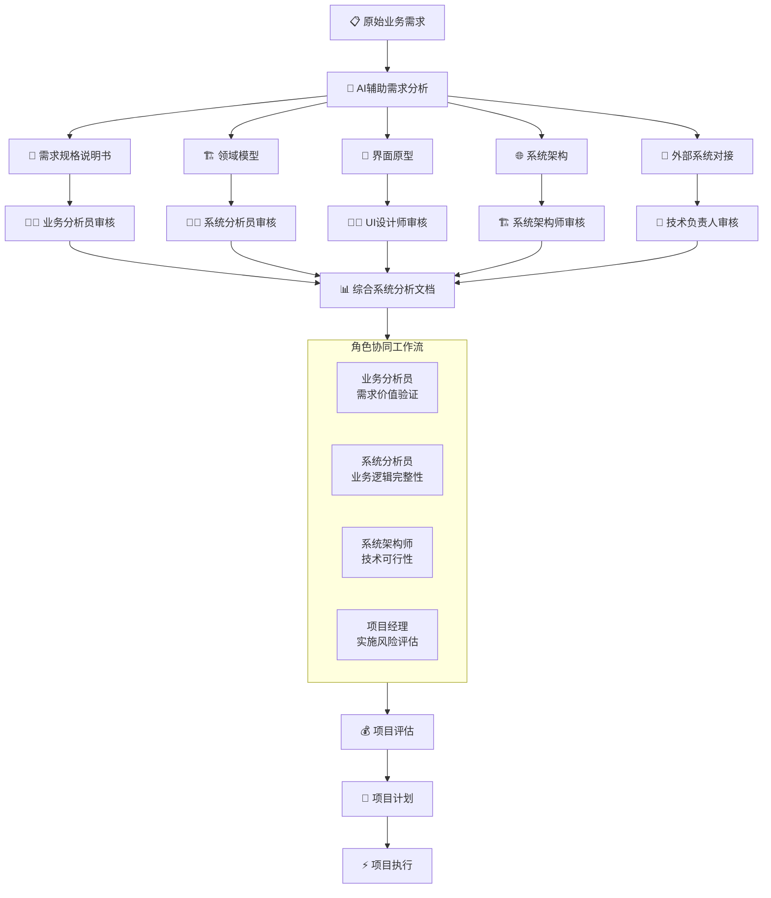
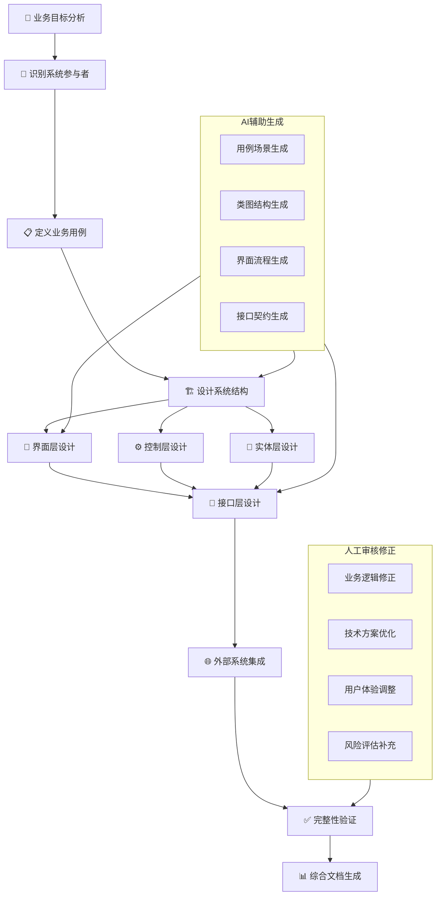
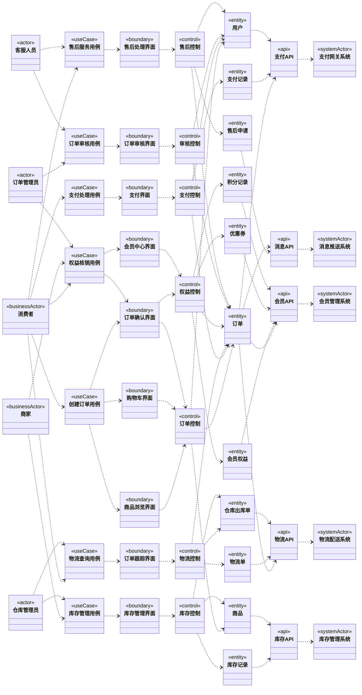

# 10 综合系统分析

## 10.1 跨维度协同分析与AI辅助建模

### 10.1.1 多维度工件协同构建

在信息化建模初期，通过AI辅助和跨角色协同，我们快速建立了完整的系统分析基础。各专业角色基于统一的需求输入，并行开展专项工作，形成相互验证、相互支撑的完整工件体系。

### 10.1.2 AI辅助建模价值体现

**需求规格说明书（业务分析员主导）**
- AI生成结构化需求描述，覆盖正常/异常流程
- 业务分析员聚焦业务价值验证和场景完整性
- 输出：四维描述法（文字、类图、交互图、状态图）

**领域模型（系统分析员主导）**
- AI识别核心业务实体和关系
- 系统分析员验证业务规则和状态机完整性
- 输出：五维度状态模式驱动的领域模型

**界面原型（UI设计师主导）**
- AI基于状态模式生成界面流程
- UI设计师优化用户体验和交互设计
- 输出：模式驱动的界面原型和导航逻辑

**系统架构（系统架构师主导）**
- AI推荐微服务划分和技术栈
- 架构师验证扩展性和性能要求
- 输出：云原生微服务架构方案

**外部系统对接（技术负责人主导）**
- AI分析接口契约和数据映射
- 技术负责人设计异常处理和补偿机制
- 输出：系统边界定义和集成方案

### 10.1.3 协同评审机制

**四层评审流程：**
1. **业务价值评审**：验证需求与业务目标一致性
2. **技术可行性评审**：评估架构方案可实现性
3. **用户体验评审**：确认界面设计用户友好性
4. **项目风险评审**：识别实施风险和应对措施

**AI辅助优势：**
- 生成基础内容覆盖80%工作量
- 确保各工件间术语一致性
- 快速响应需求变更和调整
- 积累组织知识库和最佳实践

## 10.2 综合系统分析构建方法论

### 10.2.1 核心分析原则

**原则1：业务价值驱动**
- 所有系统元素必须服务于明确的业务价值
- 参与者需求是系统设计的出发点
- 功能优先级基于业务价值排序

**原则2：架构一致性**
- 各维度工件保持概念一致性
- 技术实现与业务模型对齐
- 接口契约稳定且向后兼容

**原则3：可扩展性设计**
- 支持业务功能渐进式扩展
- 系统边界清晰便于集成
- 技术架构支持水平扩展

**原则4：风险前瞻性**
- 早期识别技术和管理风险
- 设计阶段考虑异常处理
- 建立变更影响分析机制

### 10.2.2 分析构建流程

**详细步骤说明：**

1. **业务目标分析**
   - 识别核心业务价值和成功标准
   - 确定系统范围和边界
   - 分析业务约束和假设

2. **识别系统参与者**
   - 区分业务主角和系统参与者
   - 分析各参与者的业务目标
   - 定义参与者能力和权限

3. **定义业务用例**
   - 基于参与者目标识别用例
   - 描述用例场景和流程
   - 定义用例前置和后置条件

4. **设计系统结构**
   - 识别核心业务实体
   - 定义实体间关系
   - 设计业务规则和状态机

5. **分层架构设计**
   - 界面层：用户交互和体验
   - 控制层：业务流程协调
   - 实体层：业务数据和行为
   - 接口层：系统内外通信

6. **外部系统集成**
   - 识别需要对接的外部系统
   - 设计接口契约和数据映射
   - 定义集成模式和异常处理

7. **完整性验证**
   - 验证各层次间一致性
   - 检查业务场景覆盖度
   - 评估技术实现可行性

## 10.3 完整系统架构类图

### 10.3.1 架构完整性说明

通过这个完整的系统架构类图，我们清晰地展示了从业务参与者到外部系统的完整依赖链：

**内部系统边界**：`[[用例(useCase)..>界面类(boundary)..>控制类(control)、实体类(entity)]]`

**外部系统集成**：`系统接口(api)..>其他系统(systemActor)`

这种架构设计确保了：
1. **业务价值闭环**：每个功能都服务于明确的参与者需求
2. **技术职责清晰**：各层次职责分明，便于团队协作
3. **系统边界明确**：内部实现与外部集成分离，降低复杂度
4. **扩展性良好**：新功能可以按相同模式添加，不影响现有架构

该综合系统分析文档为后续的项目评估、项目计划和项目执行提供了完整的技术基础和业务依据。

