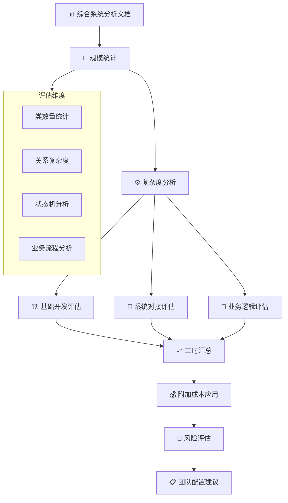
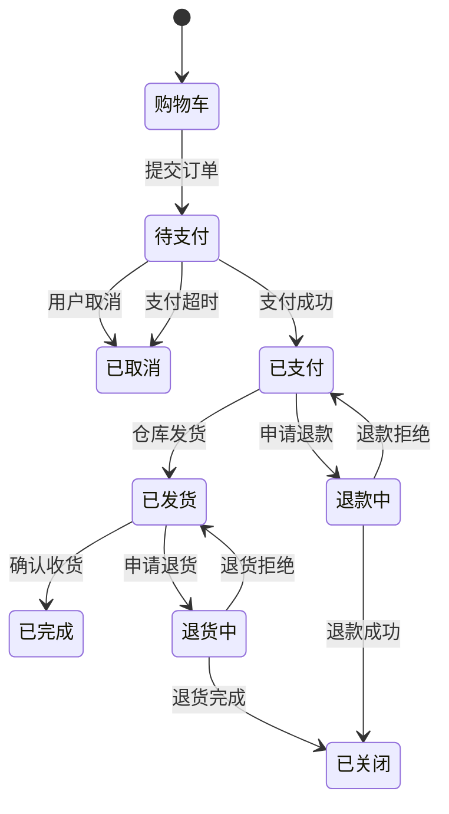
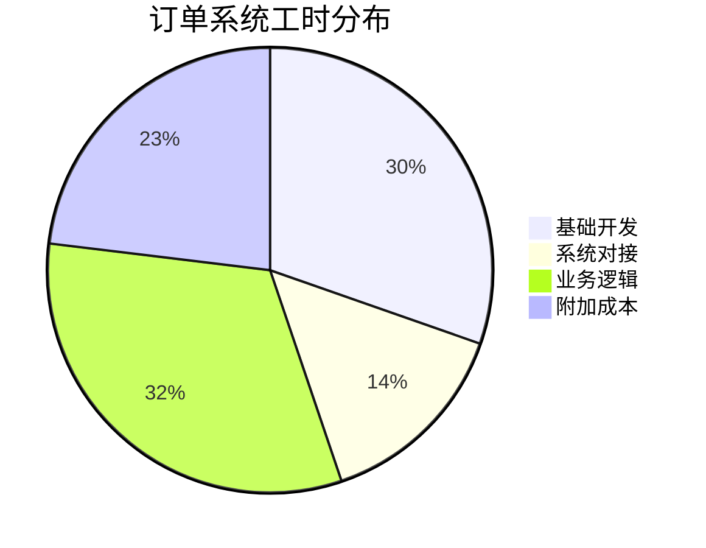
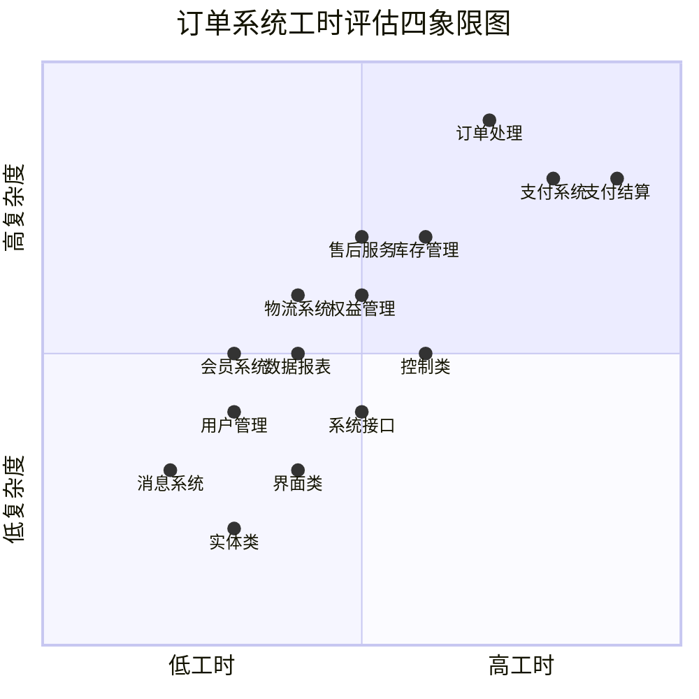
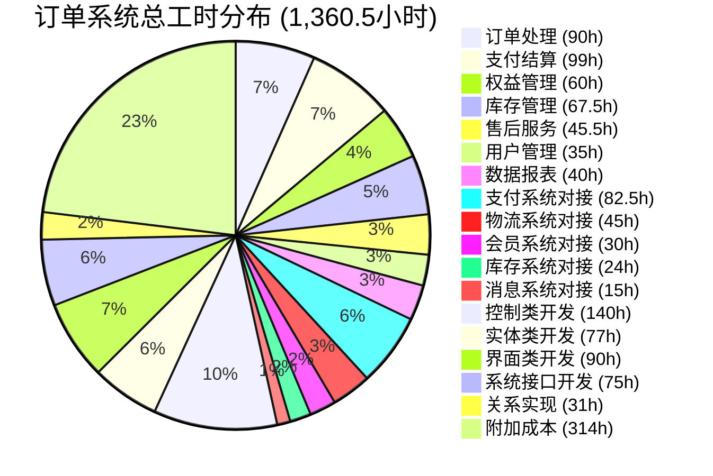
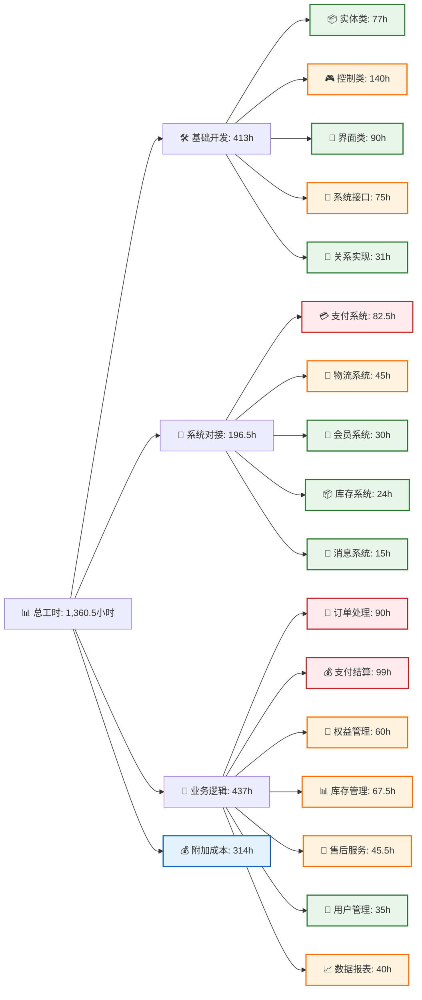
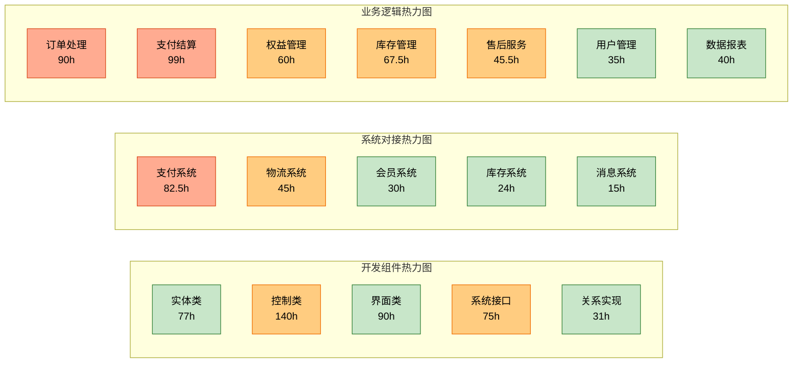
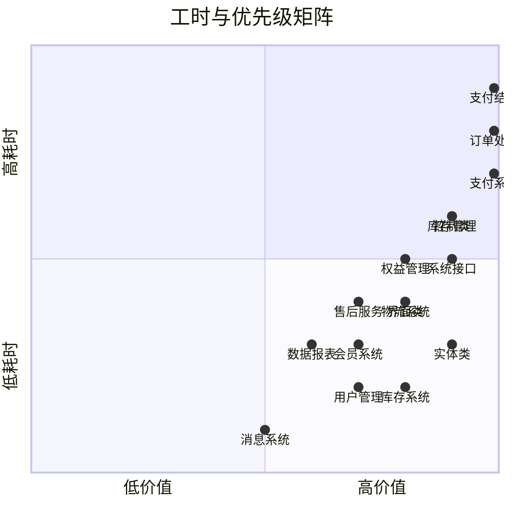

# 11 项目评估

## 11.1 评估模型应用概述

基于第10章的综合系统分析和项目工时评估算法，本章对订单系统进行详细的工时评估。评估采用分层计算方式，确保评估结果的准确性和可追溯性。

### 11.1.1 评估方法


## 11.2 基础开发工时评估

### 11.2.1 类规模统计

根据10.3完整系统架构类图，统计各类型类的数量：

| 类类型       | 数量 | 基础工时  | 复杂度系数 | 小计工时 |
| ------------ | ---- | --------- | ---------- | -------- |
| **实体类**   | 11个 | 7小时/类  | 中(1.0)    | 77小时   |
| **控制类**   | 7个  | 20小时/类 | 中(1.0)    | 140小时  |
| **界面类**   | 9个  | 10小时/类 | 中(1.0)    | 90小时   |
| **系统接口** | 5个  | 15小时/类 | 中(1.0)    | 75小时   |

**实体类明细：**
- 订单、支付记录、物流单、用户、会员权益、优惠券、商品、库存记录、仓库出库单、积分记录、售后申请

**控制类明细：**
- 订单控制、支付控制、物流控制、权益控制、库存控制、审核控制、售后控制

**界面类明细：**
- 商品浏览界面、购物车界面、订单确认界面、支付界面、订单跟踪界面、会员中心界面、库存管理界面、订单审核界面、售后处理界面

### 11.2.2 关系复杂度评估

根据类图分析，识别核心业务关系：

| 关系类型         | 数量 | 基础工时   | 复杂度系数 | 小计工时 |
| ---------------- | ---- | ---------- | ---------- | -------- |
| **核心业务关系** | 15个 | 1小时/关系 | 中(1.0)    | 15小时   |
| **外部依赖关系** | 8个  | 2小时/关系 | 中(1.0)    | 16小时   |

**基础开发总工时：**
```
77 + 140 + 90 + 75 + 15 + 16 = 413小时
```

## 11.3 系统对接工时评估

### 11.3.1 外部系统对接分析

根据10.3架构图，识别需要对接的外部系统：

| 系统类型         | 基础工时 | 复杂度系数 | 小计工时 | 对接内容             |
| ---------------- | -------- | ---------- | -------- | -------------------- |
| **支付网关系统** | 55小时   | 中(1.5)    | 82.5小时 | 支付、退款、状态同步 |
| **物流配送系统** | 30小时   | 中(1.5)    | 45小时   | 物流创建、轨迹查询   |
| **会员管理系统** | 25小时   | 中(1.2)    | 30小时   | 权益查询、积分同步   |
| **库存管理系统** | 20小时   | 中(1.2)    | 24小时   | 库存查询、锁定操作   |
| **消息推送系统** | 15小时   | 低(1.0)    | 15小时   | 通知发送、状态更新   |

**系统对接总工时：**
```
82.5 + 45 + 30 + 24 + 15 = 196.5小时
```

### 11.3.2 对接复杂度说明

**支付网关系统（中复杂度）：**
- 多种支付渠道集成
- 异步通知机制
- 安全签名验证
- 异常处理和重试机制

**物流配送系统（中复杂度）：**
- 多物流公司接口适配
- 实时轨迹状态同步
- 电子面单生成

## 11.4 业务逻辑工时评估

### 11.4.1 核心业务流程分析

基于用例和状态机分析，评估各业务模块复杂度：

| 业务模块     | 基础工时 | 复杂度系数 | 小计工时 | 核心功能                 |
| ------------ | -------- | ---------- | -------- | ------------------------ |
| **订单处理** | 50小时   | 高(1.8)    | 90小时   | 创建、状态管理、流程控制 |
| **支付结算** | 55小时   | 高(1.8)    | 99小时   | 支付、退款、分账         |
| **用户管理** | 35小时   | 中(1.0)    | 35小时   | 注册、登录、权限         |
| **权益管理** | 40小时   | 中(1.5)    | 60小时   | 权益核销、优惠券         |
| **库存管理** | 45小时   | 中(1.5)    | 67.5小时 | 库存控制、出入库         |
| **售后服务** | 35小时   | 中(1.3)    | 45.5小时 | 申请、审核、处理         |
| **数据报表** | 40小时   | 中(1.0)    | 40小时   | 统计、分析、导出         |

### 11.4.2 状态机复杂度分析

**订单处理状态机（高复杂度）：**


**状态机特征：**
- 状态数量：8个主要状态
- 转换路径：12条主要路径
- 异常分支：6种异常情况
- 并发要求：库存锁定、支付并发

**业务逻辑总工时：**
```
90 + 99 + 35 + 60 + 67.5 + 45.5 + 40 = 437小时
```

## 11.5 工时汇总与风险评估

### 11.5.1 总工时计算

**基础工时汇总：**
```
基础开发: 413小时
系统对接: 196.5小时  
业务逻辑: 437小时
基础总工时 = 413 + 196.5 + 437 = 1,046.5小时
```

**应用附加成本：**
```
总工时 = 基础总工时 × 1.3 = 1,046.5 × 1.3 = 1,360.5小时
```

### 11.5.2 风险评估

根据M1评估标准：

| 评估维度       | 结果           | 风险等级 |
| -------------- | -------------- | -------- |
| **总工时范围** | 1,360.5小时    | 中风险   |
| **技术复杂度** | 中等           | 中风险   |
| **系统集成度** | 5个外部系统    | 中风险   |
| **业务复杂度** | 高复杂度状态机 | 中高风险 |

**总体风险等级：中风险**

### 11.5.3 团队配置建议

基于1,360.5小时总工时，建议配置：

**团队规模：5-6人**
- 后端开发：3人
- 前端开发：2人  
- 测试：1人

**开发周期：4-5个月**
- 需求细化：2周
- 架构设计：2周
- 开发实现：12周
- 测试验收：4周

## 11.6 评估结果分析

### 11.6.1 工时分布分析



### 11.6.2 关键发现

1. **业务逻辑占比最高**（32.1%）
   - 复杂的订单状态机是主要工时消耗点
   - 支付结算流程涉及多系统协作

2. **系统对接复杂度适中**（14.4%）
   - 支付和物流系统对接占主要部分
   - 标准API接口降低集成难度

3. **基础开发分布均衡**（30.3%）
   - 控制类和实体类开发工时相当
   - 界面类开发因交互复杂度需要较多工时

### 11.6.3 优化建议

**降低风险措施：**
1. **分阶段实施**：先核心订单流程，后增值功能
2. **接口契约先行**：提前定义系统间接口规范
3. **原型验证**：对复杂状态机进行原型验证

**效率提升机会：**
1. **组件复用**：通用业务组件（支付、物流）可复用
2. **代码生成**：基础CRUD功能可使用代码生成工具
3. **自动化测试**：复杂业务流程需要完善的测试覆盖

## 11.7 结论

基于综合系统分析的工时评估显示，订单系统总开发工时为**1,360.5小时**，属于**中风险**项目。评估结果反映了系统的真实复杂度，特别是订单状态机和多系统集成的开发成本。

这种基于架构类图和业务流分析的评估方法，相比传统的功能点估算，能够更准确地捕捉系统的技术复杂度和集成难度，为项目计划和资源分配提供可靠依据。

**下一步建议：**
1. 基于评估结果细化项目计划
2. 针对高风险模块进行技术预研
3. 建立详细的需求变更影响分析机制
4. 制定分阶段交付和验收标准

# 11.8 工时评估可视化总览

## 11.8.1 全方位工时分布图



## 11.8.2 工时占比环形图



## 11.8.3 工时层级树状图



## 11.8.4 工时热力图矩阵



## 11.8.5 工时优先级矩阵



## 11.8.6 可视化解读说明

### 颜色编码体系
- **🟢 绿色 (低复杂度/低耗时)**: <50小时，标准开发难度
- **🟡 黄色 (中等复杂度/中等耗时)**: 50-80小时，需要技术设计
- **🔴 红色 (高复杂度/高耗时)**: >80小时，技术挑战大

### 关键发现

1. **核心业务模块**（红色区域）
   - 支付结算：99小时 - 复杂状态机和资金安全
   - 订单处理：90小时 - 多状态转换和异常处理
   - 支付系统对接：82.5小时 - 安全认证和实时性要求

2. **中等复杂度模块**（黄色区域）
   - 控制类开发：140小时 - 业务流程协调
   - 库存管理：67.5小时 - 并发控制和数据一致性
   - 权益管理：60小时 - 规则引擎和核销逻辑

3. **基础支撑模块**（绿色区域）
   - 实体类开发：77小时 - 数据模型和验证
   - 界面类开发：90小时 - 用户交互实现
   - 用户管理：35小时 - 标准CRUD操作

### 实施建议

**第一阶段 (高价值+高耗时)**
- 订单处理、支付结算、支付系统对接
- 需要资深开发人员负责

**第二阶段 (高价值+中等耗时)**  
- 控制类开发、库存管理、权益管理
- 标准开发团队可完成

**第三阶段 (基础支撑)**
- 实体类、界面类、用户管理等
- 可作为新人培训任务

这种可视化展示方式让项目管理者能够：
- 快速识别技术难点和风险点
- 合理分配开发资源和时间
- 制定分阶段实施策略
- 有效控制项目进度和质量