# 12 项目计划生成

## 12.1 项目计划的概念与价值

### 12.1.1 什么是AI加速的并行项目计划

AI加速的并行项目计划是一种基于智能辅助和多维度协同的项目管理方法，它通过AI技术同步启动业务建模、架构设计、系统分析等关键活动，实现前期工作的快速完成和开发任务的尽早启动。这种方法打破了传统瀑布模型的线性约束，通过价值优先级驱动和并行工作流，大幅提升项目交付效率。

### 12.1.2 并行项目计划的核心价值

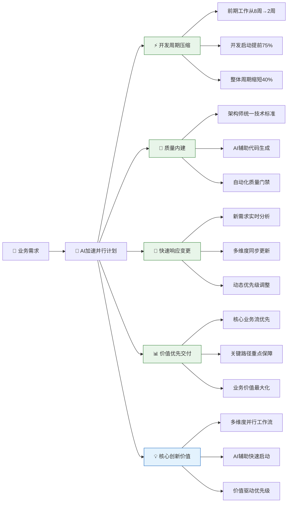

**时间价值**：通过AI辅助和多维度并行，将传统8周的前期工作压缩至2周，开发启动时间提前75%，整体项目周期缩短40%。

**质量价值**：架构师统一技术标准，AI辅助生成高质量代码框架，自动化质量门禁确保关键路径质量。

**响应价值**：新需求通过AI实时分析，多维度同步更新，动态调整优先级，确保项目始终对准最高业务价值。

**业务价值**：基于业务流优先级，确保核心功能优先交付，关键路径重点保障，最大化投资回报。

## 12.2 并行项目计划构建方法论

### 12.2.1 核心构建原则

**原则1：多维度并行启动**
- 业务建模、架构设计、系统分析、用例实现、质量保障五个维度同步启动
- AI辅助各维度快速生成初步成果
- 架构师统一协调和集成各维度输出

**原则2：价值优先级驱动**
- 识别核心业务流和关键路径用例
- 高业务价值任务优先分配资源
- 动态调整优先级响应业务变化

**原则3：架构与实现分离**
- 架构师负责系统结构和实现模式
- 开发员负责单元内容和业务逻辑
- AI辅助生成代码框架和基础实现

**原则4：持续反馈优化**
- 单元分析为架构设计提供早期反馈
- 质量保障贯穿整个开发周期
- 新需求实时同步更新各维度

### 12.2.2 五维度并行构建流程

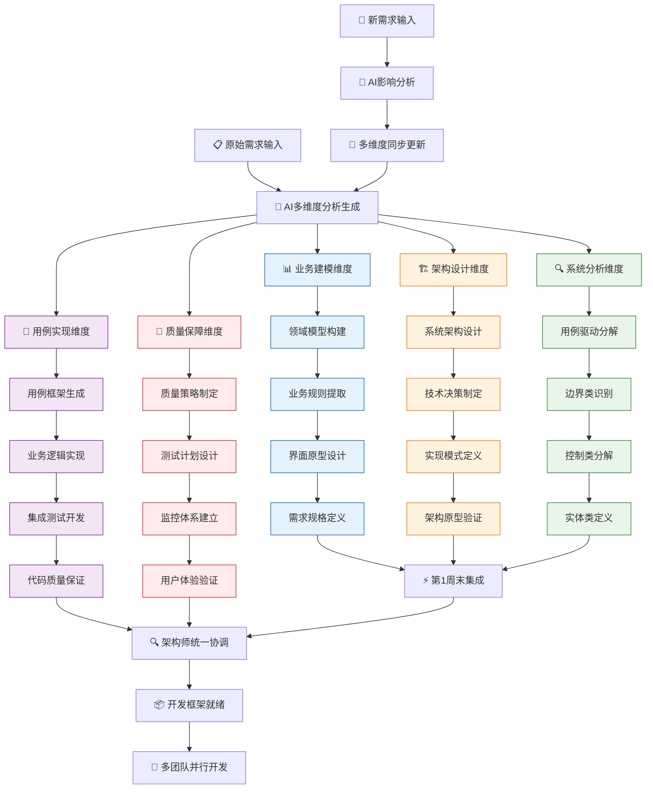

## 12.3 订单系统多维度项目计划

### 12.3.1 阶段一：AI加速并行启动（第1-2周）

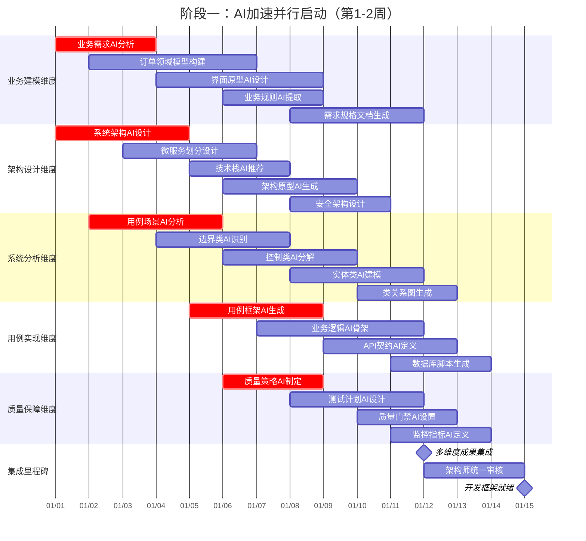

### 12.3.2 阶段二：核心业务流开发（第3-10周）

基于业务价值优先级，重点保障P0核心业务流的开发：

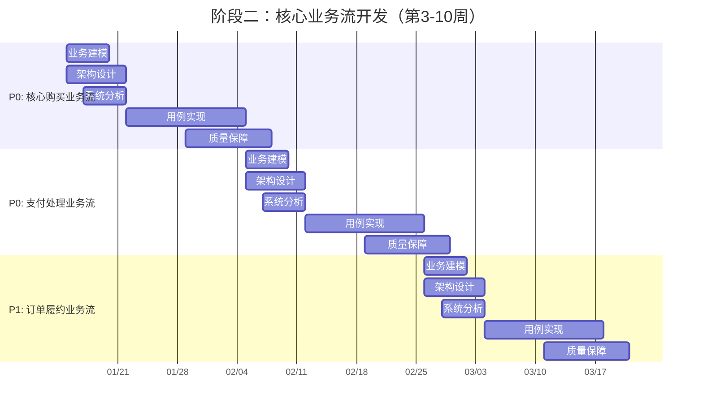

### 12.3.3 订单系统具体实施示例

**核心购买业务流的多维度实施：**

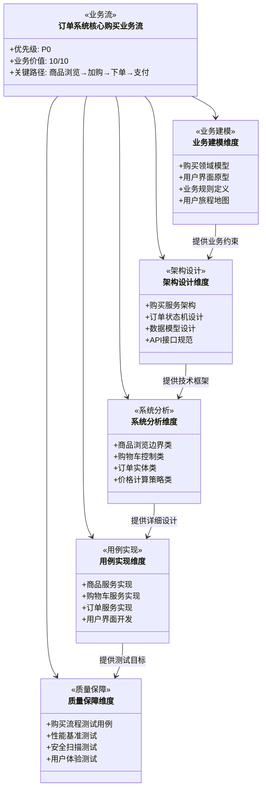

**架构师与开发员的职责划分示例：**

| 组件类型         | 架构师职责                                     | 开发员职责                                   | AI辅助内容                                   |
| ---------------- | ---------------------------------------------- | -------------------------------------------- | -------------------------------------------- |
| **订单边界类**   | 定义接口契约 设计交互模式 制定状态管理   | 实现界面逻辑 编写用户交互 完成单元测试 | 生成界面框架 创建组件模板 产出测试用例 |
| **购物车控制类** | 设计业务流程 定义协调模式 制定异常处理   | 实现业务逻辑 编写协调代码 完成集成测试 | 生成控制框架 创建流程模板 产出测试场景 |
| **商品实体类**   | 设计数据模型 定义业务规则 制定持久化策略 | 实现数据操作 编写业务方法 完成数据测试 | 生成实体框架 创建数据映射 产出验证逻辑 |

### 12.3.4 新需求响应机制

当新需求进入时的实时处理流程：

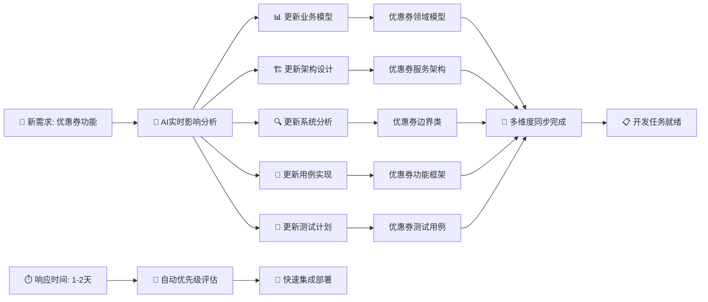

## 12.4 项目成功保障

### 12.4.1 关键成功指标

| 维度         | 指标项             | 目标值    | 测量频率 |
| ------------ | ------------------ | --------- | -------- |
| **时间效率** | 前期工作周期       | ≤2周      | 项目启动 |
|              | 开发启动时间       | 第3周     | 项目计划 |
|              | 核心业务流交付     | 第8周     | 里程碑   |
| **质量保障** | 代码生成接受率     | ≥85%      | 每次提交 |
|              | 关键路径测试覆盖率 | ≥90%      | 每迭代   |
|              | 生产缺陷密度       | ≤0.1/千行 | 每月     |
| **业务价值** | P0业务流完成度     | 100%      | 每迭代   |
|              | 用户满意度         | ≥4.5/5.0  | 每发布   |
|              | 业务指标达成       | ≥95%      | 上线后   |

### 12.4.2 风险控制策略

**技术风险控制：**
- AI生成代码由架构师审核确保技术质量
- 关键技术组件提前进行原型验证
- 建立技术债务管理机制

**业务风险控制：**
- 核心业务流优先保障资源投入
- 建立需求变更影响评估流程
- 定期与业务方确认需求理解

**资源风险控制：**
- 多维度并行避免单点瓶颈
- 建立人员备份和知识转移机制
- 动态调整资源分配应对优先级变化

## 12.5 总结

本章提出的AI加速并行项目计划方法，通过多维度同步启动、价值优先级驱动、架构与实现分离等创新实践，为订单系统项目提供了高效的项目管理框架。

**核心创新价值：**
1. **时间压缩**：前期工作从8周压缩至2周，开发效率提升40%
2. **质量提升**：架构师统一技术标准，AI辅助确保代码质量
3. **响应敏捷**：新需求实时分析同步，快速响应业务变化
4. **价值最大化**：核心业务流优先保障，投资回报最优

该计划确保订单系统项目在保证质量的前提下，以最高效的方式交付最大业务价值，为项目成功奠定坚实基础。

# 12.6 订单系统详细项目计划

## 12.6.1 订单系统多维度详细任务分解

### 12.6.1.1 阶段一：AI加速并行启动（第1-2周）

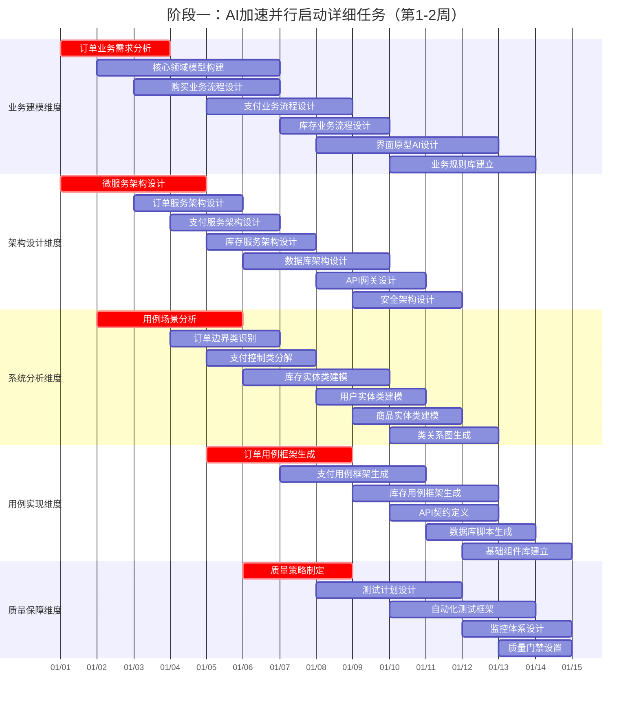

### 12.6.1.2 阶段二：核心购买业务流开发（第3-6周）

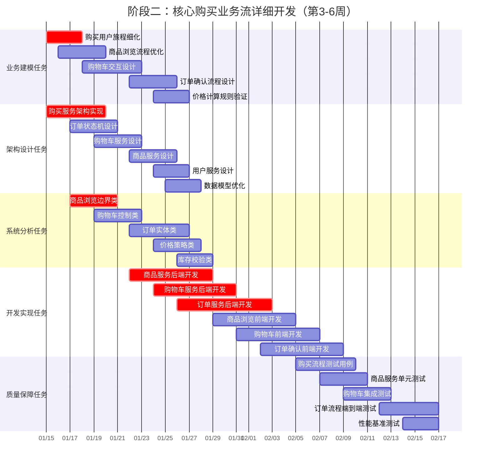

### 12.6.1.3 阶段三：支付业务流开发（第7-10周）

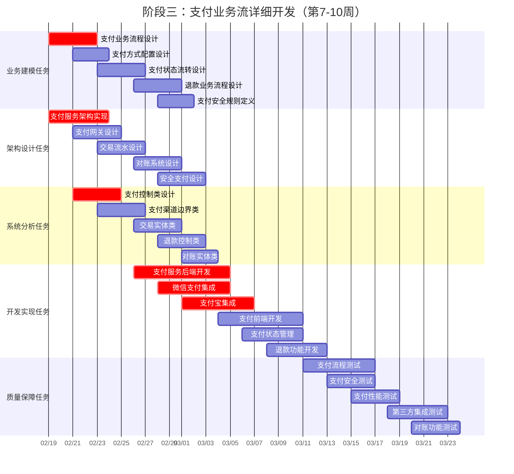

### 12.6.1.4 阶段四：库存与履约业务流（第11-14周）

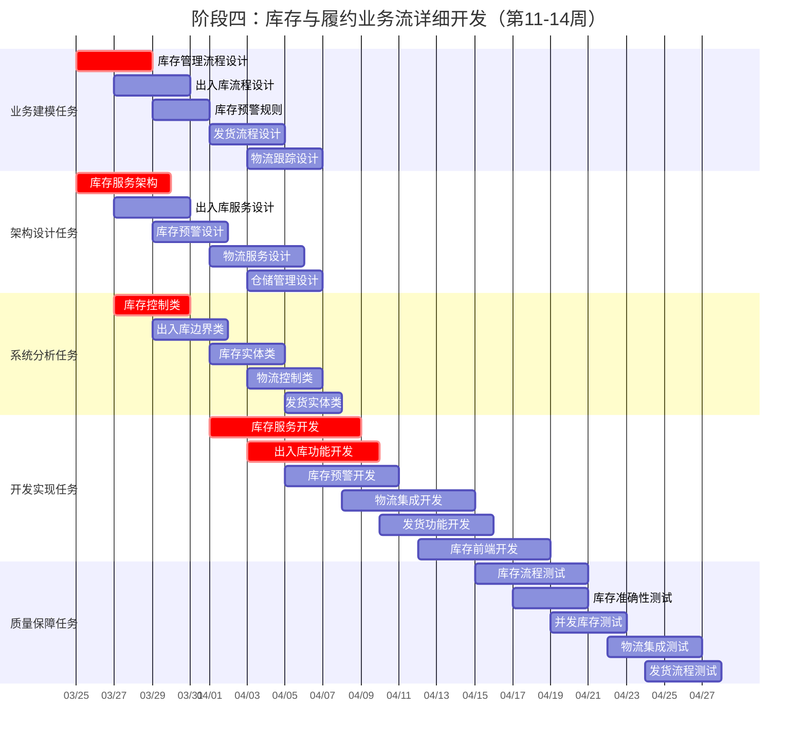

### 12.6.1.5 阶段五：会员权益业务流（第15-18周）

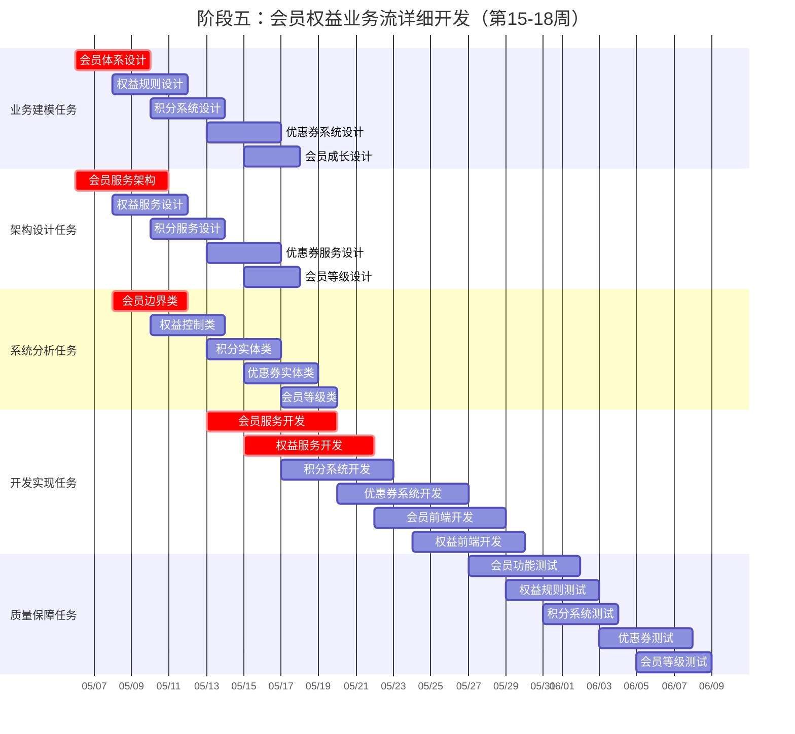

### 12.6.1.6 阶段六：系统优化与上线（第19-20周）

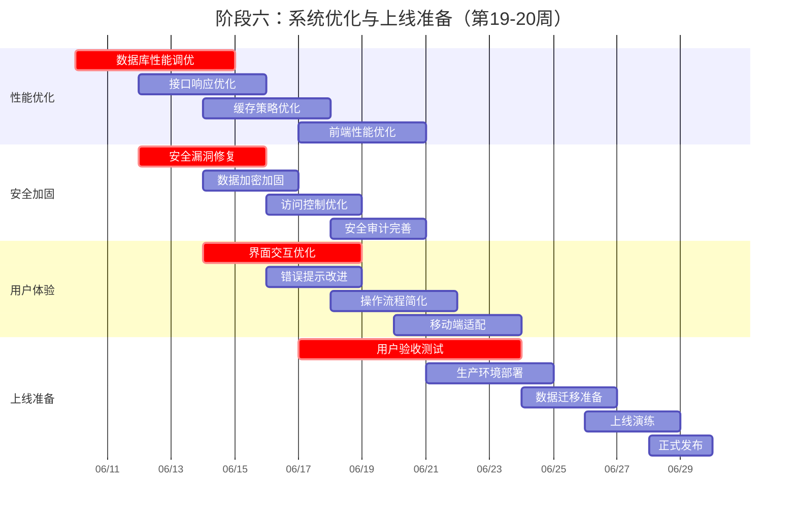

## 12.6.2 订单系统完整任务清单

### 12.6.2.1 业务建模维度任务清单

| 任务ID | 任务名称         | 优先级 | 开始时间   | 结束时间   | 负责人     | 工作量 | 交付物       |
| ------ | ---------------- | ------ | ---------- | ---------- | ---------- | ------ | ------------ |
| BM-001 | 订单业务需求分析 | P0     | 2024-01-01 | 2024-01-03 | 业务分析师 | 3人天  | 需求规格文档 |
| BM-002 | 核心领域模型构建 | P0     | 2024-01-02 | 2024-01-06 | 业务分析师 | 5人天  | 领域模型图   |
| BM-003 | 购买业务流程设计 | P0     | 2024-01-03 | 2024-01-06 | 业务分析师 | 4人天  | 业务流程图   |
| BM-004 | 支付业务流程设计 | P0     | 2024-01-05 | 2024-01-08 | 业务分析师 | 4人天  | 支付流程图   |
| BM-005 | 库存业务流程设计 | P1     | 2024-01-07 | 2024-01-09 | 业务分析师 | 3人天  | 库存流程图   |
| BM-006 | 界面原型AI设计   | P0     | 2024-01-08 | 2024-01-12 | UI设计师   | 5人天  | 界面原型     |
| BM-007 | 业务规则库建立   | P1     | 2024-01-10 | 2024-01-13 | 业务分析师 | 4人天  | 业务规则文档 |
| BM-008 | 购买用户旅程细化 | P0     | 2024-01-15 | 2024-01-17 | 业务分析师 | 3人天  | 用户旅程图   |
| BM-009 | 商品浏览流程优化 | P0     | 2024-01-16 | 2024-01-19 | 业务分析师 | 4人天  | 优化流程文档 |
| BM-010 | 购物车交互设计   | P0     | 2024-01-18 | 2024-01-22 | UI设计师   | 5人天  | 交互设计文档 |
| BM-011 | 支付业务流程设计 | P0     | 2024-02-19 | 2024-02-22 | 业务分析师 | 4人天  | 支付业务文档 |
| BM-012 | 会员体系设计     | P2     | 2024-05-06 | 2024-05-09 | 业务分析师 | 4人天  | 会员体系文档 |

### 12.6.2.2 架构设计维度任务清单

| 任务ID   | 任务名称         | 优先级 | 开始时间   | 结束时间   | 负责人     | 工作量 | 交付物         |
| -------- | ---------------- | ------ | ---------- | ---------- | ---------- | ------ | -------------- |
| ARCH-001 | 微服务架构设计   | P0     | 2024-01-01 | 2024-01-04 | 系统架构师 | 4人天  | 架构设计文档   |
| ARCH-002 | 订单服务架构设计 | P0     | 2024-01-03 | 2024-01-05 | 系统架构师 | 3人天  | 服务架构图     |
| ARCH-003 | 支付服务架构设计 | P0     | 2024-01-04 | 2024-01-06 | 系统架构师 | 3人天  | 支付架构图     |
| ARCH-004 | 数据库架构设计   | P0     | 2024-01-06 | 2024-01-09 | 数据架构师 | 4人天  | 数据库设计文档 |
| ARCH-005 | 购买服务架构实现 | P0     | 2024-01-15 | 2024-01-19 | 系统架构师 | 5人天  | 服务实现方案   |
| ARCH-006 | 订单状态机设计   | P0     | 2024-01-17 | 2024-01-20 | 系统架构师 | 4人天  | 状态机设计     |
| ARCH-007 | 支付服务架构实现 | P0     | 2024-02-19 | 2024-02-23 | 系统架构师 | 5人天  | 支付架构实现   |
| ARCH-008 | 库存服务架构     | P1     | 2024-03-25 | 2024-03-29 | 系统架构师 | 5人天  | 库存架构设计   |
| ARCH-009 | 会员服务架构     | P2     | 2024-05-06 | 2024-05-10 | 系统架构师 | 5人天  | 会员架构设计   |

### 12.6.2.3 系统分析维度任务清单

| 任务ID | 任务名称       | 优先级 | 开始时间   | 结束时间   | 负责人     | 工作量 | 交付物         |
| ------ | -------------- | ------ | ---------- | ---------- | ---------- | ------ | -------------- |
| SA-001 | 用例场景分析   | P0     | 2024-01-02 | 2024-01-05 | 系统分析师 | 4人天  | 用例文档       |
| SA-002 | 订单边界类识别 | P0     | 2024-01-04 | 2024-01-06 | 系统分析师 | 3人天  | 边界类定义     |
| SA-003 | 支付控制类分解 | P0     | 2024-01-05 | 2024-01-07 | 系统分析师 | 3人天  | 控制类设计     |
| SA-004 | 商品浏览边界类 | P0     | 2024-01-17 | 2024-01-20 | 系统分析师 | 4人天  | 边界类详细设计 |
| SA-005 | 购物车控制类   | P0     | 2024-01-19 | 2024-01-22 | 系统分析师 | 4人天  | 控制类详细设计 |
| SA-006 | 支付控制类设计 | P0     | 2024-02-21 | 2024-02-24 | 系统分析师 | 4人天  | 支付控制设计   |
| SA-007 | 库存控制类     | P1     | 2024-03-27 | 2024-03-30 | 系统分析师 | 4人天  | 库存控制设计   |
| SA-008 | 会员边界类     | P2     | 2024-05-08 | 2024-05-11 | 系统分析师 | 4人天  | 会员边界设计   |

### 12.6.2.4 开发实现维度任务清单

| 任务ID  | 任务名称           | 优先级 | 开始时间   | 结束时间   | 负责人     | 工作量 | 交付物         |
| ------- | ------------------ | ------ | ---------- | ---------- | ---------- | ------ | -------------- |
| DEV-001 | 订单用例框架生成   | P0     | 2024-01-05 | 2024-01-08 | 核心开发员 | 4人天  | 代码框架       |
| DEV-002 | 商品服务后端开发   | P0     | 2024-01-22 | 2024-01-28 | 后端开发   | 7人天  | 商品服务代码   |
| DEV-003 | 购物车服务后端开发 | P0     | 2024-01-24 | 2024-01-30 | 后端开发   | 7人天  | 购物车服务代码 |
| DEV-004 | 订单服务后端开发   | P0     | 2024-01-26 | 2024-02-02 | 后端开发   | 8人天  | 订单服务代码   |
| DEV-005 | 商品浏览前端开发   | P0     | 2024-01-29 | 2024-02-04 | 前端开发   | 7人天  | 前端界面代码   |
| DEV-006 | 支付服务后端开发   | P0     | 2024-02-26 | 2024-03-05 | 后端开发   | 8人天  | 支付服务代码   |
| DEV-007 | 微信支付集成       | P0     | 2024-02-28 | 2024-03-05 | 后端开发   | 6人天  | 支付集成代码   |
| DEV-008 | 库存服务开发       | P1     | 2024-04-01 | 2024-04-08 | 后端开发   | 8人天  | 库存服务代码   |
| DEV-009 | 会员服务开发       | P2     | 2024-05-13 | 2024-05-19 | 后端开发   | 7人天  | 会员服务代码   |

### 12.6.2.5 质量保障维度任务清单

| 任务ID | 任务名称         | 优先级 | 开始时间   | 结束时间   | 负责人     | 工作量 | 交付物       |
| ------ | ---------------- | ------ | ---------- | ---------- | ---------- | ------ | ------------ |
| QA-001 | 质量策略制定     | P0     | 2024-01-06 | 2024-01-08 | 质量经理   | 3人天  | 质量策略文档 |
| QA-002 | 购买流程测试用例 | P0     | 2024-02-05 | 2024-02-09 | 测试工程师 | 5人天  | 测试用例文档 |
| QA-003 | 商品服务单元测试 | P0     | 2024-02-07 | 2024-02-10 | 测试工程师 | 4人天  | 单元测试报告 |
| QA-004 | 支付流程测试     | P0     | 2024-03-11 | 2024-03-16 | 测试工程师 | 6人天  | 支付测试报告 |
| QA-005 | 支付安全测试     | P0     | 2024-03-13 | 2024-03-16 | 安全测试   | 4人天  | 安全测试报告 |
| QA-006 | 库存流程测试     | P1     | 2024-04-15 | 2024-04-20 | 测试工程师 | 6人天  | 库存测试报告 |
| QA-007 | 会员功能测试     | P2     | 2024-05-27 | 2024-06-01 | 测试工程师 | 6人天  | 会员测试报告 |
| QA-008 | 用户验收测试     | P0     | 2024-06-17 | 2024-06-23 | 测试经理   | 7人天  | UAT报告      |

### 12.6.2.6 关键里程碑任务清单

| 里程碑ID | 里程碑名称       | 日期       | 类型 | 负责人     | 验收标准               |
| -------- | ---------------- | ---------- | ---- | ---------- | ---------------------- |
| M-001    | 微服务框架完成   | 2024-01-12 | 技术 | 系统架构师 | 架构设计评审通过       |
| M-002    | 核心购买流程集成 | 2024-02-16 | 业务 | 技术负责人 | 购买流程端到端测试通过 |
| M-003    | 支付系统集成完成 | 2024-03-22 | 业务 | 技术负责人 | 支付流程测试通过       |
| M-004    | 库存系统集成完成 | 2024-04-26 | 业务 | 技术负责人 | 库存管理测试通过       |
| M-005    | 会员系统集成完成 | 2024-06-07 | 业务 | 技术负责人 | 会员功能测试通过       |
| M-006    | 用户验收测试开始 | 2024-06-28 | 质量 | 质量经理   | 所有功能测试完成       |
| M-007    | 系统正式上线     | 2024-07-12 | 项目 | 项目经理   | UAT通过，生产就绪      |

这个详细的项目计划为订单系统的成功实施提供了完整的任务清单和时间安排，确保在AI辅助下各维度并行推进，基于价值优先级有序开发，最终高质量交付订单系统。