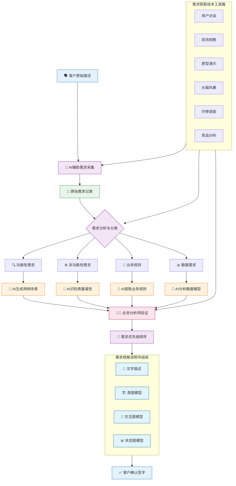
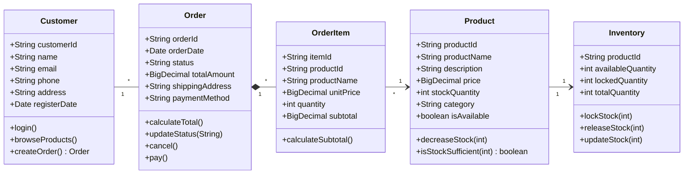
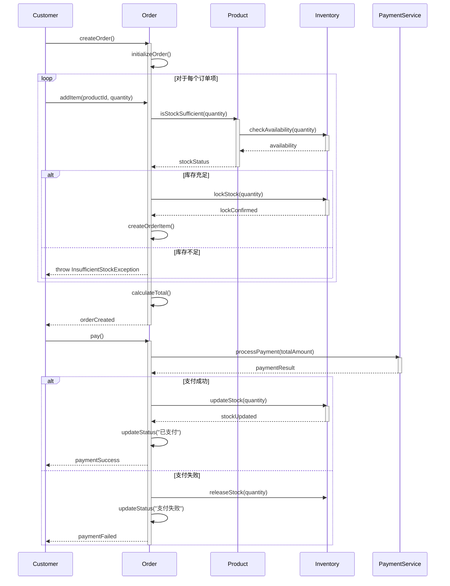
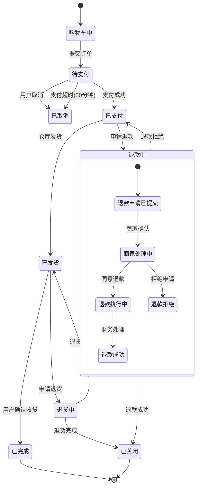
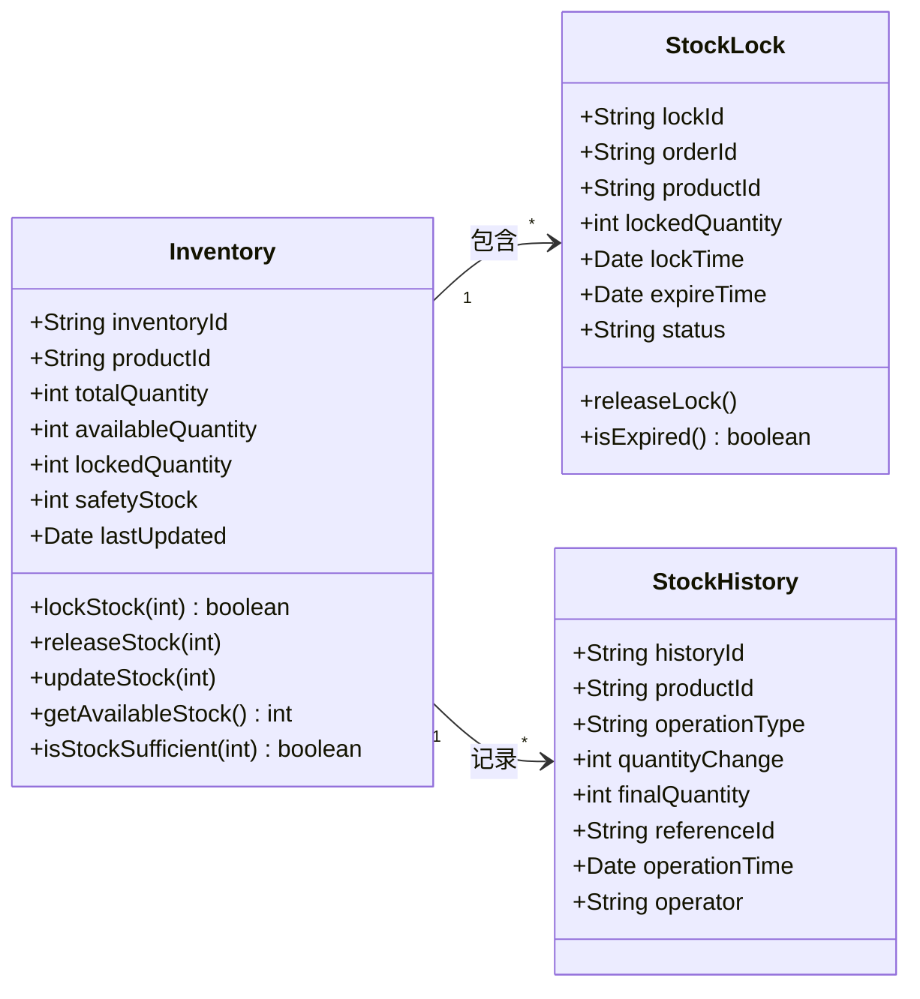
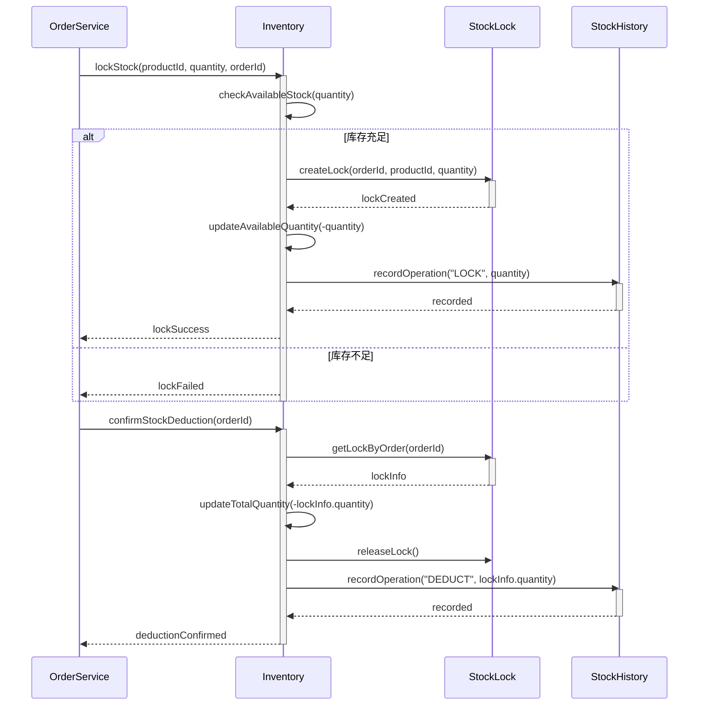
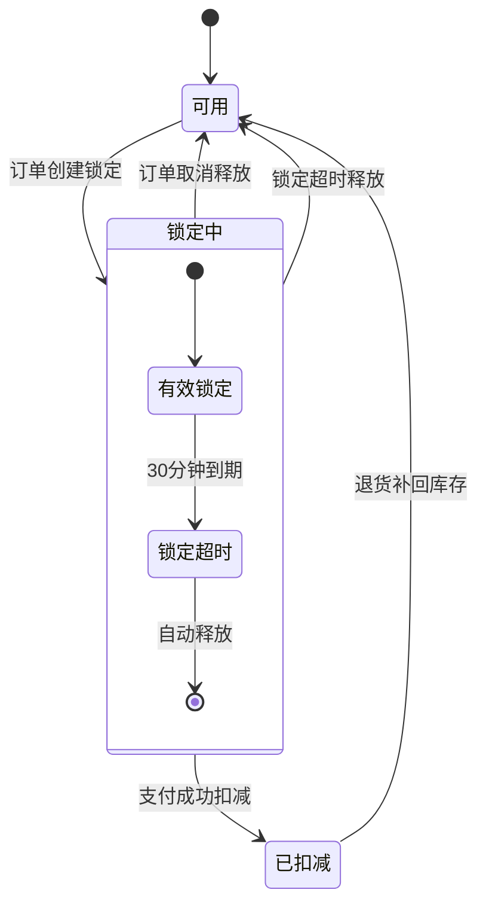
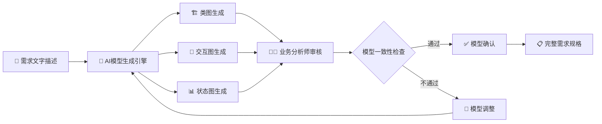

# 5 需求获取：从客户描述到规格说明

## 5.1 需求获取的整体流程

需求获取是将客户模糊、杂乱的业务描述转化为结构化、可执行的需求规格说明书的系统化过程。本章通过订单系统案例，展示如何运用AI辅助和各种需求获取技术，实现从混沌到秩序的需求转化。



## 5.2 需求规格说明书的四维描述法

### 5.2.1 描述方法定义

需求规格说明书必须采用四种互补的描述方式，确保需求的完整性、准确性和可验证性：

1. **文字描述**：自然语言表达，提供业务背景和详细说明
2. **类图模型**：静态结构描述，定义业务实体及其关系
3. **交互图模型**：动态行为描述，展示对象间的协作过程
4. **状态图模型**：生命周期描述，刻画对象状态变迁

### 5.2.2 四维描述的价值

**消除歧义**：不同描述方式相互验证，减少理解偏差
**分层抽象**：从不同抽象层次完整描述系统
**团队协作**：为不同角色提供合适的理解视角
**质量保证**：多维度验证需求的一致性和完整性

## 5.3 需求获取技术方法

### 5.3.1 AI辅助的需求提取

#### 文字描述生成
**AI提示词：**
```
基于客户访谈记录，生成结构化需求描述：
1. 按业务模块组织需求描述
2. 使用清晰、无歧义的业务术语
3. 包含正常流程和异常处理
4. 明确前置条件和后置条件

输入：客户原始描述和访谈记录
输出：结构化需求文字描述
```

#### 模型图生成
**AI提示词：**
```
基于需求文字描述，生成配套的模型图：
1. 类图：识别业务实体、属性和关系
2. 时序图：描述关键业务流程交互
3. 状态图：定义核心对象状态变迁

要求：模型图与文字描述保持一致
```

## 5.4 订单系统需求规格说明书

### 5.4.1 订单管理模块需求

#### 文字描述

**需求标识**：REQ-ORD-001  
**需求名称**：订单创建功能  
**业务描述**：系统应允许注册客户创建新的商品订单。客户从商品目录中选择商品并指定购买数量，系统实时验证库存可用性，计算订单总金额，生成待支付订单。

**前置条件**：
- 客户已成功登录系统
- 商品库存信息准确可用

**后置条件**：
- 新订单被创建并处于"待支付"状态
- 相应商品库存被锁定

**正常流程**：
1. 客户浏览商品目录并选择商品
2. 客户指定购买数量并加入购物车
3. 系统验证库存充足性
4. 客户确认订单信息并提交
5. 系统生成订单并锁定库存
6. 订单进入"待支付"状态

**异常流程**：
- 库存不足：系统提示客户库存不足，建议调整数量
- 商品下架：系统提示商品已不可用，建议移除
- 网络异常：系统保存草稿，待恢复后继续

#### 类图模型



#### 交互图模型



#### 状态图模型



### 5.4.2 库存管理模块需求

#### 文字描述

**需求标识**：REQ-INV-001  
**需求名称**：库存锁定与扣减  
**业务描述**：系统应在订单创建时锁定相应库存，防止超卖。支付成功后实际扣减库存，支付失败或订单取消时释放锁定库存。

**业务规则**：
1. 下单时锁定库存，锁定库存不计入可用库存
2. 支付成功后，锁定库存转为实际扣减
3. 支付失败或订单取消，立即释放锁定库存
4. 库存锁定有效期30分钟，超时自动释放

#### 类图模型（库存部分）



#### 交互图模型（库存操作）



#### 状态图模型（库存锁定）



## 5.5 AI辅助需求规格生成

### 5.5.1 文字到模型的转换流程



### 5.5.2 AI生成提示词模板

#### 类图生成提示词
```
基于以下业务需求描述，生成UML类图：
1. 识别核心业务实体作为类
2. 提取每个实体的关键属性
3. 定义实体间的关联关系
4. 识别必要的业务方法
5. 使用正确的UML语法

业务需求描述：[具体的需求文字描述]
```

#### 交互图生成提示词
```
基于以下业务流程描述，生成时序图：
1. 识别参与交互的对象
2. 定义消息传递序列
3. 包含正常流程和异常处理
4. 使用alt/opt/loop等交互片段
5. 标注激活期和返回值

业务流程：[具体的流程描述]
```

#### 状态图生成提示词
```
基于以下业务对象生命周期描述，生成状态图：
1. 识别对象的所有可能状态
2. 定义状态间的转换条件
3. 包含初始状态和终止状态
4. 支持嵌套状态和并发状态
5. 标注转换触发事件

生命周期描述：[具体的状态变迁描述]
```

## 5.6 需求验证与确认

### 5.6.1 四维一致性检查

**交叉验证规则：**
1. 类图中的实体必须在交互图中出现
2. 交互图中的消息必须对应类图中的方法
3. 状态图中的状态必须与类图中的状态属性一致
4. 文字描述的业务规则必须在模型中体现

### 5.6.2 客户确认流程

**确认检查单：**
- [ ] 文字描述准确反映了业务需求
- [ ] 类图正确表达了业务实体关系
- [ ] 交互图完整展示了业务流程
- [ ] 状态图准确刻画了对象生命周期
- [ ] 所有模型之间保持一致
- [ ] 需求具备可测试性和可实现性

## 5.7 总结

通过文字、类图、交互图、状态图四维描述法，结合AI辅助生成技术，需求规格说明书能够：

1. **全面覆盖**：从静态结构到动态行为完整描述系统
2. **精确表达**：消除自然语言的歧义性
3. **高效沟通**：为不同技术背景的团队成员提供合适视图
4. **质量保证**：多维度交叉验证确保需求一致性
5. **持续维护**：模型化的需求便于变更管理和影响分析

订单系统的完整案例展示了如何将客户模糊的业务需求，通过结构化的四维描述方法，转化为精确、完整、可验证的需求规格说明书，为后续的设计和开发工作奠定坚实基础。
